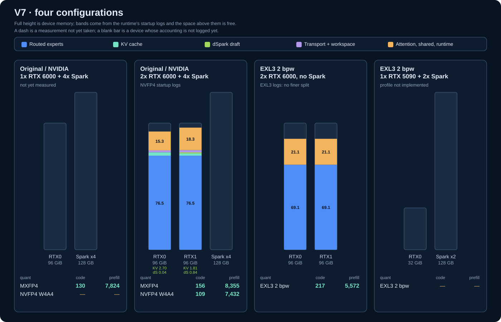

# DS41RT

DS41RT serves the official [DeepSeek V4.1 Flash](https://huggingface.co/deepseek-ai/DeepSeek-V4.1-Flash) checkpoint across one or two RTX PRO 6000 Blackwell coordinator GPUs and four DGX Spark expert workers. It combines native target execution, local dSpark speculative decoding, token-level prefix reuse, tools, constrained output, and vision in one OpenAI-compatible service.

The historical official-image v6 campaign used an enforced **400 W power limit** and **standard 14,001 MHz maximum memory speed with no memory overclock**. Its loaded memory clock reached 13,365 MHz; the RTX driver was 595.91.07. The four GB10 workers used driver 580.159.03. V7 quant measurements and their outstanding provenance are identified separately below.

[](docs/release-v7-configurations.svg)

[](docs/native-path-execution.svg)

## Performance

The official full checkpoint remains the default. Its **decode** measurements are the [v14 campaign](docs/release-v14-performance.md) on the published v14 images, which shorten the verification cycle (device-ordered stages, overlapped cache producers, a two-RTX device sampler); its prefill, deployment, startup and memory tables remain the historical [v6 campaign](docs/release-v6-performance.md), **not re-campaigned since**, apart from a [v7 regression check](docs/release-v7-official-regression.md) that confirms the default path is unchanged: the published v7 images reproduce the v6 deployment geometry exactly and measure 1x C1 code decode at **134.38** against the recorded 130.41. The new NVFP4 and EXL3 measurements use the v7 raw-result package; their reports below distinguish recorded controls from outstanding provenance and qualification.

The release protocol uses **400 W per RTX card and standard memory speed, without a memory overclock**. Reported throughput cells use three samples. Reasoning code uses high-effort thinking and counts reasoning plus final-answer tokens; other throughput cases disable thinking. The official v6 campaign kept the experimental TP2 switches off.

**Headlines.** Tokens/s across all configurations. Prefill is the best cell median
from a completed, passing matrix; decode is C1 dSpark, with a weighted nine-category
score excluding counting. Each column pair comes from its own campaign: the official
decode rows are the v14 campaign and the official prefill row is v6, NVFP4 is the
[v8 campaign](docs/release-v8-notes.md) on the published v8 images, EXL3 is the v7
campaign, and the Official TP6 columns are the validated **warm-candidate** v9
campaign. They are not a single co-measured run, so no change column is tabulated;
each report states its own observed repeat spread.

| Measurement | Official 1x | Official 2x | NVFP4 1x | NVFP4 2x | EXL3 5090+2-spark | EXL3 2x6000 0-spark | Official TP6 1x | Official TP6 2x |
|---|---:|---:|---:|---:|---:|---:|---:|---:|
| Prefill | 7,824 | 8,355 | 5,237 | 7,371 | 2,013 | 5,597 | 7,131 | 8,577 |
| Counting decode | 182.39 | 219.86 | 144.66 | 192.42 | 161.98 | 337.00 | 174.54 | 231.51 |
| Weighted decode | 104.69 | 129.67 | 81.74 | 100.78 | 88.20 | 146.24 | 96.83 | 110.19 |
| C1 code decode | 146.12 | 179.86 | 112.55 | 145.96 | 122.50 | 225.20 | 139.56 | 159.34 |

New-quant reports: [NVFP4 W4A4 (v8)](docs/release-v8-nvfp4-performance.md) · [EXL3 K2 (including the 5090+2-spark compact profile)](docs/release-v7-exl3-k2-performance.md).
Official TP6 reports: [1 RTX TP6](docs/release-v9-tp6-1rtx-official.md) · [2 RTX TP6](docs/release-v9-tp6-2rtx-official.md) · [campaign status](docs/release-v9-tp6-campaign-status.md). These are validated warm-candidate performance, measured on the candidate binaries rather than the final images; the final v9 images have passed bounded functional checks, and no final-image performance numbers are claimed.
V10 TP3 reports: [official native 1x/3-Spark](docs/release-v10-tp3-official-1x-3spark.md) · [compact EXL3 TP3 1x/3-Spark](docs/release-v10-tp3-exl3-compact-1x-3spark.md) · [campaign status](docs/release-v10-tp3-campaign-status.md) — **INFORMATIONAL**: the official native arm records **309 / 359** performance records and **88 / 264** tool-eval scenario-runs and is published as measured, incomplete and informational, not a qualification; the compact EXL3 TP3 arm is **complete at 359 / 359** performance records and **264 / 264** tool-eval scenario-runs with a strict **PASS**, and its remaining network/threshold PENDING cells stay explicitly pending rather than zero.

**EXL3 5090+2-spark** uses one RTX PRO 6000 with a **32 GiB total budget
including headroom** and **two TP2 Sparks**; **EXL3 2x6000 0-spark** uses two
uncapped RTX PRO 6000 cards and no Sparks. The first simulates RTX 5090 memory
capacity, not its performance, and the two columns are not isolated second-GPU
scaling. Both EXL3 prefill campaigns completed all 30 cells. Decode completion
checks passed **29/30 for EXL3 5090+2-spark** and **28/30 for EXL3 2x6000
0-spark**: the failed high-effort reasoning samples exhausted 4,096 output
tokens with no final code; throughput includes them.

Both EXL3 configurations carry the **full battery** on the published images:
decode, prefill, retained-context decode with its separate 2K control,
counting/code/topic concurrency scaling, mixed traffic and target-only decode,
plus three completed high-effort tool-call evaluations each — EXL3 5090+2-spark
at **156/176, 157/176 and 153/176**, EXL3 2x6000 0-spark at **159/176, 154/176
and 156/176**. Run scores move with sampling, so the
[performance report](docs/release-v7-exl3-k2-performance.md) lists every run
rather than averaging them.
The NVFP4 battery is **deferred pending the W4A4 optimization**, which changes
the kernel family and the activation wire; re-measuring it first would only have
to be redone.
See [compact setup and residency](docs/release-v7-exl3-compact.md)
and the [configuration accounting chart](docs/release-v7-configurations.svg).
No physical RTX 5090 has been tested; the same-capability grid checks used RTX PRO 6000.
The release pair named by `ds41rt.config` is `ghcr.io/tpurtell/ds41rt-coordinator:v14`
and `ghcr.io/tpurtell/ds41rt-spark-expert:v14` ([release notes and registry
digests](docs/release-v14-notes.md)). `latest` resolves to the same pair; both
roles were verified by anonymous pull on their matching architectures. The
Spark image is **universal**: it advertises
`io.ds41rt.v41.spark_tp_roles=tp2;tp3;tp6` on top of the default TP4 shard, so one
pair serves every approved native topology and `./run.sh` selects the role
from `SPARK_TP`. V13 remains available as the previous numbered pair
([v13 notes](docs/release-v13-notes.md)). V9 release images remain published as
`ghcr.io/tpurtell/ds41rt-coordinator:v9` and `ghcr.io/tpurtell/ds41rt-spark-expert:v9`
([digests and roles](docs/release-v9-notes.md)). V8 release images remain published as
`ghcr.io/tpurtell/ds41rt-coordinator:v8` and `ghcr.io/tpurtell/ds41rt-spark-expert:v8`
([digests](docs/release-v8-notes.md)).
These four new-quant campaigns were re-run against the **published release images**,
so the headline is a published-image measurement rather than a working-tree build; the
earlier NVFP4 1x prefill attempt that an interrupted campaign left unfinished is now a
completed, passing matrix (4,141 tok/s) instead of a dash.

V14 is faster than v13 on every measured family in paired A/B sessions: C1
decode by 12–19%, two-RTX sampled decode by 35–38% (sampling now stays on the
GPU), and concurrent traffic by 6–17%. The only key that did not improve is
two-RTX code at C16 (−1.0%). Official 2x counting decode (219.86) is back near
the historical 221.64 with the default five-token block; the
[v14 performance report](docs/release-v14-performance.md) has the full comparison.

**Official image only below.** The decode tables below (content type, retained
context, concurrency, mixed traffic and dSpark acceptance) are the v14 campaign;
the prefill, deployment, startup and memory tables are preserved from v6. Older official-reference, acceptance and
tool-evaluation results retain their separately named historical campaigns; apart
from the EXL3 5090+2-spark runs above, none qualifies either new quant.

**Content-type decode.** Median tokens/s of three repeats, v14. Official Flash is DeepSeek's hosted `deepseek-flash` API, measured 2026-09-24 with the same corpus and controls, three sequential requests per case. Its rates include network streaming and unknown provider hardware, so they are a reference rather than a controlled hardware comparison. The API rejects JSON Schema `response_format` with HTTP 400. [Raw official record](docs/release-official-flash-reference-20260924.json).

| Case | 1 RTX target | 1 RTX dSpark | 2 RTX target | 2 RTX dSpark | Official Flash API |
|---|---:|---:|---:|---:|---:|
| Code | 60.63 | 146.12 | 61.76 | 179.86 | 328.92 |
| Code with reasoning | 59.87 | 115.78 | 60.60 | 138.99 | 265.65 |
| Math | 59.79 | 129.15 | 60.91 | 155.34 | 230.37 |
| Fable | 59.36 | 67.59 | 60.56 | 84.98 | 128.86 |
| Hello | 58.37 | 77.20 | 60.43 | 113.79 | 151.88 |
| Topic | 60.00 | 84.05 | 60.50 | 102.32 | 189.53 |
| Natural JSON | 59.72 | 133.54 | 60.48 | 157.00 | 266.83 |
| Schema JSON | 59.12 | 135.55 | 60.17 | 159.10 | HTTP 400 |
| Multilingual | 59.18 | 87.46 | 60.24 | 106.52 | 176.78 |
| Counting 1–200 | 60.81 | 182.39 | 61.64 | 219.86 | 417.01 |

**1 RTX prefill matrix.** Median effective tokens/s after shape warmup and verified parent reuse.

| Retained base | +1K | +2K | +4K | +8K | +16K | +32K |
|---|---:|---:|---:|---:|---:|---:|
| 0K | 3,005 | 4,031 | 6,950 | 7,493 | 7,801 | 7,824 |
| 32K | 2,463 | 3,326 | 5,379 | 6,140 | 6,598 | 6,863 |
| 64K | 2,242 | 3,103 | 4,961 | 5,665 | 6,151 | 6,361 |
| 128K | 1,928 | 2,718 | 4,205 | 4,914 | 5,343 | 5,530 |
| 256K | 1,463 | 2,122 | 3,195 | 3,797 | 4,156 | 4,306 |

**2 RTX prefill matrix.** Median effective tokens/s after shape warmup and verified parent reuse.

| Retained base | +1K | +2K | +4K | +8K | +16K | +32K |
|---|---:|---:|---:|---:|---:|---:|
| 0K | 4,725 | 6,369 | 7,825 | 8,185 | 8,355 | 8,290 |
| 32K | 3,683 | 5,153 | 6,373 | 6,930 | 7,207 | 7,251 |
| 64K | 3,221 | 4,626 | 5,673 | 6,226 | 6,507 | 6,567 |
| 128K | 2,588 | 3,678 | 4,655 | 5,202 | 5,486 | 5,556 |
| 256K | 1,770 | 2,697 | 3,336 | 3,847 | 4,126 | 4,229 |

**Decode over retained context.** Weighted nine-category dSpark tokens/s with verified prefix reuse, v14. The context source differs from v6 (the v7-era file).

| Retained base | 1 RTX | 2 RTX |
|---|---:|---:|
| 0K | 102.79 | 124.91 |
| 2K | 108.50 | 129.83 |
| 32K | 100.37 | 118.29 |
| 64K | 99.76 | 123.70 |
| 128K | 99.13 | 119.95 |
| 256K | 94.70 | 108.22 |

**Concurrency scaling.** Median aggregate tokens/s from earliest first output to final completion, including admission gaps, v14.

| Concurrency | 1 RTX counting | 2 RTX counting | 1 RTX code | 2 RTX code | 1 RTX topic | 2 RTX topic |
|---|---:|---:|---:|---:|---:|---:|
| 1 | 183.05 | 218.43 | 143.36 | 187.76 | 86.28 | 108.02 |
| 2 | 268.07 | 325.51 | 221.85 | 284.08 | 131.75 | 168.36 |
| 4 | 480.50 | 595.51 | 381.69 | 516.72 | 251.27 | 311.28 |
| 8 | 768.33 | 992.72 | 610.86 | 861.79 | 382.46 | 487.66 |
| 16 | 1,326.87 | 1,622.69 | 1,057.35 | 1,394.33 | 605.29 | 834.23 |

**Mixed traffic.** Code/fable/topic mix; aggregate tokens/s median and range across three sweeps, v14.

| Concurrency | 1 RTX | 2 RTX |
|---|---:|---:|
| 1 | 128.34 (127.87–146.76) | 171.68 (171.23–180.94) |
| 2 | 119.97 (116.85–128.93) | 167.00 (162.91–172.04) |
| 4 | 160.51 (142.95–179.96) | 214.11 (197.18–218.97) |
| 8 | 171.70 (167.87–172.92) | 247.43 (240.65–252.11) |
| 16 | 212.53 (203.73–213.00) | 314.35 (308.25–319.88) |

**Deployment and cache capacity.** RAM bytes include staging and snapshot overhead. Combined tokens count each logical source once; active requests must fit the GPU pool.

| Configuration | RTX expert layers | Spark resident / active layers / budget | Global FP4 source pool | RAM cache | Combined usable tokens | Prompt / turn retention |
|---|---:|---:|---:|---:|---:|---:|
| 1 RTX | 0–4, TP1 | 40 / 35 / 100 GiB each | 16.701 GB / 18,736,128 usable + 28,672 private-tail tokens | 3.25 GiB pinned / 2,235,904 logical tokens | 20,972,032 | 20 / 20 |
| 2 RTX | 0–19, TP2 | 20 / 20 / 100 GiB each | 13.091 GB / 14,680,064 usable + 28,672 private-tail tokens | 6.75 GiB pinned / 6,291,968 logical tokens | 20,972,032 | 20 / 20 |

**Startup.** Standard launcher to API readiness, including orchestration; one observation per layout.

| Configuration | Seconds |
|---|---:|
| 1 RTX | 58.63 |
| 2 RTX | 31.71 |

**Memory after readiness.** GPU allocations include weights, KV and workspaces; later graph capture can consume additional memory.

| Configuration | Logical RTX | Loaded MiB | Free MiB | Planned runtime reserve MiB |
|---|---:|---:|---:|---:|
| 1 RTX | 0 | 94,590.00 | 2,661.00 | 2,048.00 |
| 2 RTX | 0 | 95,132.00 | 2,119.00 | 800.00 |
| 2 RTX | 1 | 95,738.00 | 1,510.00 | 800.00 |

**dSpark acceptance.** V14, C1, three requests per content type, from `/v1/stats`. Accepted/verified drafts, and mean emitted tokens per verification round in parentheses. Rows the length policy declines to verify are neither accepted nor rejected, so these are serving rates, not fixed-history agreement. Schema JSON is grammar-constrained; reasoning code includes reasoning and final output.

| Content | 1 RTX | 2 RTX |
|---|---:|---:|
| Code | 91.10% (5.37) | 88.05% (5.19) |
| Code with reasoning | 75.41% (3.72) | 70.88% (3.61) |
| Math | 78.54% (4.50) | 73.51% (4.49) |
| Fable | 54.94% (1.86) | 56.63% (2.14) |
| Hello | 53.97% (2.15) | 44.23% (2.31) |
| Topic | 61.29% (2.54) | 57.82% (2.62) |
| Natural JSON | 71.21% (2.96) | 74.07% (3.61) |
| Schema JSON | 96.39% (5.21) | 82.29% (4.29) |
| Multilingual | 57.55% (2.45) | 56.30% (2.73) |
| Counting 1–200 | 99.27% (5.90) | 99.47% (5.94) |

**Historical native tool calling.** The three v4 full-checkpoint campaigns retained in v5; not rerun for v6 or v7. High-effort thinking was enabled, and failures remain in the scores.

| Run | Basic | Hard | Total |
|---|---:|---:|---:|
| 2026-09-16T04-12-34.961137Z_2214ecfb | 124/138 | 31/38 | 155/176 |
| 2026-09-16T04-17-40.551606Z_43911d6a | 126/138 | 34/38 | 160/176 |
| 2026-09-16T04-22-39.602726Z_81eaa393 | 123/138 | 33/38 | 156/176 |

Historical EXL3 performance, acceptance and quantization analysis are preserved in the [v5 performance report](https://github.com/tpurtell/ds41rt/blob/v5/docs/release-v5-performance.md); they are not v6 measurements.

**V12 GPU sampling comparison (2026-09-23, dSpark on).** The released v12
sampler serves normal and constrained stochastic decoding on the GPU for
`temperature`, `top_p`, `top_k`, `min_p`, and deterministic `seed`. The campaign
used one selected RTX PRO 6000 plus four Spark workers, the official DeepSeek
V4.1 Flash checkpoint, five discarded warmups, and three interleaved repeats
on natural output budgets. All 15 raw reports passed the campaign validator
with zero quality or cache-gate failures. Values below are median observed
decode tokens/s per content case; the weighted row is the median of the three
per-repeat weighted ratios (weights sum to 8.0). Counting has weight zero.

| Content case | Greedy | T0.2 / top-p 0.95 | T0.7 / top-p 0.9 | T0.7 / min-p 0.05 | T0.7 / top-k 40 |
| --- | ---: | ---: | ---: | ---: | ---: |
| Code | 138.5 | 133.0 | 129.0 | 127.3 | 133.3 |
| Code with reasoning | 103.7 | 100.4 | 97.6 | 100.4 | 95.2 |
| Math | 134.1 | 131.6 | 140.7 | 126.5 | 132.7 |
| Fable | 61.0 | 57.3 | 54.6 | 57.6 | 57.6 |
| Hello | 65.3 | 72.2 | 65.1 | 65.5 | 75.2 |
| Topic | 74.3 | 69.4 | 73.0 | 72.5 | 75.0 |
| Natural JSON (0.5) | 98.6 | 96.6 | 95.4 | 85.2 | 103.5 |
| Schema JSON (0.5) | 104.3 | 99.7 | 93.6 | 97.0 | 112.1 |
| Multilingual | 76.8 | 76.6 | 70.4 | 74.6 | 71.1 |
| **Weighted (sum w = 8.0)** | **94.17** | **89.65** | **89.73** | **90.91** | **89.64** |
| Counting 1–200 (weight 0) | 166.4 | 162.6 | 162.4 | 166.2 | 164.9 |

The paired v11 and v12 campaigns used identical request bodies and produced
identical response hashes and token counts in all 150 `(mode, repeat, case)`
samples. V12's weighted nucleus medians are **11.25% higher** at T0.2/top-p
0.95 and **7.74% higher** at T0.7/top-p 0.9; these gains exceed either run's
repeat spread. Greedy, min-p and top-k move by −1.36%, +2.16% and +2.17%,
respectively, within the observed spread. The four stochastic v12 medians form
one cluster; their order is not resolved by three repeats. The image source,
hardware identity, raw hashes, repeat series, GPU/CPU sampling residual and
fixed-logit timings are in [v12 performance](docs/release-v12-performance.md).

**Historical v11 CPU sampling comparison (dSpark on).** The
release decode battery `scripts/bench-ds41-release-decode.py` keeps the
nine-category weighted corpus, per-category weights and decode-only metric of
the headline table above, and additionally drives five canonical sampling
profiles with an explicit per-request seed and an optional fixed generated
length. Every profile states all four filters, so a run cannot silently inherit
a server default: unrelated filters are disabled with the vLLM conventions
(`top_k=0` disables top-k, `top_p=1.0` disables nucleus, `min_p=0.0` disables
min-p), and `temperature=0` is the greedy control, which by construction ignores
the other filters.

| Profile | temperature | top_p | top_k | min_p |
|---|---:|---:|---:|---:|
| `greedy` | 0.0 | 1.0 | 0 (disabled) | 0.0 |
| `temp0.2-topp0.95` | 0.2 | 0.95 | 0 (disabled) | 0.0 |
| `temp0.7-topp0.9` | 0.7 | 0.9 | 0 (disabled) | 0.0 |
| `temp0.7-minp0.05` | 0.7 | 1.0 | 0 (disabled) | 0.05 |
| `temp0.7-topk40` | 0.7 | 1.0 | 40 | 0.0 |

**Measured sampling comparison (2026-09-22, v11 final build, dSpark on).** One
deployment on the real topology — one RTX of the two present plus the four
configured Spark workers, dSpark on — measured from image source
`fb5115466a8c70c063280e25957577f284e903e3` (coordinator local image id
`sha256:e0e5d631a54e84f36cd1cd99e2a7cf4e2092c15919c8c79403007ba0852d0d89`, Spark
expert local image id
`sha256:f1233987c3b9ba13d468d621c96945052db15e7ede9a8feaf101f506aee85516`; the
published registry manifest digests are different values, listed in the release
notes) at
host HEAD `fb51154`, run identity
`285544d4e350bacc4137031ac884aded92e73f6fc207ccaf44584e18bedc3653`. Five
discarded warmups preceded a rotating five-mode by three-repeat campaign of 15
raw reports on the natural per-category budgets;
`scripts/validate-sampling-campaign.py` passed with zero failures and recomputed
every number from the per-sample timings (`campaign-validation.json`
`476b233029ee01cb200a7632463dea2a1f0e509b8b256140a0bab79ebfc5ba5b`).

Weighted decode, n=3 median of the per-repeat weighted ratios (observed decode
tokens/s; weights sum to 8.0), dSpark on:

| Sampling mode | Weighted decode tok/s | repeats (spread) |
|---|---:|---|
| greedy | 95.46 | 92.9590 / 97.3036 / 95.4597 (4.34) |
| temperature 0.2 + top_p 0.95 | 80.58 | 78.6887 / 84.4165 / 80.5842 (5.73) |
| temperature 0.7 + top_p 0.9 | 83.29 | 84.1616 / 83.2861 / 82.5288 (1.63) |
| temperature 0.7 + min_p 0.05 | 88.99 | 88.2909 / 88.9857 / 89.2613 (0.97) |
| temperature 0.7 + top_k 40 | 87.74 | 88.2760 / 86.2790 / 87.7424 (2.00) |

Per-content-case n=3 median observed decode tokens/s. The weighted row is the
median of the per-repeat ratios, not the mean of the case rows:

| Content case | greedy | temp 0.2 / top_p 0.95 | temp 0.7 / top_p 0.9 | temp 0.7 / min_p 0.05 | temp 0.7 / top_k 40 |
|---|---:|---:|---:|---:|---:|
| code | 138.7 | 112.7 | 115.0 | 122.0 | 124.5 |
| code with reasoning | 105.1 | 88.4 | 89.3 | 97.1 | 93.2 |
| math | 134.1 | 116.9 | 121.1 | 112.4 | 124.5 |
| fable | 62.6 | 54.2 | 56.0 | 61.4 | 59.0 |
| hello | 66.4 | 68.6 | 63.7 | 66.1 | 77.2 |
| topic | 75.0 | 65.9 | 69.3 | 70.6 | 75.0 |
| natural JSON (0.5) | 99.4 | 85.1 | 87.3 | 85.0 | 94.9 |
| schema JSON (0.5) | 102.0 | 91.0 | 87.2 | 94.9 | 106.5 |
| multilingual | 77.1 | 67.3 | 65.6 | 73.8 | 70.2 |
| **weighted (sum w = 8.0)** | **95.46** | **80.58** | **83.29** | **88.99** | **87.74** |
| counting 1-200 (weight 0, diagnostic) | 165.8 | 135.3 | 142.0 | 156.8 | 154.6 |

Ordered-sampler optimization, before and after. The two columns come from
**different image sources** — baseline `9d9b3e0` and final `fb51154` — and the
baseline raw package is preserved as provenance rather than re-measured:

| Sampling mode | baseline `9d9b3e0` | final `fb51154` | ratio |
|---|---:|---:|---:|
| greedy | 94.41 | 95.46 | 1.01 |
| temperature 0.2 + top_p 0.95 | 47.35 | 80.58 | 1.70 |
| temperature 0.7 + top_p 0.9 | 47.52 | 83.29 | 1.75 |
| temperature 0.7 + min_p 0.05 | 88.26 | 88.99 | 1.01 |
| temperature 0.7 + top_k 40 | 47.14 | 87.74 | 1.86 |

Reading these numbers:

- **greedy is clearly first** at 95.46 tokens/s: its margin over every other
  mode is +6.47 to +14.88, wider than any other mode's own repeat spread
  (0.97-5.73).
- The four stochastic modes form one tight cluster and are **not ordered
  internally**: `min_p=0.05` 88.99 over `top_k=40` 87.74 is a +1.24 margin
  against a top_k 40 spread of 2.00, and `top_p=0.9` 83.29 over `top_p=0.95`
  80.58 is a +2.70 margin against a top_p 0.95 spread of 5.73. Both are within
  noise, so a 2nd/3rd/4th/5th ordering is not resolved by three repeats; the
  per-repeat values are listed in the weighted table above so the tie is
  checkable.
- The three ordered top_p/top_k modes now sit at 90.6-98.6% of the min-p
  envelope (top_p 0.95 90.6%, top_p 0.9 93.6%, top_k 40 98.6%).
- The recovery is **workload-identical**: the weighted token totals are exactly
  equal between baseline and final for every mode (greedy 6608, min_p 7013,
  top_k 40 6067, top_p 0.9 6870, top_p 0.95 7166) and the per-case median
  completion tokens are identical for all nine cases, so the entire gain is
  reduced elapsed time (top_k 40 128.44 s -> 69.37 s, top_p 0.9 144.33 s ->
  82.47 s, top_p 0.95 151.70 s -> 88.11 s, with greedy at 0.989x and min_p at
  0.988x of baseline elapsed).
- The optimization is commit `fb51154`: bit-identical heap/radix ordered-path
  selection replacing the per-row full-vocabulary sort; see
  [release-v11-performance.md](docs/release-v11-performance.md).
- The counting 1-200 sequence is a weight-0 diagnostic and is **not** part of the
  weighted figure; it passed on every mode and is reported separately.
- Natural EOS means the modes do different amounts of work: the median
  `code-reasoning` answer runs 1088-1393 completion tokens and `fable` 134-153,
  so the length spread is real and is reported per case rather than normalized
  away. `hello` finished on its 32-token natural budget in 11 of 15 samples.
- Provenance caveat: every `(profile, repeat, case)` uses its own nonce token as
  the first user-content token, so prompts differ by that nonce as well as by the
  sampling vector. This comparison therefore does not claim that the sampling
  vector is the only difference between columns.

**dSpark draft activity (final build, untimed proof).** dSpark is configured on
for this deployment, but configuration is not evidence of drafting, so a separate
untimed pass restarted the same final image with
`RUST_LOG='info,ds41rt::timing=debug,ds41rt::logit_trace=debug,ds41rt::draft_policy=debug'`
and sent one sequential short request per mode (`hello`, 32-token natural
budget), capturing a finite window per mode. Every mode produced drafts and none
was suppressed by the adaptive gate:

| Sampling mode | Rounds | Proposed | Accepted | Emitted | Accepted fraction |
|---|---:|---:|---:|---:|---:|
| greedy | 10 | 29 | 21 | 31 | 0.724 |
| temperature 0.2 + top_p 0.95 | 14 | 46 | 17 | 31 | 0.326 |
| temperature 0.7 + top_p 0.9 | 6 | 24 | 11 | 16 | 0.450 |
| temperature 0.7 + min_p 0.05 | 15 | 42 | 16 | 31 | 0.381 |
| temperature 0.7 + top_k 40 | 12 | 33 | 19 | 31 | 0.548 |

These are single short-request samples: they prove that active drafting occurred
on the released build for every mode, and they are not a serving acceptance rate.
`logit_trace=debug` disables the compact greedy fast path during that untimed
pass only; the timed numbers above were measured with default logging, and the
deployment was restarted with default logging afterwards.

Each report records the requested vector, the exact fields sent, the seed and
its source, the EOS/length policy, every per-sample actual `completion_tokens`,
and per-case medians across repeats. The release campaign uses each category's
natural corpus budget with natural EOS and does not force a fixed length, so
output lengths legitimately differ between profiles; the actual per-case length
spread is recorded and reported rather than normalized away.
`--fixed-decode-tokens N` remains available as an optional diagnostic mode: it
sets `ignore_eos`, `min_tokens=N` and `max_tokens=N` for the weighted cases only,
while the weight-0 counting diagnostic keeps its corpus budget so the counting
quality contract is not truncated; an unhonoured fixed length is recorded through
`fixed_length_honored` instead of assumed. The campaign's raw reports are gated
before aggregation by `scripts/validate-sampling-campaign.py`, which requires
exactly five profiles by three repeats with no duplicates, a pinned identity
snapshot (1 RTX + 4 Spark, dspark, local image ids and source/version labels),
cross-file identity, exact canonical per-profile vectors with per-sample request
seeds, natural budgets (max equals the corpus budget, no minimum, EOS free),
complete and passed weighted cases, published numbers recomputed from the raw
samples, exact n-repeat medians, true cyclic rotation verified from raw
timestamps, and recorded length spreads; diagnostics are reported separately and
never folded into the weighted median. Warmup follows
the release protocol: before the timed rotation, one discarded full invocation
per profile runs the same category shapes with its own per-profile `--nonce-seed`
(warmup 79201-79205, timed 79101-79105), writing
`warmup-*` files that stay outside the aggregate glob and are never scored. That
pass warms execution shapes, kernels, workspace and adaptive state, and it uses
fresh unique prompts, with the nonce seeded as the first user-content token
ahead of the category prompt. Native shared-prefix caching is preserved rather
than disabled: because the nonce comes first, the only prefix a warmup and a
timed sample can share is the invariant chat-template header, and the harness
does not assume that sharing is zero. It records each sample's
`prompt_cache_hit_tokens` and requires a bounded static-prefix hit (at most 32
tokens) for the sample to pass, so a larger donated prefix is a recorded failure
rather than a claim. A profile's nonce seed is fixed across its three repeats,
while the generated nonce still differs for every `(profile, repeat, case)`
because it is derived from the position in the repeat plan; the five profiles use
pairwise distinct seeds, so no profile can reuse another's prompts or prefix
cache. This
campaign has no retained-context cells. Stochastic profiles require an explicit
`--seed`. The harness is strict-only: a vector the engine cannot express is a
hard request error, never a silent substitution.
Each run embeds a hardware, software and container-image identity snapshot
(`--identity-file`) alongside the measured source revision, the harness SHA-256
and the source label; the release-document commit is assigned only at render
time and is distinct from the measurement source revision. Because the campaign
interleaves the profiles by repeat (rotating the order each repeat) so a slow
drift hits every profile equally, `scripts/aggregate-sampling-decode.py` combines
the per-repeat raw reports into per-profile weighted medians and reports the
observed execution order, flagging a profile-major ordering instead of hiding
it. dSpark activity is not exposed in the usage block or `/v1/stats`, so a claim
that drafts were active for a stochastic profile needs the separate untimed
runtime-log pass described above
(`RUST_LOG='info,ds41rt::timing=debug,ds41rt::logit_trace=debug,ds41rt::draft_policy=debug'`,
which `run.sh` forwards to the coordinator and every worker); the adaptive gate
may legitimately suppress drafts at poor acceptance, so actual activity is
recorded rather than forced, and a suppressed-draft run is never reported as
active dSpark. The historical v11 table above records its CPU sampler; the v12
table records the released GPU sampler. The greedy fast path
applies only when every request in a batch is greedy and unconstrained — mixed or
constrained batches take the full logits path — so it is not a blanket default
device argmax. The scope is the native production path: one RTX coordinator plus
the four configured Spark workers.

Sampling facts for this engine (native candidate):

- `temperature < 1e-5` is greedy, and a request that omits `temperature` is
  greedy. This is ds41rt-specific and deliberately differs from vLLM's default
  temperature of 1.0.
- `top_k=0` or `-1` disables top-k; `top_k` greater than or equal to the
  vocabulary size is a no-op; otherwise top-k keeps that many tokens. On an exact
  boundary tie ds41rt keeps the lowest token id, and vLLM's tie behaviour may
  differ, so the vectors are semantically matched to vLLM rather than claimed to
  be bit-exact with it.
- `seed` is a signed 64-bit integer and is wrapped deterministically, including
  `-1`. vLLM maps only `seed == -1` to unseeded and otherwise uses negative
  seeds as given; ds41rt does not adopt that convention.
- The host stochastic sampler applies filters in the order
  mask → temperature → min_p → top_k → top_p.
- Under stochastic sampling dSpark stays active through sample-and-match
  verification (target draws and proposals are compared, and the same draw emits
  on a mismatch); it is not a rejection-sampling algorithm.
- A seed reproduces the same logits and execution path; it does not promise
  universal cross-batch determinism.

## Getting started

The release topology requires:

- one Linux amd64 host with one or two RTX PRO 6000 Blackwell 96 GB GPUs;
- four ARM64 DGX Spark hosts reachable over passwordless SSH;
- Docker with the NVIDIA Container Toolkit on all five hosts;
- IP connectivity for the expert fabric and `/dev/infiniband` access for the qualified RoCE path;
- the pinned model snapshot in the same `HF_HOME` layout on every host.

Weights are mounted read-only from the host Hugging Face cache and are not included in the repository or images.

Clone the source and initialize its pinned dependencies:

```bash
git clone --recurse-submodules https://github.com/tpurtell/ds41rt.git
cd ds41rt
git submodule update --init --recursive
```

Edit [`ds41rt.config`](ds41rt.config) for the deployment. At minimum, verify the four `SPARK_*_HOST` names and `SPARK_*_LANE_A` addresses. Configure all four `LANE_B` values for the qualified secondary rail or leave all four empty. Pin `COORDINATOR_GPU_UUID` and `COORDINATOR_GPU_PCI_BUS_ID` on multi-GPU hosts. Keep `MODEL_REVISION` synchronized with the snapshot installed on every machine.

The official full checkpoint remains the default. To opt into the routed-expert EXL3 checkpoint while retaining the normal FP8 PLE tables, set:

```bash
MODEL_ID=wrldsuksgo2mars/DeepSeek-V4.1-EXL3-K3.25-v1
MODEL_REVISION=cfd4ca1d1934a8e81dd2d7515598d4ce288e8b88
EXL3_PAIRED_TP4=on
```

Install that exact snapshot on the coordinator and all four Sparks. Historical
EXL3 performance and FP4-PLE analysis remain in the linked v5 performance report;
v6 treats EXL3 as a compatibility path and reports performance for the official
checkpoint.

The two v7 checkpoints need no extra switches: set `MODEL_ID` and
`MODEL_REVISION` to the snapshot and the engine detects the expert format from
the checkpoint's config. The NVFP4 publication runs in the same topologies as
the official checkpoint, and the EXL3 2 bpw publication runs either fully on
two cards with no Sparks or, on a single card, in the compact profile:

```bash
MODEL_ID=diffbot/DeepSeek-V4.1-Flash-EXL3-2.0bpw-2x-RTX-PRO-6000
MODEL_REVISION=28b7ab71ba2eb15569b08b91a8ea07df8eda8a75
SPARK_COUNT=2              # one RTX card with a 32 GiB ceiling, two Sparks
```

`SPARK_COUNT=2` requires an EXL3 checkpoint, caps the card at 32 GiB including
headroom, and uses two Spark workers instead of four. NVIDIA's W4A4
publication needs no such switch:

```bash
MODEL_ID=nvidia/DeepSeek-V4.1-Flash-NVFP4
MODEL_REVISION=3431dde3247c13b5957f682b1e3c6fcae2566079
```

To use the published images, pull the coordinator image locally and the Spark image on each worker:

```bash
docker pull ghcr.io/tpurtell/ds41rt-coordinator:v14
for host in ostrich dodo emu kiwi; do
  ssh "$host" docker pull ghcr.io/tpurtell/ds41rt-spark-expert:v14
done
./run.sh --dry-run
./run.sh
```

An explicit six-rank example (`examples/configs/tp2ep3-native.config`,
`tp3ep2-native.config`, `tp6ep1-native.config`) adds `rhea` and `moa` to that loop:
a default `./build.sh` builds and distributes to the four active ranks only, so the
Spark image has to reach the fifth and sixth host by pull or by building with that
`--config`. The coordinator image is x86_64 and runs only on the RTX host.

Building from source exports CUDA kernels on the coordinator GPU and the first Spark. Stop existing serving processes on those build devices to leave GPU memory available, then run:

```bash
./build.sh
./run.sh --dry-run
./run.sh
```

`build.sh` compiles amd64 coordinator artifacts locally, compiles ARM64 expert artifacts natively on the first Spark, verifies source and dependency identity, and distributes the Spark image to all configured workers. A subset such as `./build.sh --spark-hosts ostrich,dodo` limits build and distribution only; serving still needs all four ranks.

The standard launch listens on port **8000**. Replace an existing deployment with `./run.sh --restart`; stop it with `./stop.sh`. A basic request is:

```bash
curl http://127.0.0.1:8000/v1/chat/completions \
  -H 'Content-Type: application/json' \
  -d '{
    "model": "deepseek-ai/DeepSeek-V4.1-Flash",
    "messages": [{"role": "user", "content": "Write a CUDA haiku."}],
    "stream": false
  }'
```

Thinking is enabled at **high** effort when a request omits thinking controls. Pass `"reasoning_effort":"low"`, `"high"`, or `"max"` to select an effort, `"reasoning_effort":"none"` to turn it off, or `"thinking":{"type":"disabled"}` to disable it explicitly. Responses keep reasoning and final content separate.

## Runtime options

Command-line values override [`ds41rt.config`](ds41rt.config) for one launch:

| Option | Default | Purpose |
|---|---:|---|
| `--listen HOST:PORT` | `0.0.0.0:8000` | API bind address |
| `--rtx-gpus auto\|1\|2` | `auto` | Select two feasible peer GPUs automatically, or force a layout |
| `--concurrency N` | `16` | Active requests, 1–16 |
| `--kv-pool-size SIZE` | automatic | Exact global KV/index pool; B, MB, GB, MiB, or GiB |
| `--host-cache-bytes auto\|SIZE` | `auto` | Pinned RAM paging sized from GPU capacity, retention slots and context limit; `0` disables |
| `--memory-reservation SIZE` | device plan | Total GPU occupancy ceiling as bytes or a percentage |
| `--prefix-cache-entries N` | `20` | Independent limits for retained completed turns and prompt snapshots |
| `--max-context-tokens N` | `1,048,576` | Per-request context maximum |
| `--max-output-tokens N` | `393,216` | Model output maximum |
| `--prefill-batch-tokens N` | `2,048` | Prefill step size, 80–4,096 |
| `--dspark` / `--no-dspark` | enabled | Enable or disable speculative decoding |
| `--restart` | off | Replace the running five-host deployment |
| `--dry-run` | off | Validate configuration, images, hosts, model, and devices without starting services |

V6 source builds additionally accept `--tp2-attention`, `--tp2-query-projection`,
`--tp2-output-projection` and `--tp2-dspark-experts`. These independent experiments
require two RTX GPUs and default to off; use `--no-tp2-…` to override an enabled
recipe setting. Attention replicates KV; draft expert TP2 requires native weights
and dSpark, and leaves draft attention/projections on RTX1. Current measurements
do not establish a consistent decode win.

Automatic RTX selection checks physical UUIDs, bidirectional peer reads, the
requested cache or memory ceiling, and available memory. With `--restart`, it
adds back only memory owned by the coordinator container being replaced; other
GPU processes still count against feasibility. The chosen UUID order is passed
through unchanged as logical RTX0/RTX1. Dual mode publishes its live memory-derived RTX layer boundary before starting
Spark workers, so only the remaining routed layers load there. Single mode keeps
all 40 layers on every Spark. Restarting the same coordinator container preserves
its acknowledged boundary; `./run.sh --restart` replans the deployment.

With no explicit pool setting, single-RTX mode uses a **16.701 GB global pool
for 18,736,128 usable tokens plus 28,672 private-tail tokens**. Dual-RTX mode uses
a **13.091 GB global pool for 14,680,064 usable tokens plus 28,672 private-tail
tokens**. The 20 completed-turn and prompt-snapshot limits
remain independent of the aggregate token budget. `--kv-pool-size` selects the
exact global pool. The recipe defaults to `--host-cache-bytes auto`, which keeps
usable GPU plus RAM token capacity above `prefix-cache-entries × max-context-tokens`;
snapshot overhead and restore staging are reserved separately. Explicit RAM sizes
and `0` override that automatic capacity guarantee. `--memory-reservation` caps total planned device occupancy;
when both are present, the exact pool must fit under the ceiling. A reservation
without an explicit KV size uses remaining capacity for KV before filling extra
RTX expert layers; specify both to preserve a chosen pool under a tighter ceiling. Smaller values
are useful for side-by-side development servers:

```bash
./run.sh --listen 0.0.0.0:18000 --concurrency 2 \
  --max-context-tokens 65536 --max-output-tokens 8192 \
  --kv-pool-size 2GiB --prefix-cache-entries 3 --no-dspark
```

The API supports incremental SSE, cancellation, tools, parallel tool calls, JSON and supported JSON Schema constraints, and up to sixteen images in a prompt. Image input accepts data URLs and bounded HTTP/HTTPS URLs. See the [thinking](docs/release-v1-thinking.md), [tool serving](docs/release-v1-tool-serving.md), [output constraints](docs/release-v1-response-constraints.md), and [vision](docs/release-v1-vision-serving.md) qualification records.

## Engineering

dSpark chooses each request's verification length every round with an online
bandwidth-balance policy: it maximizes expected committed tokens per unit of
predicted round time, pricing each layer's routed-expert weight traffic (known
slice bytes per 16-row group) over an effective bandwidth fitted continuously
from the lane's own layer timings. It needs no offline calibration, so quant,
TP width, clock and thermal changes are absorbed at runtime. dSpark drafts its
trained five-token block by default on both layouts; `--dspark-draft-limit 7`
loads the extended block and chooses 5 or 7 per round (experimental: it measured
slower under concurrency). `--dspark-fixed` verifies every draft. `/v1/stats` exports the fitted costs, prediction error
and acceptance under `dspark_policy`. See the [policy design](docs/dspark-bandwidth-policy.md).

The coordinator owns attention, mHC residuals, embeddings, mapped Engram lookup, routers, shared experts, vision, all three dSpark stages, the vocabulary head, sampling, cache ownership, and the API. Dual mode splits this work by dependency across the RTX pair, uses TP2 for all shared experts and encoder routed experts, and partitions vocabulary rows for deterministic parallel greedy selection. Four Sparks retain only decoder routed experts in dual mode and all routed experts in single mode.

Compressed global KV uses FP4 E2M1 values with group-16 E4M3 scales. The 128-token sliding windows remain FP8, and the independent selection index uses its own FP4 format. A token radix shares immutable pages, uses copy-on-write for divergent suffixes, and restores retained target/dSpark state. Partial matches replay no more than the final 128 encoder tokens; exact hits can reuse saved first-token logits. The default keeps 20 completed turns and 20 prompt snapshots under LRU eviction.

The [engineering report](docs/ENGINEERING.md) covers the final kernels, execution lanes, cache transactions, prefix policy, transport, dSpark, vision, constrained decoding, memory planning, and startup path. [`architecture.md`](architecture.md) gives the compact ownership contract.

## Qualification

The clean v6 candidate uses the official full checkpoint and three samples per
performance cell. Its release qualification covers:

- matched one/two-RTX target-only and dSpark throughput for nine content categories plus counting;
- one/two-RTX prefill matrices covering 30 retained-base/suffix cells each, retained-prefix decode through 256K, and separate 2K controls;
- counting, code, and topic at C1, C2, C4, C8, and C16, plus three mixed-traffic sweeps per layout;
- cache restoration and overload behavior under a one-off two-minute tiny-pool pressure torture test;
- independent correctness and serving checks for replicated-KV attention, query projection, output projection, and dSpark routed-expert TP2, followed by a combined opt-in smoke check;
- one basic EXL3 compatibility smoke, without a new EXL3 performance campaign;
- clean five-host candidate builds and standard-script deployment smokes, with binary, image, checkpoint, telemetry, and raw-evidence provenance.

Historical native draft-acceptance and high-effort tool campaigns are reproduced
in the performance section and explicitly identified as measurements that were
not rerun for v6. The performance report and downloadable qualification-evidence
archive preserve failures and measured limitations alongside passes. The
[v6 release plan](docs/release-v6-plan.md) records the rejected TP2 experiments;
the [Phase 2 engineering log](docs/phase2-dual-rtx.md) covers the earlier dual-RTX
implementation sequence.

## RDMA tools for DGX Spark and RoCE PCs

Move model weights, checkpoints, datasets, and container images between your local AI machines with [Local AI Tap](https://github.com/tpurtell/local-ai-tap):

- **`rdmasync`** — rsync-style file synchronization with RDMA bulk transfers.
- **`rdmapipe`** — stream command output over RDMA into a remote command, using SSH for authentication and orchestration.

Native **ARM64 and AMD64 binary bottles** are available for Linux, including DGX Spark. Homebrew installs the dependencies automatically.

**Install on both endpoints**, with [Homebrew](https://brew.sh/) already installed:

```bash
brew tap tpurtell/local-ai https://github.com/tpurtell/local-ai-tap.git

if brew commands | grep -qx trust; then
  brew trust --tap tpurtell/local-ai
fi

brew install tpurtell/local-ai/rdmapipe tpurtell/local-ai/rdmasync
```

Replace `spark` below with your machine’s SSH hostname or alias.

**Copy model files over RDMA:**

```bash
rdmasync -a --rdma=required \
  --rsync-path=/home/linuxbrew/.linuxbrew/bin/rdmasync \
  ./models/ spark:~/models/
```

**Stream an ARM64 container image directly into a Spark:**

```bash
docker image save --platform linux/arm64 my-ai-image:latest |
  rdmapipe \
    --remote-path=/home/linuxbrew/.linuxbrew/bin/rdmapipe \
    spark -- docker image load
```

The Docker example requires an ARM64 image locally and Docker access on both machines.

Use these tools on a trusted, configured RDMA/RoCE fabric with working Linux drivers and SSH access. Bulk RDMA traffic is not encrypted.

[Installation guide and documentation →](https://github.com/tpurtell/local-ai-tap#readme)

## Thanks

DS41RT builds on the official DeepSeek V4.1 Flash model and reference implementation, NVIDIA CUDA and DGX Spark, [SparkInfer](https://github.com/efeslab/SparkInfer), [XGrammar](https://github.com/mlc-ai/xgrammar), Hugging Face, and the open-source Rust, Python, and CUDA ecosystems.

DS41RT is available under the [MIT License](LICENSE). Dependency licenses and notices are in [THIRD_PARTY_NOTICES.md](THIRD_PARTY_NOTICES.md).
