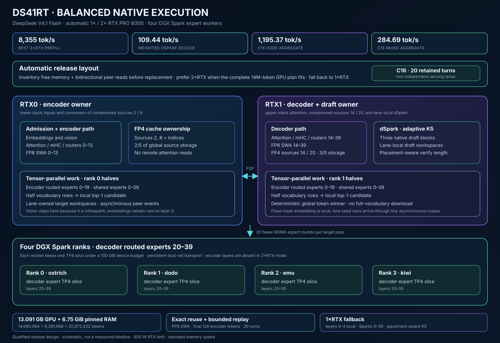

# DS41RT

DS41RT serves the official [DeepSeek V4.1 Flash](https://huggingface.co/deepseek-ai/DeepSeek-V4.1-Flash) checkpoint across one or two RTX PRO 6000 Blackwell coordinator GPUs and four DGX Spark expert workers. It combines native target execution, local dSpark speculative decoding, token-level prefix reuse, tools, constrained output, and vision in one OpenAI-compatible service.

The historical official-image v6 campaign used an enforced **400 W power limit** and **standard 14,001 MHz maximum memory speed with no memory overclock**. Its loaded memory clock reached 13,365 MHz; the RTX driver was 595.91.07. The four GB10 workers used driver 580.159.03. V7 quant measurements and their outstanding provenance are identified separately below.

[](docs/native-path-execution.svg)

## Performance

The official full checkpoint remains the default. Its measurements are the historical [v6 campaign](docs/release-v6-performance.md), **not re-campaigned for v7**. The new NVFP4 and EXL3 measurements use the v7 raw-result package; their reports below distinguish recorded controls from outstanding provenance and qualification.

The release protocol uses **400 W per RTX card and standard memory speed, without a memory overclock**. Reported throughput cells use three samples. Reasoning code uses high-effort thinking and counts reasoning plus final-answer tokens; other throughput cases disable thinking. The official v6 campaign kept the experimental TP2 switches off.

**Headlines.** Tokens/s across all six configurations. Prefill is the best cell median
from a completed, passing matrix; decode is C1 dSpark, with a weighted nine-category
score excluding counting. `Δ` compares two RTX cards with one for the official and
NVFP4 pairs; EXL3 compares different deployment profiles, not isolated second-GPU scaling.

| Measurement | Official 1x | Official 2x | Δ | NVFP4 1x | NVFP4 2x | Δ | EXL3 1x | EXL3 2x | Δ |
|---|---:|---:|---:|---:|---:|---:|---:|---:|---:|
| Prefill | 7,824 | 8,355 | +6.8% | — | 7,432 | — | 2,015 | 5,702 | +182.9% |
| Counting decode | 161.58 | 221.64 | +37.2% | 113.32 | 152.25 | +34.4% | 163.55 | 337.35 | +106.3% |
| Weighted decode | 92.00 | 109.44 | +19.0% | 66.60 | 80.12 | +20.3% | 88.10 | 145.10 | +64.7% |
| C1 code decode | 130.41 | 155.70 | +19.4% | 88.77 | 109.20 | +23.0% | 123.54 | 222.06 | +79.7% |

New-quant reports: [NVFP4 W4A4](docs/release-v7-nvfp4-performance.md) · [EXL3 K2 (including 1x compact)](docs/release-v7-exl3-k2-performance.md).

EXL3 1x uses one RTX PRO 6000 with a **32 GiB total budget including headroom**
and **two TP2 Sparks**; EXL3 2x uses no Sparks. This simulates RTX 5090 memory
capacity, not its performance, and the change column is not isolated second-GPU
scaling. Both EXL3 prefill campaigns completed all 30 cells. Decode completion
checks passed **29/30 for EXL3 1x** and **28/30 for EXL3 2x**: the failed
high-effort reasoning samples exhausted 4,096 output tokens with no final code;
throughput includes them. See [compact setup and residency](docs/release-v7-exl3-compact.md)
and the [configuration accounting chart](docs/release-v7-configurations.svg).
No physical RTX 5090 has been tested; the same-capability grid checks used RTX PRO 6000.
V7 release Docker images have not been built or published; runtime evidence is WIP.
NVFP4 1x best prefill remains unmeasured after an interrupted campaign and is not estimated.

**Official image only below.** Every remaining performance table in this section is
preserved from v6, not re-measured for v7. Older official-reference, acceptance and
tool-evaluation results retain their separately named historical campaigns; none
qualifies either new quant.

**Content-type decode.** Median tokens/s. Official Flash values are the historical one-shot reference, including its prior fable wording; they were not rerun.

| Case | 1 RTX target | 1 RTX dSpark | 2 RTX target | 2 RTX dSpark | Historical official Flash |
|---|---:|---:|---:|---:|---:|
| Code | 49.08 | 130.41 | 51.67 | 155.70 | 345.90 |
| Code with reasoning | 47.51 | 100.27 | 50.74 | 126.08 | — |
| Math | 45.77 | 134.22 | 48.45 | 134.13 | 285.33 |
| Fable | 44.72 | 56.49 | 48.25 | 67.88 | 123.63 |
| Hello | 44.75 | 61.51 | 48.39 | 98.04 | 141.10 |
| Topic | 46.28 | 73.57 | 48.59 | 87.10 | 169.24 |
| Natural JSON | 47.37 | 103.83 | 50.07 | 133.90 | 175.33 |
| Schema JSON | 48.50 | 105.79 | 50.84 | 102.92 | HTTP 400 |
| Multilingual | 45.84 | 74.10 | 49.50 | 82.97 | 183.61 |
| Counting 1–200 | 49.36 | 161.58 | 49.53 | 221.64 | 427.29 |

**1 RTX prefill matrix.** Median effective tokens/s after shape warmup and verified parent reuse.

| Retained base | +1K | +2K | +4K | +8K | +16K | +32K |
|---|---:|---:|---:|---:|---:|---:|
| 0K | 3,005 | 4,031 | 6,950 | 7,493 | 7,801 | 7,824 |
| 32K | 2,463 | 3,326 | 5,379 | 6,140 | 6,598 | 6,863 |
| 64K | 2,242 | 3,103 | 4,961 | 5,665 | 6,151 | 6,361 |
| 128K | 1,928 | 2,718 | 4,205 | 4,914 | 5,343 | 5,530 |
| 256K | 1,463 | 2,122 | 3,195 | 3,797 | 4,156 | 4,306 |

**2 RTX prefill matrix.** Median effective tokens/s after shape warmup and verified parent reuse.

| Retained base | +1K | +2K | +4K | +8K | +16K | +32K |
|---|---:|---:|---:|---:|---:|---:|
| 0K | 4,725 | 6,369 | 7,825 | 8,185 | 8,355 | 8,290 |
| 32K | 3,683 | 5,153 | 6,373 | 6,930 | 7,207 | 7,251 |
| 64K | 3,221 | 4,626 | 5,673 | 6,226 | 6,507 | 6,567 |
| 128K | 2,588 | 3,678 | 4,655 | 5,202 | 5,486 | 5,556 |
| 256K | 1,770 | 2,697 | 3,336 | 3,847 | 4,126 | 4,229 |

**Decode over retained context.** Weighted nine-category dSpark tokens/s with verified prefix reuse.

| Retained base | 1 RTX | 2 RTX | Change |
|---|---:|---:|---:|
| 0K | 86.85 | 104.21 | +20.0% |
| 2K | 85.97 | 103.81 | +20.7% |
| 32K | 83.28 | 100.72 | +20.9% |
| 64K | 82.64 | 102.15 | +23.6% |
| 128K | 86.67 | 98.40 | +13.5% |
| 256K | 80.02 | 92.78 | +15.9% |

**Concurrency scaling.** Median aggregate tokens/s from earliest first output to final completion, including admission gaps.

| Concurrency | 1 RTX counting | 2 RTX counting | 1 RTX code | 2 RTX code | 1 RTX topic | 2 RTX topic |
|---|---:|---:|---:|---:|---:|---:|
| 1 | 159.32 | 211.83 | 137.43 | 171.96 | 74.63 | 96.94 |
| 2 | 252.73 | 314.71 | 218.48 | 279.69 | 125.39 | 163.79 |
| 4 | 454.48 | 586.05 | 384.41 | 476.04 | 225.99 | 260.73 |
| 8 | 736.37 | 973.21 | 625.30 | 749.73 | 333.06 | 447.59 |
| 16 | 1,267.07 | 1,508.81 | 1,069.16 | 1,195.37 | 601.90 | 622.81 |

**Mixed traffic.** Code/fable/topic mix; aggregate tokens/s median and range across three sweeps.

| Concurrency | 1 RTX | 2 RTX |
|---|---:|---:|
| 1 | 104.01 (97.36–130.92) | 156.41 (144.89–160.71) |
| 2 | 107.10 (100.71–114.91) | 140.72 (136.36–141.02) |
| 4 | 139.42 (135.51–161.87) | 184.62 (171.39–186.38) |
| 8 | 147.90 (145.71–164.74) | 211.97 (206.42–215.89) |
| 16 | 191.75 (183.09–193.95) | 284.69 (281.08–296.28) |

**Deployment and cache capacity.** RAM bytes include staging and snapshot overhead. Combined tokens count each logical source once; active requests must fit the GPU pool.

| Configuration | RTX expert layers | Spark resident / active layers / budget | Global FP4 source pool | RAM cache | Combined usable tokens | Prompt / turn retention |
|---|---:|---:|---:|---:|---:|---:|
| 1 RTX | 0–4, TP1 | 40 / 35 / 100 GiB each | 16.701 GB / 18,736,128 usable + 28,672 private-tail tokens | 3.25 GiB pinned / 2,235,904 logical tokens | 20,972,032 | 20 / 20 |
| 2 RTX | 0–19, TP2 | 20 / 20 / 100 GiB each | 13.091 GB / 14,680,064 usable + 28,672 private-tail tokens | 6.75 GiB pinned / 6,291,968 logical tokens | 20,972,032 | 20 / 20 |

**Startup.** Standard launcher to API readiness, including orchestration; one observation per layout.

| Configuration | Seconds |
|---|---:|
| 1 RTX | 58.63 |
| 2 RTX | 31.71 |

**Memory after readiness.** GPU allocations include weights, KV and workspaces; later graph capture can consume additional memory.

| Configuration | Logical RTX | Loaded MiB | Free MiB | Planned runtime reserve MiB |
|---|---:|---:|---:|---:|
| 1 RTX | 0 | 94,590.00 | 2,661.00 | 2,048.00 |
| 2 RTX | 0 | 95,132.00 | 2,119.00 | 800.00 |
| 2 RTX | 1 | 95,738.00 | 1,510.00 | 800.00 |

**Historical native draft acceptance.** V5 measurements, not rerun for v6 or v7: C1, three requests per content type. Accepted/verified percentage and mean emitted tokens per nonterminal cycle in parentheses. Schema JSON is grammar-constrained; reasoning code includes reasoning and final output. Adaptive selection omits unverified drafts, so these are serving rates, not fixed-history agreement.

| Content | Historical 1 RTX | Historical 2 RTX |
|---|---:|---:|
| Code | 90.67% (5.26) | 74.89% (5.82) |
| Code with reasoning | 78.90% (3.74) | 68.83% (3.92) |
| Math | 90.97% (5.55) | 69.25% (5.21) |
| Fable | 52.86% (1.79) | 40.70% (1.77) |
| Hello | 65.12% (2.75) | 35.33% (2.43) |
| Topic | 61.93% (2.47) | 49.38% (2.47) |
| Natural JSON | 82.14% (4.17) | 62.14% (4.00) |
| Schema JSON | 75.40% (4.65) | 54.76% (4.29) |
| Multilingual | 57.33% (2.22) | 50.37% (2.38) |

**Historical native tool calling.** The three v4 full-checkpoint campaigns retained in v5; not rerun for v6 or v7. High-effort thinking was enabled, and failures remain in the scores.

| Run | Basic | Hard | Total |
|---|---:|---:|---:|
| 2026-09-16T04-12-34.961137Z_2214ecfb | 124/138 | 31/38 | 155/176 |
| 2026-09-16T04-17-40.551606Z_43911d6a | 126/138 | 34/38 | 160/176 |
| 2026-09-16T04-22-39.602726Z_81eaa393 | 123/138 | 33/38 | 156/176 |

Historical EXL3 performance, acceptance and quantization analysis are preserved in the [v5 performance report](https://github.com/tpurtell/ds41rt/blob/v5/docs/release-v5-performance.md); they are not v6 measurements.

## Getting started

The release topology requires:

- one Linux amd64 host with one or two RTX PRO 6000 Blackwell 96 GB GPUs;
- four ARM64 DGX Spark hosts reachable over passwordless SSH;
- Docker with the NVIDIA Container Toolkit on all five hosts;
- IP connectivity for the expert fabric and `/dev/infiniband` access for the qualified RoCE path;
- the pinned model snapshot in the same `HF_HOME` layout on every host.

Weights are mounted read-only from the host Hugging Face cache and are not included in the repository or images.

Clone the source and initialize its pinned dependencies:

```bash
git clone --recurse-submodules https://github.com/tpurtell/ds41rt.git
cd ds41rt
git submodule update --init --recursive
```

Edit [`ds41rt.config`](ds41rt.config) for the deployment. At minimum, verify the four `SPARK_*_HOST` names and `SPARK_*_LANE_A` addresses. Configure all four `LANE_B` values for the qualified secondary rail or leave all four empty. Pin `COORDINATOR_GPU_UUID` and `COORDINATOR_GPU_PCI_BUS_ID` on multi-GPU hosts. Keep `MODEL_REVISION` synchronized with the snapshot installed on every machine.

The official full checkpoint remains the default. To opt into the routed-expert EXL3 checkpoint while retaining the normal FP8 PLE tables, set:

```bash
MODEL_ID=wrldsuksgo2mars/DeepSeek-V4.1-EXL3-K3.25-v1
MODEL_REVISION=cfd4ca1d1934a8e81dd2d7515598d4ce288e8b88
EXL3_PAIRED_TP4=on
```

Install that exact snapshot on the coordinator and all four Sparks. Historical
EXL3 performance and FP4-PLE analysis remain in the linked v5 performance report;
v6 treats EXL3 as a compatibility path and reports performance for the official
checkpoint.

The two v7 checkpoints need no extra switches: set `MODEL_ID` and
`MODEL_REVISION` to the snapshot and the engine detects the expert format from
the checkpoint's config. The NVFP4 publication runs in the same topologies as
the official checkpoint, and the EXL3 2 bpw publication runs either fully on
two cards with no Sparks or, on a single card, in the compact profile:

```bash
MODEL_ID=diffbot/DeepSeek-V4.1-Flash-EXL3-2.0bpw-2x-RTX-PRO-6000
MODEL_REVISION=28b7ab71ba2eb15569b08b91a8ea07df8eda8a75
SPARK_COUNT=2              # one RTX card with a 32 GiB ceiling, two Sparks
```

`SPARK_COUNT=2` requires an EXL3 checkpoint, caps the card at 32 GiB including
headroom, and uses two Spark workers instead of four. NVIDIA's W4A4
publication needs no such switch:

```bash
MODEL_ID=nvidia/DeepSeek-V4.1-Flash-NVFP4
MODEL_REVISION=3431dde3247c13b5957f682b1e3c6fcae2566079
```

To use the published images, pull the coordinator image locally and the Spark image on each worker:

```bash
docker pull ghcr.io/tpurtell/ds41rt-coordinator:v6
for host in ostrich dodo emu kiwi; do
  ssh "$host" docker pull ghcr.io/tpurtell/ds41rt-spark-expert:v6
done
./run.sh --dry-run
./run.sh
```

Building from source exports CUDA kernels on the coordinator GPU and the first Spark. Stop existing serving processes on those build devices to leave GPU memory available, then run:

```bash
./build.sh
./run.sh --dry-run
./run.sh
```

`build.sh` compiles amd64 coordinator artifacts locally, compiles ARM64 expert artifacts natively on the first Spark, verifies source and dependency identity, and distributes the Spark image to all configured workers. A subset such as `./build.sh --spark-hosts ostrich,dodo` limits build and distribution only; serving still needs all four ranks.

The standard launch listens on port **8000**. Replace an existing deployment with `./run.sh --restart`; stop it with `./stop.sh`. A basic request is:

```bash
curl http://127.0.0.1:8000/v1/chat/completions \
  -H 'Content-Type: application/json' \
  -d '{
    "model": "deepseek-ai/DeepSeek-V4.1-Flash",
    "messages": [{"role": "user", "content": "Write a CUDA haiku."}],
    "stream": false
  }'
```

Thinking is enabled at **high** effort when a request omits thinking controls. Pass `"reasoning_effort":"low"`, `"high"`, or `"max"` to select an effort, `"reasoning_effort":"none"` to turn it off, or `"thinking":{"type":"disabled"}` to disable it explicitly. Responses keep reasoning and final content separate.

## Runtime options

Command-line values override [`ds41rt.config`](ds41rt.config) for one launch:

| Option | Default | Purpose |
|---|---:|---|
| `--listen HOST:PORT` | `0.0.0.0:8000` | API bind address |
| `--rtx-gpus auto\|1\|2` | `auto` | Select two feasible peer GPUs automatically, or force a layout |
| `--concurrency N` | `16` | Active requests, 1–16 |
| `--kv-pool-size SIZE` | automatic | Exact global KV/index pool; B, MB, GB, MiB, or GiB |
| `--host-cache-bytes auto\|SIZE` | `auto` | Pinned RAM paging sized from GPU capacity, retention slots and context limit; `0` disables |
| `--memory-reservation SIZE` | device plan | Total GPU occupancy ceiling as bytes or a percentage |
| `--prefix-cache-entries N` | `20` | Independent limits for retained completed turns and prompt snapshots |
| `--max-context-tokens N` | `1,048,576` | Per-request context maximum |
| `--max-output-tokens N` | `393,216` | Model output maximum |
| `--prefill-batch-tokens N` | `2,048` | Prefill step size, 80–4,096 |
| `--dspark` / `--no-dspark` | enabled | Enable or disable speculative decoding |
| `--restart` | off | Replace the running five-host deployment |
| `--dry-run` | off | Validate configuration, images, hosts, model, and devices without starting services |

V6 source builds additionally accept `--tp2-attention`, `--tp2-query-projection`,
`--tp2-output-projection` and `--tp2-dspark-experts`. These independent experiments
require two RTX GPUs and default to off; use `--no-tp2-…` to override an enabled
recipe setting. Attention replicates KV; draft expert TP2 requires native weights
and dSpark, and leaves draft attention/projections on RTX1. Current measurements
do not establish a consistent decode win.

Automatic RTX selection checks physical UUIDs, bidirectional peer reads, the
requested cache or memory ceiling, and available memory. With `--restart`, it
adds back only memory owned by the coordinator container being replaced; other
GPU processes still count against feasibility. The chosen UUID order is passed
through unchanged as logical RTX0/RTX1. Dual mode publishes its live memory-derived RTX layer boundary before starting
Spark workers, so only the remaining routed layers load there. Single mode keeps
all 40 layers on every Spark. Restarting the same coordinator container preserves
its acknowledged boundary; `./run.sh --restart` replans the deployment.

With no explicit pool setting, single-RTX mode uses a **16.701 GB global pool
for 18,736,128 usable tokens plus 28,672 private-tail tokens**. Dual-RTX mode uses
a **13.091 GB global pool for 14,680,064 usable tokens plus 28,672 private-tail
tokens**. The 20 completed-turn and prompt-snapshot limits
remain independent of the aggregate token budget. `--kv-pool-size` selects the
exact global pool. The recipe defaults to `--host-cache-bytes auto`, which keeps
usable GPU plus RAM token capacity above `prefix-cache-entries × max-context-tokens`;
snapshot overhead and restore staging are reserved separately. Explicit RAM sizes
and `0` override that automatic capacity guarantee. `--memory-reservation` caps total planned device occupancy;
when both are present, the exact pool must fit under the ceiling. A reservation
without an explicit KV size uses remaining capacity for KV before filling extra
RTX expert layers; specify both to preserve a chosen pool under a tighter ceiling. Smaller values
are useful for side-by-side development servers:

```bash
./run.sh --listen 0.0.0.0:18000 --concurrency 2 \
  --max-context-tokens 65536 --max-output-tokens 8192 \
  --kv-pool-size 2GiB --prefix-cache-entries 3 --no-dspark
```

The API supports incremental SSE, cancellation, tools, parallel tool calls, JSON and supported JSON Schema constraints, and up to sixteen images in a prompt. Image input accepts data URLs and bounded HTTP/HTTPS URLs. See the [thinking](docs/release-v1-thinking.md), [tool serving](docs/release-v1-tool-serving.md), [output constraints](docs/release-v1-response-constraints.md), and [vision](docs/release-v1-vision-serving.md) qualification records.

## Engineering

Single-RTX dSpark defaults to adaptive K5 with placement-aware costs calibrated
for the 400 W RTX and four Spark configuration. The binary embeds the profile
and selects costs from the expert layers actually installed on each backend.
Native serving accepts `--dspark-draft-limit 7` for K7;
`DS41RT_ADAPTIVE_COST_PROFILE=legacy` restores the previous cost formula.
The [development comparison](docs/phase2-adaptive-verification.md#single-rtx-default-comparison)
records the policy tradeoffs; the release performance tables above measure the selected K5 default.

The coordinator owns attention, mHC residuals, embeddings, mapped Engram lookup, routers, shared experts, vision, all three dSpark stages, the vocabulary head, sampling, cache ownership, and the API. Dual mode splits this work by dependency across the RTX pair, uses TP2 for all shared experts and encoder routed experts, and partitions vocabulary rows for deterministic parallel greedy selection. Four Sparks retain only decoder routed experts in dual mode and all routed experts in single mode.

Compressed global KV uses FP4 E2M1 values with group-16 E4M3 scales. The 128-token sliding windows remain FP8, and the independent selection index uses its own FP4 format. A token radix shares immutable pages, uses copy-on-write for divergent suffixes, and restores retained target/dSpark state. Partial matches replay no more than the final 128 encoder tokens; exact hits can reuse saved first-token logits. The default keeps 20 completed turns and 20 prompt snapshots under LRU eviction.

The [engineering report](docs/ENGINEERING.md) covers the final kernels, execution lanes, cache transactions, prefix policy, transport, dSpark, vision, constrained decoding, memory planning, and startup path. [`architecture.md`](architecture.md) gives the compact ownership contract.

## Qualification

The clean v6 candidate uses the official full checkpoint and three samples per
performance cell. Its release qualification covers:

- matched one/two-RTX target-only and dSpark throughput for nine content categories plus counting;
- one/two-RTX prefill matrices covering 30 retained-base/suffix cells each, retained-prefix decode through 256K, and separate 2K controls;
- counting, code, and topic at C1, C2, C4, C8, and C16, plus three mixed-traffic sweeps per layout;
- cache restoration and overload behavior under a one-off two-minute tiny-pool pressure torture test;
- independent correctness and serving checks for replicated-KV attention, query projection, output projection, and dSpark routed-expert TP2, followed by a combined opt-in smoke check;
- one basic EXL3 compatibility smoke, without a new EXL3 performance campaign;
- clean five-host candidate builds and standard-script deployment smokes, with binary, image, checkpoint, telemetry, and raw-evidence provenance.

Historical native draft-acceptance and high-effort tool campaigns are reproduced
in the performance section and explicitly identified as measurements that were
not rerun for v6. The performance report and downloadable qualification-evidence
archive preserve failures and measured limitations alongside passes. The
[v6 release plan](docs/release-v6-plan.md) records the rejected TP2 experiments;
the [Phase 2 engineering log](docs/phase2-dual-rtx.md) covers the earlier dual-RTX
implementation sequence.

## RDMA tools for DGX Spark and RoCE PCs

Move model weights, checkpoints, datasets, and container images between your local AI machines with [Local AI Tap](https://github.com/tpurtell/local-ai-tap):

- **`rdmasync`** — rsync-style file synchronization with RDMA bulk transfers.
- **`rdmapipe`** — stream command output over RDMA into a remote command, using SSH for authentication and orchestration.

Native **ARM64 and AMD64 binary bottles** are available for Linux, including DGX Spark. Homebrew installs the dependencies automatically.

**Install on both endpoints**, with [Homebrew](https://brew.sh/) already installed:

```bash
brew tap tpurtell/local-ai https://github.com/tpurtell/local-ai-tap.git

if brew commands | grep -qx trust; then
  brew trust --tap tpurtell/local-ai
fi

brew install tpurtell/local-ai/rdmapipe tpurtell/local-ai/rdmasync
```

Replace `spark` below with your machine’s SSH hostname or alias.

**Copy model files over RDMA:**

```bash
rdmasync -a --rdma=required \
  --rsync-path=/home/linuxbrew/.linuxbrew/bin/rdmasync \
  ./models/ spark:~/models/
```

**Stream an ARM64 container image directly into a Spark:**

```bash
docker image save --platform linux/arm64 my-ai-image:latest |
  rdmapipe \
    --remote-path=/home/linuxbrew/.linuxbrew/bin/rdmapipe \
    spark -- docker image load
```

The Docker example requires an ARM64 image locally and Docker access on both machines.

Use these tools on a trusted, configured RDMA/RoCE fabric with working Linux drivers and SSH access. Bulk RDMA traffic is not encrypted.

[Installation guide and documentation →](https://github.com/tpurtell/local-ai-tap#readme)

## Thanks

DS41RT builds on the official DeepSeek V4.1 Flash model and reference implementation, NVIDIA CUDA and DGX Spark, [SparkInfer](https://github.com/efeslab/SparkInfer), [XGrammar](https://github.com/mlc-ai/xgrammar), Hugging Face, and the open-source Rust, Python, and CUDA ecosystems.

DS41RT is available under the [MIT License](LICENSE). Dependency licenses and notices are in [THIRD_PARTY_NOTICES.md](THIRD_PARTY_NOTICES.md).
