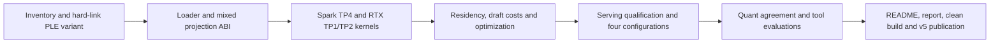

# V5: mixed-projection EXL3 serving

Support routed-expert EXL3 on one or two RTX cards and four Sparks, keeping
weights compressed through the production decode and prefill paths. Qualify
the supplied K3.25 checkpoints, measure the resulting residency and speed,
and publish v5. V4 remains the full-model baseline until measured replacement
tables are ready.

## Frozen checkpoint inputs

| Checkpoint | Revision | Safetensors bytes |
| --- | --- | ---: |
| `wrldsuksgo2mars/DeepSeek-V4.1-EXL3-K3.25-v1` | `cfd4ca1d1934a8e81dd2d7515598d4ce288e8b88` | 441,361,180,176 |
| `wrldsuksgo2mars/DeepSeek-V4.1-EXL3-K3.25-FP4PLE-v1` | `04cada4d3f38584f069e0a7debc53720832d738e` | 349,198,438,400 |

Local manifests contain 47,232 routed projections, including the three dSpark
blocks. Gate: 13,530 K3 and 2,214 K4; up: 12,054 K3 and 3,690 K4;
down: 9,840 K3 and 5,904 K4. Projection geometry is 5120 by 2304
(transposed for down). Checkpoint-average 3.25 bpw is descriptive; kernel
selection must use each projection's integer tier and validated storage.
These are inventory observations, not quality or performance results.

Shards 1–48 have identical content-addressed blob names in both local snapshots.
Only shards 49–52 change for PLE. Reconstruct each Spark snapshot with hard links
to unchanged base blobs and transfer only the four replacement shards and variant
metadata. Verify hashes and shared inodes before publishing the local snapshot ref.
Never overwrite a linked base file in place.

## Component treatment and acceptance

| Component | Existing implementation to inspect | Required v5 treatment |
| --- | --- | --- |
| Catalog and metadata | Production `v41_config.rs` / `v41_catalog.rs`; inherited `exl3_format.rs` as a reference | Recognize routed-only V4.1 schema, validate actual projection tiers/shapes/rotations; support integer tiers 2–5 without assuming uniform gate/up/down. Preserve native non-routed tensors and both PLE formats. |
| Weight packing and residency | Production `v41_expert_staging.rs` and daemon `v41_experts.rs`; older `../ds4rt` slabs as a reference | Build exact compressed TP4 Spark, TP1 RTX and TP2 RTX slices with correct rotation axes. Account for descriptors, scratch, graphs, dSpark, KV and PLE; fill additional RTX layers from the bottom. |
| Mixed expert compute | Vendored B12x mixed trellis and `../brandon-glm-5.3-flash/recipe` projection-native adapter | Reuse applicable projection-tier contracts and kernels, port native AOT ABI for V4.1 geometry, retain static route maps and fixed workspace. No full-weight dequantization fallback or allocation on replay. |
| Numerical contracts | EXL3 dequant/rotation reference and original native routed path | Validate K2–K5, unequal projection tiers, TP reductions, routing weights, clipping, tails, changed routes, poisoned scratch, graph replay, and real checkpoint projections on both GPU types. |
| Decode/prefill policy | Current independent lanes and adaptive dSpark | Measure actual Spark/RTX costs and retune for compressed residency; preserve independent lanes, fast loading and full-model performance. Profile structural bottlenecks before repeated tuning sweeps. |
| Serving | Current native cache, vision, constrained output and cancellation paths | Qualify actual one/two-RTX quant serving, dSpark, retained-context reuse, long needles, branches, tools, vision and recovery. FP4 PLE needs actual engine support and quality evidence. |

B12x changes go to the existing fork's master, with a matching DS41RT dependency
pin and source provenance. Follow `third_party/sparkinfer/AGENTS.md`: CuTe DSL
core compute, plan-time policy, dynamic live sizes, stable graph storage, and
64-bit pool offsets. Treat inherited K2/K3 exports as unqualified for the new
geometry; their presence does not establish V4.1 serving support.

An early partition constraint needs explicit resolution: 2304 intermediate
channels divided equally across four Sparks gives 576 channels per rank,
which is not aligned to the old H128 rotation slices. RTX TP2 gives 1152,
which is H128-aligned. Compare an aligned uneven Spark partition (640, 640,
512, 512) with an implementation that correctly handles split rotation blocks;
do not merely relax the old divisibility check. The chosen design must preserve
the full projection's rotation math and be measured on the four-worker path.
The vendored projection-native B12x preparation already recognizes ordered
consecutive K2–K6 families, but native exports, actual supported family widths,
checkpoint conversion and the V4.1 serving integration still require inspection.

## Measurements and publication tables

Normal performance benchmarks use **FP8 PLE**, for both full and EXL3 models.
Use matched prompts/configurations and three samples where applicable. State
400 W power limits, standard memory speed, cache bytes plus token capacities,
actual resident layers and Spark memory budgets. Record raw evidence and source
identities. Do not compile while collecting GPU performance measurements.

- Headlines: one RTX, two RTX, and two-versus-one change for full and EXL3.
  Remove the old v3-change table.
- Content-type decode: full and EXL3 tables.
- Prefill: four matrices (full/EXL3 times one/two RTX). Drop short-prefill controls.
- Retained-context decode: one table with one/two/change columns for each model;
  omit old-version deltas.
- Concurrency: two tables, full and EXL3, each covering counting/code/topic and
  one/two RTX. Mixed traffic adds two EXL3 columns.
- Deployment/capacity and startup: four configurations. Layout memory: six
  device rows (one single-card plus two dual-card rows for each model).
  Omit the peak telemetry table; retain raw telemetry in evidence.
- Tool calls: retain full-model results, add three high-thinking EXL3 FP8-PLE
  runs and three EXL3 NVFP4-PLE runs, with scores and failures preserved.
- Replicate all release tables in README and the linked performance report.

After engine optimization is complete and the candidate is ready to publish,
perform a one-time quant analysis: size, shapes, tier distribution and top-1
agreement against the original model. Freeze a diverse shared-input dataset and
reference token choices so comparisons do not drift onto different generated
histories. Report sample counts, per-category agreement, uncertainty and exact
protocol. Budget approximately 3–5 minutes of evaluation runtime per quant;
measure both FP8-PLE and NVFP4-PLE variants. This is not a recurring release suite.

Switch the recipe default to EXL3 with **FP8 PLE** only if measured top-1 agreement
exceeds 90% and measured serving performance justifies it. Otherwise retain the
full-model default and report the evidence. Never infer the anticipated expert
bandwidth benefit from bits alone.

## Completion gates

- [x] Verified Spark snapshots, unchanged hard links and four replacement shards.
  [Per-host manifest and verification](release-v5-spark-snapshots.json).
- [ ] Generic mixed projection loader, residency and native compute for RTX/Spark.
- [ ] GPU numerical and graph correctness, including real checkpoint projections.
- [ ] Optimized one/two-RTX decode, prefill, startup and memory without clear full-model regression.
- [ ] Serving and quality qualification, including both PLE variants as specified.
- [ ] Four-configuration release performance tables and raw evidence.
- [ ] One-time quant analysis and bounded top-1 comparisons; evidence-based default decision.
- [ ] Clean build/run, fork and engine commits pushed, v5 images/assets/notes published and verified.

## Loader contract progress

`v41_exl3.rs` adds a native V4.1 manifest reader and per-projection descriptors.
It validates the original non-routed architecture against the existing strict
config contract, requires matching compact/external quant metadata, and checks
the exact backbone/dSpark projection inventory. K2–K5 are accepted individually;
fractional per-projection tiers, incorrect shapes and rotation axes are rejected.
Physical header validation checks tensor dtype, shape and byte length against
the declared tier. PLE metadata is retained for its subsequent storage validator.

The descriptor exposes an H128-aligned TP partition candidate. This establishes
slice coverage, not GPU numerical equivalence or a selected performance policy.
Both supplied local checkpoints passed checks against all 188,928 physical
routed tensor headers: FP8 PLE in 2.48 seconds and FP4 PLE in 2.66 seconds,
without reading weight payloads. Raw outputs are preserved in
[FP8-PLE evidence](evidence/v5-loader-exl3-fp8ple.log.gz) and
[FP4-PLE evidence](evidence/v5-loader-exl3-fp4ple.log.gz). The loader unit suite passed
72 tests (two opt-in fixture tests ignored); explicit checkpoint checks are run
separately with `DS41RT_EXL3_SNAPSHOT` and `cargo test -p ds41rt-loader
v41_exl3 --lib -- --include-ignored --nocapture`.

The production `read_official_v41_catalog` now validates full, EXL3 FP8-PLE,
and EXL3 NVFP4-PLE inventories, including unchanged non-routed tensors and exact
index/header coverage. Numbered shard counts are derived for EXL3 rather than
fixed to the supplied artifact. The original full checkpoint still validates.

`v41_exl3_staging.rs` adds caller-buffer reads of packed projections and rotations.
It supports TP1/TP2/TP4 with complete H128 blocks and 64-bit file offsets. Full
reads avoid the column-copy scratch path. Synthetic K2–K5 reads at offsets beyond
2 GiB pass; K3/K4 gate/up/down and rotation reads from the actual checkpoint
reconstruct the full bytes exactly across TP2 and TP4. The daemon compiles with
the catalog changes. [Loader evidence](release-v5-exl3-loader.json) records all
three validated catalogs and the staging checks.

The catalog accounts for rank-specific storage, including replicated hidden-axis
rotations. Under the current aligned partition candidate, all-backbone Spark
weights are 61.87 / 61.87 / 49.59 / 49.59 GB, versus 72.19 GB on each Spark for
the full checkpoint. These are checkpoint storage budgets before RTX offload,
kernel conversion, workspace and runtime overhead—not final deployment budgets.

Native packing, GPU execution and residency integration remain required. The
native FP4 packer explicitly rejects EXL3 input; FP4 PLE requires its own row
gather implementation. Neither format is claimed as a working serving backend
yet. No v5 runtime or quality acceptance is claimed.

## Initial GPU geometry check

The inherited K3/K4 mixed component passed serial-tier comparison, masked routes,
repeatability and CUDA graph replay at hidden=5120, intermediate=640 on SM120
(188 SMs). This uses synthetic small activations and is not full V4.1 numerical
qualification or a serving benchmark. The bounded probe is
`python/tools/qualify_v41_exl3_geometry.py`.

Fixed mixed-Trellis SwiGLU clipping in fork `c024d14c`, pushed to fork master
and pinned in DS41RT. Both mixed compiler entry points and the production plan
now forward the model limit to the common kernel, whose specialization identity
already includes clipping. Three clipping-sensitive component tests pass on
SM120 and SM121, covering two-tier direct/packed and three-tier packed execution.
The clipped reference differs from its finite unclipped control by more than
1%, and mixed output matches clipped serial execution within 0.4% relative norm.
Repeatability and graph replay pass. [Evidence and fixture correction](release-v5-exl3-swiglu.json)
preserve the initial overflowing control and its bounded replacement. Native
AOT integration and model-level numerical qualification remain pending.
