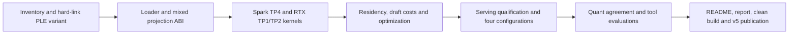

# V5: mixed-projection EXL3 serving

Support routed-expert EXL3 on one or two RTX cards and four Sparks, keeping
weights compressed through the production decode and prefill paths. Qualify
the supplied K3.25 checkpoints, measure the resulting residency and speed,
and publish v5. V4 remains the full-model baseline until measured replacement
tables are ready.

## Frozen checkpoint inputs

| Checkpoint | Revision | Safetensors bytes |
| --- | --- | ---: |
| `wrldsuksgo2mars/DeepSeek-V4.1-EXL3-K3.25-v1` | `cfd4ca1d1934a8e81dd2d7515598d4ce288e8b88` | 441,361,180,176 |
| `wrldsuksgo2mars/DeepSeek-V4.1-EXL3-K3.25-FP4PLE-v1` | `04cada4d3f38584f069e0a7debc53720832d738e` | 349,198,438,400 |

Local manifests contain 47,232 routed projections, including the three dSpark
blocks. Gate: 13,530 K3 and 2,214 K4; up: 12,054 K3 and 3,690 K4;
down: 9,840 K3 and 5,904 K4. Projection geometry is 5120 by 2304
(transposed for down). Checkpoint-average 3.25 bpw is descriptive; kernel
selection must use each projection's integer tier and validated storage.
These are inventory observations, not quality or performance results.

Shards 1–48 have identical content-addressed blob names in both local snapshots.
Only shards 49–52 change for PLE. Reconstruct each Spark snapshot with hard links
to unchanged base blobs and transfer only the four replacement shards and variant
metadata. Verify hashes and shared inodes before publishing the local snapshot ref.
Never overwrite a linked base file in place.

## Component treatment and acceptance

| Component | Existing implementation to inspect | Required v5 treatment |
| --- | --- | --- |
| Catalog and metadata | Production `v41_config.rs` / `v41_catalog.rs`; inherited `exl3_format.rs` as a reference | Recognize routed-only V4.1 schema, validate actual projection tiers/shapes/rotations; support integer tiers 2–5 without assuming uniform gate/up/down. Preserve native non-routed tensors and both PLE formats. |
| Weight packing and residency | Production `v41_expert_staging.rs` and daemon `v41_experts.rs`; older `../ds4rt` slabs as a reference | Build exact compressed TP4 Spark, TP1 RTX and TP2 RTX slices with correct rotation axes. Account for descriptors, scratch, graphs, dSpark, KV and PLE; fill additional RTX layers from the bottom. |
| Mixed expert compute | Vendored B12x mixed trellis and `../brandon-glm-5.3-flash/recipe` projection-native adapter | Reuse applicable projection-tier contracts and kernels, port native AOT ABI for V4.1 geometry, retain static route maps and fixed workspace. No full-weight dequantization fallback or allocation on replay. |
| Numerical contracts | EXL3 dequant/rotation reference and original native routed path | Validate K2–K5, unequal projection tiers, TP reductions, routing weights, clipping, tails, changed routes, poisoned scratch, graph replay, and real checkpoint projections on both GPU types. |
| Decode/prefill policy | Current independent lanes and adaptive dSpark | Measure actual Spark/RTX costs and retune for compressed residency; preserve independent lanes, fast loading and full-model performance. Profile structural bottlenecks before repeated tuning sweeps. |
| Serving | Current native cache, vision, constrained output and cancellation paths | Qualify actual one/two-RTX quant serving, dSpark, retained-context reuse, long needles, branches, tools, vision and recovery. FP4 PLE needs actual engine support and quality evidence. |

B12x changes go to the existing fork's master, with a matching DS41RT dependency
pin and source provenance. Follow `third_party/sparkinfer/AGENTS.md`: CuTe DSL
core compute, plan-time policy, dynamic live sizes, stable graph storage, and
64-bit pool offsets. Treat inherited K2/K3 exports as unqualified for the new
geometry; their presence does not establish V4.1 serving support.

An early partition constraint needs explicit resolution: 2304 intermediate
channels divided equally across four Sparks gives 576 channels per rank,
which is not aligned to the old H128 rotation slices. RTX TP2 gives 1152,
which is H128-aligned. Compare an aligned uneven Spark partition (640, 640,
512, 512) with an implementation that correctly handles split rotation blocks;
do not merely relax the old divisibility check. The chosen design must preserve
the full projection's rotation math and be measured on the four-worker path.
The vendored projection-native B12x preparation already recognizes ordered
consecutive K2–K6 families, but native exports, actual supported family widths,
checkpoint conversion and the V4.1 serving integration still require inspection.

## Measurements and publication tables

Normal performance benchmarks use **FP8 PLE**, for both full and EXL3 models.
Use matched prompts/configurations and three samples where applicable. State
400 W power limits, standard memory speed, cache bytes plus token capacities,
actual resident layers and Spark memory budgets. Record raw evidence and source
identities. Do not compile while collecting GPU performance measurements.

- Headlines: one RTX, two RTX, and two-versus-one change for full and EXL3.
  Remove the old v3-change table.
- Content-type decode: full and EXL3 tables.
- dSpark acceptance by content type: full versus EXL3 with FP8 PLE, on one
  and two RTX cards. Collect alongside the planned performance runs, covering
  counting, code, topic and the other measured content types. Report accepted
  draft tokens / verified draft tokens (with counts), mean accepted draft tokens
  and emitted tokens per cycle, mean verification length, configured K/policy,
  and zero-acceptance rate. Pair these with TPS and draft/verification timings.
  Match prompts and base contexts; differing K or policies must be explicit so
  raw acceptance percentages are not mistaken for like-for-like comparisons.
- Prefill: four matrices (full/EXL3 times one/two RTX). Drop short-prefill controls.
- Retained-context decode: one table with one/two/change columns for each model;
  omit old-version deltas.
- Concurrency: two tables, full and EXL3, each covering counting/code/topic and
  one/two RTX. Mixed traffic adds two EXL3 columns.
- Deployment/capacity and startup: four configurations. Layout memory: six
  device rows (one single-card plus two dual-card rows for each model).
  Omit the peak telemetry table; retain raw telemetry in evidence.
- Tool calls: retain full-model results, add three high-thinking EXL3 FP8-PLE
  runs and three EXL3 NVFP4-PLE runs, with scores and failures preserved.
- Replicate all release tables in README and the linked performance report.

After kernel optimization and RTX layer placement are settled, recalibrate and
qualify the dSpark adaptive profile for EXL3 on both one- and two-RTX configurations.
Model Spark and RTX expert costs separately according to actual placement, and
measure quantized draft cost as well as target verification cost. Do not reuse
the full-model timing assumptions without measurement. Acceptance measurements
above must explain whether quantizing both target and draft changes useful work
per cycle; higher acceptance alone is not a performance requirement. Investigate
material changes with bounded controls if needed, without automatically repeating
the full qualification suite. FP4 PLE remains limited to tools and top-1 analysis.

After engine optimization is complete and the candidate is ready to publish,
perform a one-time quant analysis: size, shapes, tier distribution and top-1
agreement against the original model. Freeze a diverse shared-input dataset and
reference token choices so comparisons do not drift onto different generated
histories. Report sample counts, per-category agreement, uncertainty and exact
protocol. Budget approximately 3–5 minutes of evaluation runtime per quant;
measure both FP8-PLE and NVFP4-PLE variants. This is not a recurring release suite.

Switch the recipe default to EXL3 with **FP8 PLE** only if measured top-1 agreement
exceeds 90% and measured serving performance justifies it. Otherwise retain the
full-model default and report the evidence. Never infer the anticipated expert
bandwidth benefit from bits alone.

## Completion gates

- [x] Verified Spark snapshots, unchanged hard links and four replacement shards.
  [Per-host manifest and verification](release-v5-spark-snapshots.json).
- [ ] Generic mixed projection loader, residency and native compute for RTX/Spark.
- [ ] GPU numerical and graph correctness, including real checkpoint projections.
- [ ] Optimized one/two-RTX decode, prefill, startup and memory without clear full-model regression.
- [ ] Serving and quality qualification, including both PLE variants as specified.
- [ ] Four-configuration release performance tables and raw evidence.
- [ ] One-time quant analysis and bounded top-1 comparisons; evidence-based default decision.
- [ ] Clean build/run, fork and engine commits pushed, v5 images/assets/notes published and verified.

## Loader contract progress

`v41_exl3.rs` adds a native V4.1 manifest reader and per-projection descriptors.
It validates the original non-routed architecture against the existing strict
config contract, requires matching compact/external quant metadata, and checks
the exact backbone/dSpark projection inventory. K2–K5 are accepted individually;
fractional per-projection tiers, incorrect shapes and rotation axes are rejected.
Physical header validation checks tensor dtype, shape and byte length against
the declared tier. PLE metadata is retained for its subsequent storage validator.

The descriptor exposes an H128-aligned TP partition candidate. This establishes
slice coverage, not GPU numerical equivalence or a selected performance policy.
Both supplied local checkpoints passed checks against all 188,928 physical
routed tensor headers: FP8 PLE in 2.48 seconds and FP4 PLE in 2.66 seconds,
without reading weight payloads. Raw outputs are preserved in
[FP8-PLE evidence](evidence/v5-loader-exl3-fp8ple.log.gz) and
[FP4-PLE evidence](evidence/v5-loader-exl3-fp4ple.log.gz). The loader unit suite passed
72 tests (two opt-in fixture tests ignored); explicit checkpoint checks are run
separately with `DS41RT_EXL3_SNAPSHOT` and `cargo test -p ds41rt-loader
v41_exl3 --lib -- --include-ignored --nocapture`.

The production `read_official_v41_catalog` now validates full, EXL3 FP8-PLE,
and EXL3 NVFP4-PLE inventories, including unchanged non-routed tensors and exact
index/header coverage. Numbered shard counts are derived for EXL3 rather than
fixed to the supplied artifact. The original full checkpoint still validates.

`v41_exl3_staging.rs` adds caller-buffer reads of packed projections and rotations.
It supports TP1/TP2/TP4 with complete H128 blocks and 64-bit file offsets. Full
reads avoid the column-copy scratch path. Synthetic K2–K5 reads at offsets beyond
2 GiB pass; K3/K4 gate/up/down and rotation reads from the actual checkpoint
reconstruct the full bytes exactly across TP2 and TP4. The daemon compiles with
the catalog changes. [Loader evidence](release-v5-exl3-loader.json) records all
three validated catalogs and the staging checks.

The catalog accounts for rank-specific storage, including replicated hidden-axis
rotations. Under the current aligned partition candidate, all-backbone Spark
weights are 61.87 / 61.87 / 49.59 / 49.59 GB, versus 72.19 GB on each Spark for
the full checkpoint. These are checkpoint storage budgets before RTX offload,
kernel conversion, workspace and runtime overhead—not final deployment budgets.

Native packing, GPU execution and residency integration remain required. The
native FP4 packer explicitly rejects EXL3 input; FP4 PLE requires its own row
gather implementation. Neither format is claimed as a working serving backend
yet. No v5 runtime or quality acceptance is claimed.

## Initial GPU geometry check

The inherited K3/K4 mixed component passed serial-tier comparison, masked routes,
repeatability and CUDA graph replay at hidden=5120, intermediate=640 on SM120
(188 SMs). This uses synthetic small activations and is not full V4.1 numerical
qualification or a serving benchmark. The bounded probe is
`python/tools/qualify_v41_exl3_geometry.py`.

Fixed mixed-Trellis SwiGLU clipping in fork `c024d14c`, pushed to fork master
and pinned in DS41RT. Both mixed compiler entry points and the production plan
now forward the model limit to the common kernel, whose specialization identity
already includes clipping. Three clipping-sensitive component tests pass on
SM120 and SM121, covering two-tier direct/packed and three-tier packed execution.
The clipped reference differs from its finite unclipped control by more than
1%, and mixed output matches clipped serial execution within 0.4% relative norm.
Repeatability and graph replay pass. [Evidence and fixture correction](release-v5-exl3-swiglu.json)
preserve the initial overflowing control and its bounded replacement. Native
AOT integration and model-level numerical qualification remain pending.

## Native AOT launch bridge

`export_b12x_v41_exl3_aot.py` exports the mixed compute and epilogue objects,
exact buffer layout (including aliases), generated C bridge and artifact hashes.
The bridge loads on its owning device and launches on the supplied stream;
execution does not allocate host storage or synchronize. Export currently covers
two or three distinct integer tiers, with direct routing limited to two tiers.
Packed route preparation and the final typed serving ABI remain to be connected.

`qualify_v41_exl3_aot.py` passed on RTX SM120 and Spark SM121 using six actual
layer-0 experts with independently mixed K3/K4 gate/up/down projections and an
H128-aligned 640-wide intermediate slice. Native output is bitwise equal to the
same B12x kernels launched through Python at 1, 3 and 16 rows. CUDA graph replay
also matches after changing both inputs and route IDs. This checks the native
launch ABI, not an independent arithmetic reference or full-model quality.

[Results and archived artifacts](release-v5-exl3-aot.json) preserve the tested
binary hashes. Unique execution buffers for this small probe are 7,417,600 bytes
on RTX and 6,628,928 bytes on Spark; these are not deployment memory budgets.
Full expert inventories, TP reduction, packed prefill routing, Spark FP8 wire
input, compressed residency and serving integration still require verification.

`export_b12x_v41_exl3_routes_aot.py` now exports the pinned B12x small-prefix
and parallel histogram/prefix/scatter route helpers into a native CUDA driver
bridge. It uses preallocated caller buffers, validates their sizes/alignment
and non-overlap, and launches on the caller stream without allocation or
synchronization. Module creation is bound to the owning CUDA context.

The standalone CPU oracle passed on both SM120 and SM121 at planned capacities
16 and 1,024 with 384 experts/top-6. Checks include live rows 1, 3, capacity-1
and capacity; randomized mappings, invalid IDs and empty routes; exact route
coverage and block ownership; padding sentinels and untouched buffer guards;
and CUDA graph replay after changing route IDs and mappings. Invalid host-side
row/byte bounds are rejected. [Results and artifacts](release-v5-exl3-routes.json)
also document the initial missing Triton scratch arguments and corrected ABI.
This qualifies standalone route metadata preparation; connecting it to the
mixed compute bridge and native serving remains outstanding.

The combined packed export now includes the native route bridge and validates
its buffer requirements against the mixed execution workspace. Route capacity
uses B12x's bucket policy, including non-power-of-two requested capacities.
Combined route preparation, mixed compute and epilogue passed on six real
layer-0 experts at intermediate width 640: RTX planned capacity 16 and Spark
planned capacity 1,024, each tested at rows 1, 3, capacity-1 and capacity.
Outputs match Python B12x bitwise. Route metadata is poisoned between the
reference and native launch; graph replay changes inputs, reorders routes and
masks some routes. [Combined packed-path evidence](release-v5-exl3-packed.json)
records the tested binaries. Native serving, full expert inventories, TP
reduction and Spark wire input remain pending; these tests use BF16 input.

## Compressed residency plans

`v41_exl3_residency.rs` defines per-layer compressed payload buffers, independent
gate/up/down tier counts, route/projection maps, unit scales and stored FP16
rotations. Each staging job reads one source tensor into reusable caller storage
and lists its destination offsets. Replicated rotation rows share a single read;
no dequantized weight matrix or complete tier-wide staging copy is needed.
Reads check the MCG multiplier and reject non-finite stored rotations.

Synthetic K2–K5 uniform/mixed plans cover TP1/TP2/TP4, proving destination
coverage without overlaps and unchanged compressed byte totals. Uniform plans
use an empty second tier. Four-tier layout coverage does not establish a
four-tier executable kernel; generic execution still needs completion.

[Actual checkpoint evidence](release-v5-exl3-residency.json) verifies all 8,064
staged tensors from backbone layer 0 TP4/rank 0, backbone layer 0 TP2/rank 1,
and dSpark stage 0 TP1 against independent safetensors slices. Route and
descriptor maps and projection counts match B12x. The full loader suite passes
75 tests (three opt-in fixtures ignored), and the daemon compiles. These plans
are not yet connected to native device allocation/loading or serving. Staging
scratch figures in the evidence are minimum capacities; callers may supply
larger preallocated scratch to batch column reads. Startup speed remains to be
measured with the final loader and configuration.

`v41_experts/exl3.rs` now owns compressed GPU buffers and uploads the residency
plan directly. Two banks each hold 16 pinned expert staging slots and bounded
read scratch. Scoped CPU readers fill one bank while the other bank's stream
uploads; bank reuse waits for its own stream. There is no device staging copy.
Stream owners drain before pinned/device storage is released on errors.

[GPU allocation/upload evidence](release-v5-exl3-gpu-residency.json) passed on
SM120 for all 384 experts of layer 0, TP4 rank 2 (width 512), occupying
1,252,798,480 payload bytes. Readback checked 45 destinations across the first,
middle and last experts, plus all initialized metadata. The larger 640-wide
rank was rejected by the free-memory guard while baseline serving was resident;
its GPU upload qualification remains pending. This uses the baseline native
library's memory/copy APIs. The new owner still needs the EXL3 execution adapter
and serving selection; it is not yet a usable quant serving backend.

## Native module adapter and dSpark geometry

The EXL3 exporter now accepts top-3 dSpark and top-6 backbone routing rather
than fixing every export to top-6. A native info function reports geometry,
tier bits and pointer/scalar counts. `ds41rt-ffi::V41Exl3Kernel` owns a loaded
module and its CUDA context handle, validates the reported contract and checks
argument table lengths before launch. It is thread-bound and must outlive all
streams/graphs referencing its code. Execution buffer ownership/order remains
an explicit unsafe contract pending the daemon's bound execution adapter.

[dSpark/native-module evidence](release-v5-exl3-dspark-aot.json) passes for six
real stage-0 experts at width 2304/top-3, rows 1, 3, 15 and 16, including graph
replay with masked routes and poisoned routing metadata. Rust initializes the
same module outside Python and rejects incomplete argument tables. This caught
an incomplete link: Python's globally loaded CuTe runtime masked missing symbols.
The module now explicitly links `cute_dsl_runtime` with undefined-symbol errors
enabled. Full dSpark residency/execution, Rust compute launches, TP integration
and quant serving still need completion and qualification.

## Bound Rust execution

`v41_experts/exl3/execution.rs` now binds resident compressed weights to the
native compute and epilogue modules. Workspace allocation/alias resolution,
LUT upload and launch-table construction occur during setup. Launch updates
live input pointers and row bounds without workspace allocation or host waits.
The exporter now includes a hashed Trellis LUT asset, eliminating the probe's
implicit dependency on Python to supply that device tensor. A native route
owner is also available; its combined Rust packed path is not yet qualified.

[Rust GPU evidence](release-v5-exl3-rust-compute.json) passes for all 384 resident
layer-0 experts at TP4 rank 2 (512 intermediate channels), exercising six expert
IDs and masked routes against an independently prepared B12x reference. Rows
16, 3, 1 and 16 are bitwise equal. Captured graph replay consumes changed zero
input and matches the reference again after restoring input, with output
poisoned before each replay. This proves a native Rust layer compute path, not
TP reduction or full-model serving. Spark wire decoding, remaining geometries,
packed Rust execution, build packaging and serving selection remain required.

The combined Rust packed path now also passes at capacity 16 with the same
384-expert TP4/rank-2 resident shard: rows 16/3/1/16, masked routes and changed /
restored-input graph replay. [Packed Rust evidence](release-v5-exl3-rust-packed.json)
preserves the initial comparison against the wrong tile policy. Direct uses
64/256 tiles and packed uses 128/128; their independently generated B12x outputs
differ by 0.084% relative L2 on this component fixture. With the matched packed
reference, Rust output is bitwise equal. Fixtures now record routing/tile policy
and the test rejects mismatches before comparing bytes. This does not establish
model agreement or quality. Large-prefill Rust execution and Spark integration
remain pending.

## Spark FP8 wire input

`v41_exl3_wire.cu` reconstructs the existing 5,280-byte E4M3/UE8M0 K32 transfer
row into 5,120 BF16 activations. It uses CUDA conversion semantics, initializes
before graph capture, checks buffer extents/overlap and launches without host
synchronization or allocation. CMake includes the new source. The Rust EXL3
execution owner can now select this input format and owns a preallocated BF16
buffer of `capacity * 10240` bytes per lane. Network payload size is unchanged.

[Wire and integrated-layer evidence](release-v5-exl3-wire.json) passes on SM120
and SM121 for rows 1, 3, 16, 1,023 and 4,096, covering every FP8 value/scale byte,
finite bit patterns, NaN masks, allocation guards, output tails, invalid buffer
bounds and graph replay. The actual B12x wire quantizer is exercised with normal,
zero and small groups. A full 384-expert resident shard on RTX also passes Rust
wire reconstruction, packed compute and changed/restored-input graph replay
against B12x on the same reconstructed activations. Only six expert IDs are
exercised by that reference. Full ARM64 Rust serving and TP reduction are still
unqualified. The separate reconstruction launch and buffer need performance
measurement and may be candidates for fusion; no speed claim is made.

## EXL3 output precision

The native exporter now exposes BF16 or FP32 top-k output. This allows RTX
partial sums to retain FP32 precision before TP reduction, while Spark may use
BF16 output for the existing compact transport. ABI version 2 reports output
element width; Rust checks it against the manifest dtype and allocation size,
and returns the correct live output byte count. Earlier unpublished ABI-1
component exports must be regenerated. Fixture comparisons also require matching
output precision.

[Output precision evidence](release-v5-exl3-output-precision.json) passes on RTX
for a packed 1,152-channel FP32 shard and a direct 512-channel BF16 shard. Each
uses six real checkpoint experts, rows 1/3/15/16, and changed-input/route graph
replay, with bitwise equality to the matching B12x reference. Standalone Rust
loads the FP32 module and validates its ABI; the daemon compiles. This does not
yet verify paired TP2 reduction or a complete serving request. Production backend
selection, reusable per-lane workspace across layers, AOT packaging and the
remaining model formats still need integration before release qualification.

## Workspace reuse across resident layers

Each EXL3 lane now owns one workspace and prebuilds a launch table for every
resident layer. The lane retains shared ownership of all compressed weights;
layer switches select the prepared pointers, projection counts and expert map.
They do not allocate, resolve names, reload modules or wait for another lane.
The planner counts each workspace allocation once, including the optional
FP8-wire reconstruction buffer, separately from weights and CUDA module reserve.
Layers in one execution owner must share device, TP rank and kernel geometry.

[Two-layer/two-lane evidence](release-v5-exl3-shared-workspace.json) passes with
all 384 experts resident for backbone layers 0 and 1, TP4 rank 2, on RTX. Both
lanes use 21,050,716 bytes (20.1 MiB) each, exactly matching the workspace plan.
Alternating layers in opposite lane orders matches the independent six-expert
B12x references at 16/3/1/16 rows. Captured graphs remain correct after another
layer uses the shared workspace, including changed zero input and restored
input. The two lanes have distinct output allocations. This establishes storage
reuse and component correctness, not end-to-end speed or cross-device reduction.
The standard v4 coordinator was briefly stopped for residency headroom and was
restored with HTTP 200 health afterward.

The rebuild also exposed a native-export issue when B12x reused a disk-cached
executor lacking compiler IR. Native exports now disable that cache; normal
runtime cache behavior is unchanged. The initial failure and successful rebuild
are retained in the evidence. Production serving selection and artifact packaging
remain the next integration steps.

## Spark worker backend integration

`expertd-native` now selects compressed EXL3 residency/execution when the catalog
identifies routed EXL3 weights. It plans resident storage and workspace before
loading. Original checkpoints retain the existing expert backend. The worker
uses `--exl3-aot-dir` when supplied, otherwise
`<native-library-directory>/exl3/tp4-rank<R>/m<CAPACITY>`. Release artifact
packaging is still pending; these checks use explicit native export directories.

The EXL3 request adapter accepts the existing FP8 K32 wire representation and
returns compact BF16 rank partials. Its epilogue can write directly into the
transport's registered send allocation. Checksum or bounded-frame responses use
the existing host chunk format. Layer selection, executor identity, row limits
and representation are checked before compute; allocations remain at setup.

[Worker evidence](release-v5-exl3-worker.json) passes on RTX/SM120 and ARM64
GB10/SM121. Each uses all 384 resident layer-0 experts at TP4 rank 2, exercising
six routed IDs against canonical B12x fixtures. Rows 1/3/16/1 match bitwise for
mapped and chunked checksum responses, preserve prefix/tail guards, reject wrong
layer/executor selections, and recover after a sink error on the next request.
Tested capacity-16 workspace, including inputs and wire reconstruction, is
21,299,804 bytes on RTX and 8,976,796 bytes on GB10. These are component allocation
figures, not the final production capacity or throughput measurements.

The actual ARM64 daemon also loaded EXL3 layer 39 and opened its listener through
the production startup path. That isolated smoke test sent no RoCE inference
requests and was removed afterward; standard v4 serving remains healthy. It used
a new wire-decoder addon with the published v4 memory/transport library and
separate EXL3 modules, not a fully rebuilt release image.

Next integration work includes native build/image packaging, RoCE requests across
all Spark ranks, RTX TP1/TP2 and dSpark backend selection, and FP4 PLE gathering.
Decode/prefill dispatch must select suitable compiled batch capacities before
performance qualification; the initial worker currently uses one configured
capacity. Generic K2–K5 coverage, optimization, full-model quality, requested
benchmark tables and the deferred top-1 comparison remain required for v5.

## Native build and release packaging

CMake now builds EXL3 packages through `DS41RT_ENABLE_V41_EXL3_AOT`. The release
artifact script enables it; the image and `build.sh` copy and verify the package
alongside the native library. Coordinator profiles cover RTX TP1, RTX TP2 and
dSpark; Spark profiles cover all four ranks, compiling each distinct shard width
once. `DS41RT_V41_EXL3_CAPACITIES` defaults to 1/16/80/256/1024/4096 and
`DS41RT_V41_EXL3_BITS` defaults to 3/4. Other supported two/three-tier exports can
be selected at build time; four-tier/uniform execution qualification is still
pending. EXL3 exports run after the other GPU export targets to avoid overlapping
large compiler arenas.

Runtime packages contain `libds41rt_exl3.so`, route modules, manifests and lookup
tables. Earlier manually linked `libv41_exl3_probe.so` names are superseded. The
CuTe runtime remains the dependency installed by the release image and exposed
by its existing entrypoint. Package manifests record its checksum; image checks
validate it together with the serving role, source revision and packaged files.
Packages do not contain compiler objects or another copy of the CuTe runtime.

[Packaging evidence](release-v5-exl3-packaging.json) passes for capacities 1 and
16: six coordinator variants and eight Spark variants. Each package relocates
and all its modules initialize concurrently through Rust without importing
Python CUDA. Missing modules, corrupt modules, extra files and wrong
source/role/runtime identities are rejected. The image verification command also
passes without GPU access on both architectures. Complete image builds and the
larger capacities remain unqualified.

A fresh CMake native library on GB10 now passes the same mapped and chunked
worker request checks with the packaged rank-2 module and canonical B12x fixture.
This replaces the prior wire-decoder addon in that test. The minimal native build
has CUDA/EXL3 enabled and traditional expert AOT, RDMA and XGrammar disabled; it
is not the complete release build. The actual daemon loads a full EXL3 layer and
opens its listener using the default adjacent package path, with no AOT override.
The isolated smoke container was removed and standard v4 serving remains healthy.
No RoCE inference traffic or end-to-end throughput is claimed by these checks.

## RTX serving integration in progress

The single-RTX local expert owner now selects a compressed backend for EXL3
catalogs. Bottom-up placement uses actual compressed layer budgets and the
packaged `rtx-tp1` workspace costs. Each lane retains independent execution
owners and selects the smallest loaded capacity covering its live rows
(1/16/80 plus the configured maximum). Routed FP32 token sums enter the existing
shared-expert reducer; partial-launch failures drain the lane before reuse.
All variant workspace allocations are included in the budget. They currently
have separate storage; sharing mutually exclusive variant scratch is an
optimization still to do, not an assumed memory saving.

This wiring compiles and all 12 existing serving memory-planning tests pass.
The test binary needed the host Python library directory in `LD_LIBRARY_PATH`.
Its combined local EXL3/shared-expert GPU numerics now pass the bounded checks
below; full serving is not yet qualified. RTX TP2 and dSpark backend integration remain
pending, as do full-capacity packages and four-Spark RoCE inference. Existing
full-model local kernels retain their original selection and shared scratch.

[Local RTX evidence](release-v5-exl3-local-rtx.json) covers one full resident TP1
layer (384 experts, 5,554,974,736 bytes), with six routed real-checkpoint experts
checked against B12x. Two independent lane owners use 32,586,256 workspace bytes
each at configured capacity 16. The 1/3/16/1-row sequence passes bitwise FP32
expert-output comparison, the existing BF16 routed boundary followed by signed
shared-expert addition, output-tail guards and rejection/reuse checks. Separate
batch-1 and batch-16 references use identical input prefixes and matching tile
policies; the expected serving sum includes the existing BF16 rounding before
shared addition. These are numerical checks, not startup or throughput results.

The test exposed and fixed two integration restrictions: FP8-K32 input had been
limited to Spark TP4 despite the same input geometry on RTX, and the native route
bridge required capacity-sized ID views instead of the live extent. Route kernels
already mask reads by live count; the bridge now accepts exactly that extent and
still rejects short input. CPU-oracle route checks pass at capacities 16 and 1024,
including empty/invalid routes, guards and changed graph inputs. This run uses the
wire-decoder addon with the v4 native library and rebuilt EXL3 modules, not a clean
release image. TP2 execution and complete serving remain unqualified.

## TP2 serving integration and AOT module lifetime

Dual-RTX startup now plans each rank's actual compressed weight budget and loads
EXL3 rank owners when the catalog is compressed. Per-device execution owners
select compiled capacities before launch and write FP32 token sums directly to
the peer-reduction input, avoiding the legacy intermediate device copy. The
existing peer completion, cancellation drain and shared-expert chain remain in
use. Module workspace plans are checked before loading the encoder layers.
Placement still covers the 20 encoder expert layers; expanding residency beyond
that and tuning memory/workspace use remain later optimization work.

[TP2 integration evidence](release-v5-exl3-tp2-integration.json) passes with one
full layer per rank: 384 experts and 2,789,290,000 resident bytes on each GPU,
33,290,256 expert execution/reduction workspace bytes per GPU per lane at capacity
16. Two independent lanes pass zero/nonzero finite results, opposite destination
bitwise agreement, the 16/1/16/3/1/16-row sequence, CUDA device restoration and
continued use after destroying the other lane. This is not yet a stitched
two-rank B12x numerical oracle or full-model serving qualification. Isolated
six-expert rank-0 B12x comparisons pass at capacities 1 and 16; the TP1 bitwise
reference/shared-sum test also passes after the wrapper change.

The dual-rank test exposed CUDA error 720 at capacity 16. Sequential lanes and
launching capacity 16 first still failed, while a single rank passed with both
CUDA runtimes checked. CuTe AOT keeps kernel handles in globals inside each
loaded module. Creating a new CUDA library for each lane/device replaced those
handles and left the last library configured for only the last GPU. The bridge
now reference-counts one shared core/epilogue module pair and configures owning
devices during setup. The final context releases the modules. The setup/destruction
mutex does not enter the launch path, and lane streams/scratch remain independent.

The evidence still uses the v4 native library plus the wire addon and rebuilt
EXL3 packages, not complete release images. Remaining integration includes the
stitched TP2 reference check, dSpark selection, four-Spark RoCE inference, larger
capacities and FP4 PLE gathering, followed by optimization and full qualification.

## Combined TP2 numerical reference

[TP2 reference evidence](release-v5-exl3-tp2-reference.json) now closes the bounded
two-rank B12x check. Both 1152-wide rank slices use identical FP8-K32 input and
route prefixes, with separate matching-tile references at capacities 1 and 16.
Each GPU holds all 384 experts of layer 0; six real-checkpoint experts are routed.
Across 16/1/3/16/1 rows, each rank's FP32 output matches B12x bitwise, and the FP32
rank sum rounded to BF16 matches the peer reducer on both destination GPUs.
The two lanes use different and changing row orders, live-sized input views and
verified fixture hashes; device scope restores correctly. Reference outputs are
finite and nonzero. This is a component numerical check, not full-model quality,
loading-performance or serving-throughput qualification.

The fixture tool can now reuse the same hidden-input/route prefix across TP
slices, because those inputs are replicated while intermediate weights differ.
It preserves snapshot/layer/top-k/input-format checks and records the source
fixture manifest hash. dSpark backend selection is the next integration step;
four-Spark RoCE, full capacities, FP4 PLE and release qualification remain ahead.

## dSpark compressed FFN integration

dSpark now selects compressed routed weights and EXL3 execution through the
existing FFN boundary in both single- and dual-RTX startup. Auxiliary owners
retain a direct native-library reference instead of depending on NVFP4 expert
storage. Routing, shared experts, mHC and graph ownership use the same component
paths; each stage/lane has fixed input/output storage and preloaded capacity
variants. Hidden states stay BF16. The EXL3 BF16 routed sum and shared FFN result
are added with the existing native addition kernel using separate input/output
buffers. The initial alias attempt was rejected by that kernel's contract and
corrected with an explicitly budgeted shared buffer. No allocations or module
loading are added to replay. The unused standalone legacy execution-wave factory
was removed; serving constructs complete FFN owners.

[dSpark FFN evidence](release-v5-exl3-dspark-ffn.json) passes on RTX0 and RTX1 for
all three loaded stages (128 experts each). Two owners per stage agree bitwise
between eager execution and graph replay at three live rows with changed inputs.
Live 1/16/3-row execution and recovery after invalid eager/replay row counts also
pass. Loaded expert payload is 5,554,974,768 bytes, auxiliary payload is
713,428,872 bytes, and planned routed execution storage across three stages is
86,828,856 bytes per lane at capacity 16. These are component payloads, not the
complete draft runtime or device budget; other projection, attention, cache,
graph and context allocations remain separately accounted.

The complete draft chain/cache and larger capacities remain unqualified for
EXL3, as do independent dSpark expert references and full-model serving. This
FFN test compares eager and graph paths, not model quality or throughput. It
uses the v4 native library plus the wire addon and packaged EXL3 modules.
Adaptive profiles remain unchanged pending optimized kernel/placement timings;
separate Spark/RTX calibration and content-type acceptance reporting remain
required before release measurements are final.

## Complete EXL3 draft chain and capacity packaging

[Draft-chain evidence](release-v5-exl3-dspark-chain.json) passes K5 and K7 with
1/3/8/16/3 requests through the complete three-stage chain. Two independent
lanes match the single-device EXL3 path bitwise for tokens, logits and confidence,
including changed cache/seed/order, greedy and temperature sampling, cold
execution and graph replay. Cancellation/reuse, lease release and device scope
restoration pass. The separate K5 runtime check passes independent lane polling,
queued prefix capture, release/re-admission and prefix restoration with up to
eight requests per lane. These compare EXL3 execution paths; they are not an
independent dSpark numerical oracle or full-model quality/performance results.

All 18 SM120 package variants now build for TP1, TP2 and dSpark at capacities
1/16/80/256/1024/4096. Relocation, concurrent native ABI initialization and six
integrity-rejection checks pass. Building capacity 80 exposed a metadata sizing
mismatch: the mixed executor allocates exact-capacity route arrays, while the
precompiled route packer initializes its rounded token bucket. The native export
now publishes canonical packer capacity for route indices and block IDs, without
expanding compute data buffers. CPU-oracle GPU route checks at 80 and 4096 rows
pass for encoder and draft geometries, including guards, changed graph inputs,
invalid routes and short live-input rejection. Large-capacity expert compute
numerics still require qualification; package initialization is not that proof.

The existing coordinator was restored with HTTP health 200. Evidence still uses
the v4 native library plus the wire addon and rebuilt EXL3 modules. Next work
includes independent dSpark references, the updated SM121 package and four-Spark
RoCE integration, FP4 PLE gathering, then full-model serving and optimization.
Adaptive calibration and content-type acceptance reporting remain after kernel
and placement optimization, before final release measurements.

## dSpark independent routed-expert reference

[Draft reference evidence](release-v5-exl3-dspark-reference.json) passes all three
stages at capacities 1/16/80/256. Six real checkpoint experts per stage are first
compared between native AOT and B12x, with exact BF16 results at multiple live
counts, changed-input graph replay and poisoned route metadata. A separate Rust
check loads all 128 experts in each of the three stages and matches those hashed
fixtures bitwise on both RTX GPUs. Two lanes enqueue before either waits, with
different and changing row orders. Fixture snapshot, geometry, payload hashes and
matching tile/routing/output policies are checked before comparing outputs.

The reference fixture now supports valid top-3 routes and the exported rounded
route metadata capacities. The stage-2 sample is uniformly K3; its unused K4 tier
gets unreachable dummy physical storage without adding descriptor membership.
The encoder mixed-projection assertion stays in place. These changes concern
reference preparation and test coverage, not serving kernels or adaptive policy.

This closes the independent dSpark routed-expert reference gap for the tested
six experts per stage, including full resident weight packing. It does not prove
all-expert coverage or full-model quality/performance. Evidence uses the v4 native
library with the wire addon and rebuilt SM120 EXL3 modules. Next integration is
the updated full-capacity SM121 package and four-Spark RoCE path, alongside the
remaining FP4 PLE gathering implementation, before full-model optimization and
release qualification.

## Full-capacity Spark package

[SM121 package evidence](release-v5-exl3-spark-full-package.json) now covers all
24 rank/capacity variants (four ranks, capacities 1/16/80/256/1024/4096), rebuilt
with the shared AOT module-lifetime and rounded route-storage fixes. Relocation,
concurrent native module initialization and six integrity-rejection checks pass.
GPU route packing matches the CPU oracle at 80 and 4096 for rank-0 and rank-2
packages, including guards and changed graph inputs. The rank-2 ARM worker
regression passes with all 384 experts loaded and six B12x reference experts
routed at 1/3/16/1 live rows, including mapped output, checksum/chunk fallback,
invalid-request rejection and sink-failure recovery.

The identical package is staged and integrity-verified on all four Sparks in the
project cache; production worker containers remain running. The numerical worker
check uses the existing ARM test binary and v4 native library plus wire addon,
with the newly rebuilt EXL3 modules. This is not four-worker RoCE inference or a
clean release-image qualification. Larger-capacity expert compute numerics on
SM121 still need coverage beyond metadata/kernel initialization.

Before throughput qualification, the Spark worker must select among preloaded
capacity variants: it currently uses one configured capacity for every request,
which would apply prefill-sized compute to decode when configured for large
batches. That dispatch and its workspace accounting are the next serving changes,
followed by four-worker integration and full-model execution.

## Spark worker capacity dispatch

[Capacity-dispatch evidence](release-v5-exl3-worker-capacity.json) closes the
single-kernel worker limitation. EXL3 workers now preload the ordered capacity
variants up to their configured limit and select the smallest fitting variant
per request. The configured request limit remains enforced even when the last
compiled capacity rounds upward. Compressed weights and input allocations are
shared across these variants; each variant currently owns its execution scratch.
The rank-root directory (`exl3/tp4-rankN`, containing `m1`, `m16`, etc.) is now the
default and the `--exl3-aot-dir` override contract. Request dispatch performs no
allocation, file lookup, module loading or compilation.

The ARM64 SM121 worker test loads all 384 rank-2 experts of layer 0, routes six
real reference experts and matches B12x bitwise at live rows
1/3/16/17/80/81/256/257/1024/1025/4096/1. Each capacity uses a matching-policy
reference. Mapped response guards, checksum/chunk fallback, identity/layer
rejection and sink-failure recovery pass throughout. Capacity bounds and rounding
also pass CPU checks. All six variants' execution storage plus shared inputs total
941,376,128 bytes (about 898 MiB), checked against actual allocated payload. This
is worker workspace, excluding resident weights and transport storage.

These checks use the newly built ARM worker with the v4 native library plus wire
addon and SM121 EXL3 package. They prove capacity dispatch and bounded numerical
coverage, not four-worker inference or throughput. Four-worker RoCE integration
is next; full serving, optimization, adaptive calibration and release measurements
remain required.

## Four-Spark EXL3 RoCE integration

[Four-worker evidence](release-v5-exl3-four-spark-roce.json) now passes real GPU
expert execution across ostrich/dodo/emu/kiwi through persistent RoCE QPs. Each
isolated worker loads all 384 experts of layer 39 in its actual TP4 slice
(640/640/512/512). Two client lanes use different row orders and compare every
rank's BF16 response bitwise against six-expert B12x fixtures at live rows
1/3/16/17/80/1. Inputs are identical across ranks; snapshot, geometry, payload
hashes and matching reference/native tile policies are checked.

The client also verifies complete/nonduplicate response coverage, persistent
connection reuse, retained-slot admission rejection with stable retained bytes,
and recovery after abandoning an enqueued wave. The test workers use port 19451
and were removed afterward; the existing production workers remain running.
The reusable client is `v41_exl3_roce_qualify` in the transport examples.

This is a one-layer distributed expert integration check with native GPU compute,
not full-model serving or a throughput benchmark. It uses the new debug ARM
worker with v4 native libraries plus the EXL3 wire addon and rebuilt modules.
The next step is full-model EXL3 serving assembly; GPU target reduction in that
complete path, FP4 PLE gathering, generic tier coverage, optimization and all
release qualification remain required.

## Full-model dual-RTX EXL3 serving

[Dual serving evidence](release-v5-exl3-dual-serving.json) now passes full-model
functional requests with the FP8-PLE EXL3 checkpoint: encoder expert layers 0–19
are TP2 on RTX, layers 20–39 are TP4 on the four Sparks, and compressed K7 dSpark
runs with two independent lanes. The candidate uses C16 admission, 24 retained
entries, a 1M per-request context limit and 2048-token prefill steps. Its default
KV target is 14 × 1,048,576 tokens plus 32,768 tokens of page-group headroom,
occupying 13,094,420,480 global cache bytes. Placement and adaptive timings are
still the initial integration settings, not the final optimized configuration.

Arithmetic and concurrent code/topic requests produce coherent output. Exact
prompt reuse reports all 18 tokens cached; JSON schema output is `{"answer":42}`.
High-effort thinking produces the correct weather function/Paris arguments, and
continuing with the synthetic tool result reuses 364 cached tokens. A 4822-token
prefill retrieves an embedded verification code, and its follow-up retrieves the
same code with 4828 cached tokens. Closing a stream after eight SSE events is
followed by a successful recovery request. The code response reaches its explicit
128-token cap; this bounded smoke test does not score it as a complete answer.

The first debug startup overflowed the default target-thread stack while building
the draft runtime. The optimized binary completed startup without increasing the
stack. Debug full-serving support remains an open limitation. The observed
19,477 ms serving-owner initialization log is not a comparative loading benchmark
and excludes earlier setup. This run combines an optimized host coordinator,
debug ARM workers, v4 native libraries plus wire addons and the new EXL3 packages;
it is not clean-image, throughput, full-quality or one-RTX qualification.

The temporary candidate and four temporary workers were stopped; the existing
coordinator is restored with HTTP health 200. Next work is one-RTX serving and
FP4 PLE gathering, followed by kernel/workspace/residency optimization and the
required adaptive, quality, performance and release checks. Top-1 comparison
remains deferred until the engine is ready for publication.

## Full-model one-RTX EXL3 serving

[Single serving evidence](release-v5-exl3-single-serving.json) passes with RTX0
alone visible, automatic bottom-up TP1 placement, four Sparks and K5 dSpark.
Defaults select six local expert layers (0–5), compared with five in the published
full-weight layout. Those six compressed layers occupy 33,329,848,416 bytes;
the two local expert execution workspaces total 2,223,229,840 bytes. The cache
remains 16,681,077,760 global bytes for 18,710,016 logical tokens plus 32,768
private-tail tokens. All 40 layers remain resident on each Spark; requests use
the Spark path only from layer 6 upward. This is a placement observation, not a
throughput comparison or the final optimized layout.

The candidate passes arithmetic, concurrent code/topic generation, exact prompt
reuse, JSON schema output and a high-thinking tool call. Tool-result continuation
reuses 359 tokens; the 4822-token embedded-code prompt and follow-up pass with
4828 tokens reused. Stream cancellation is followed by a correct recovery answer.
C16 is the configured admission limit; this smoke test exercises two concurrent
requests. The code response hits its explicit 128-token cap, not a quality score.

Single mode currently rounds the requested 2048-token prefill step to a 4096-row
workspace, as the published full model does. This is an optimization candidate
to inspect alongside reusable EXL3 capacity storage. It has not been changed or
benchmarked here. The run uses the optimized host coordinator, debug ARM workers,
v4 native libraries plus wire addons and the new EXL3 modules. Clean-image and
full quality/performance qualification remain pending. Temporary workers were
removed and the original four worker ports and coordinator health restored.

Both RTX configurations now have full-model FP8-PLE EXL3 functional evidence.
Next implementation is FP4 PLE gathering, followed by remaining generic-tier
coverage and kernel/workspace/residency optimization. Adaptive profile updates,
content-type acceptance, all requested tables/tool tests and the deferred quant
agreement measurement still precede the v5 release.

## Packed FP4 PLE and full-model serving

[FP4-PLE evidence](release-v5-exl3-fp4ple.json) now covers direct packed-row
gathering and decoding. The loader maps the checkpoint's 128-byte E2M1 weight
rows and 16-byte E4M3 scale rows, checks the scalar global scale against the
manifest, and carries all three directly to the GPU BF16 decoder. FP4 weights
and scales fit together inside the existing FP8 weight arenas. CPU staging,
pinned buffers and GPU allocation budgets do not grow, and no table is expanded
or requantized on loading.

The independent CPU oracle matches CUDA bit-for-bit on both RTX GPUs for all
16 E2M1 codes, all finite nonnegative E4M3 encodings, four global scales and
1/24/384/4096 hash rows. Captured graphs pass with changed inputs; output guards
and invalid arguments are checked. The test explicitly creates a capture stream
on each GPU, after finding that PyTorch's implicit shared capture stream could
otherwise belong to the first GPU. Real gathered rows from both checkpoint
tables also match. Serving uploads pass synchronous/cooperative parity against
that oracle at changing live sizes, cancellation/reuse and FP4-to-FP8 format
switches in the same allocation. The loader suite passes 76 tests, with three
existing tests ignored.

The optimized host binary serves the FP4-PLE variant with layers 0–19 on RTX TP2,
layers 20–39 on four Sparks, and K7 dSpark. Functional checks pass concurrent
code/topic output, arithmetic, JSON schema, a high-thinking tool call, tool
continuation with 364 cached tokens, a 4822-token needle and a follow-up with
4828 cached tokens, and stream cancellation/recovery. C16 is configured; the
smoke exercises C2. Code output reaches its explicit 128-token cap. This is
functional evidence, not a full quality or performance score. The run uses the
v4 native base plus new addons, so clean-image qualification remains ahead.

Both PLE variants now have functional full-model coverage. Remaining work is
generic tier coverage, kernel/workspace/residency optimization, then adaptive
calibration and acceptance by content type. The requested performance tables,
three thinking-enabled tool campaigns per quant variant, deferred top-1
comparison, conditional default choice, clean packaging and v5 publication
remain required. Performance benchmarks continue to use FP8 PLE only.

## TP2 capacity scratch sharing

[Capacity-sharing evidence](release-v5-exl3-capacity-sharing.json) verifies one
data-scratch arena per GPU per decode lane across the six precompiled EXL3
capacities. Each named allocation takes the maximum size needed by any capacity;
the kernel synchronization counters remain private. Separate lanes and GPUs
retain separate arenas. Kernel geometry, launches and math are unchanged.

Execution allocation payload falls from 1,193,949,440 to 837,925,380 bytes per
lane per GPU, saving 356,024,060 bytes. With two lanes this releases 712,048,120
bytes (679 MiB) on each RTX. Including the existing TP2 reduction/output buffers,
the 2048-token serving plan falls from 1,508,522,240 to 1,152,498,180 bytes per
lane per GPU. These are verified allocation/planner figures, not an end-to-end
memory headline or a throughput result.

Both GPUs pass exact comparison with separately allocated execution at capacities
1/16/80/256/1024/4096, followed by ascending/descending graph replay after other
capacities overwrite the arena and after inputs change to zero and back. The
existing B12x references still match both FP32 rank outputs and BF16 peer sums.
Two independent lanes pass concurrent execution at capacity 4096 and remain
valid after one lane is destroyed. The existing coordinator is restored healthy.

TP1, Spark and dSpark capacity sharing remain follow-up work. The generic tier
audit also confirms that the current exporter/core handles two or three distinct
K2–K5 tiers; the four-tier K2/K3/K4/K5 specialization remains an implementation
gap. Neither that gap nor the remaining optimization and release gates is closed
by this allocation change.
