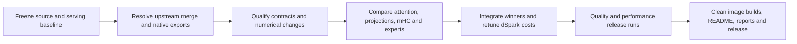

# SparkInfer upstream integration and release plan

Integrate the new upstream V4.1 kernels with DS41RT's native engine, measure
which implementations improve real serving, and publish a qualified release.
Decode on code and prose is the primary performance target; prefill, startup,
memory capacity, numerical quality, and concurrency remain release requirements.
This is an initial source analysis, **not evidence of an achieved speedup**.



## Source boundary and observed state

Inspected on 2026-09-16:

| Item | Revision or observation |
| --- | --- |
| DS41RT starting source | `c0319e2` on `dev`; working tree clean |
| Pinned fork, also local `master` | `3882b935ede761d6c73a5d6fd68e690f1e3f5380` |
| Fetched upstream `master` | `92cd3800932539c947c9a8e06123fe5f36c9eae4` |
| Shared ancestor | `3b862805d2b7fd52e6fe507fd28038bd48797cf5` |
| Divergence | 142 fork-only commits, 44 upstream-only commits |
| Merge preview | 48 conflicted paths, including API, kernel, test and deleted policy files |
| Local GPUs | Two RTX PRO 6000 Blackwell Workstation Editions, each configured for 400 W |
| Local runtime | Only `ds41rt-quant-dev` was running; no active v3 serving baseline |

The [September 11 merge](ds41-b12x-upstream-merge.md) already incorporated the
first upstream V4.1 implementation. Review the delta from the shared ancestor,
and the **final upstream tree**, rather than treating every historical V4.1
commit as functionality still present. For example, the initial dedicated
V4.1 micro kernels were subsequently removed/replaced during the recipe rewrite.

The submodule checkout exists and matches the lock, but Git reports SparkInfer
and xgrammar as uninitialized registrations. Repair registration without
changing their pinned source before reproducible build qualification. Current
DS41RT includes newer quantization work; it must be preserved, but routed-expert
EXL3/Trellis is explicitly outside this integration's serving comparison.

Sources: [upstream snapshot](https://github.com/local-inference-lab/b12x/tree/92cd3800932539c947c9a8e06123fe5f36c9eae4),
[fork snapshot](https://github.com/tpurtell/sparkinfer-glmrt/tree/3882b935ede761d6c73a5d6fd68e690f1e3f5380),
[native source lock](../third_party/sparkinfer.lock.json).

## Relevant implementation map and treatment

Paths beginning `b12x/` refer to the SparkInfer repository. “Compare” means a
correctness-qualified native comparison on our actual shapes, followed by an
engine comparison if promising. It does not mean replacing the implementation
based on an upstream benchmark.

| Logical part | Current DS41RT dependency | Upstream change and required treatment |
| --- | --- | --- |
| Native export, compilation and startup | `python/tools/export_b12x_v41_*`, `native/cmake/v41_*.cmake`; direct compiled entry points and caller-owned scratch | **Resolve first.** `77351c13` and follow-ups replace `b12x.policy` with `b12x.preparation`, retained compiled programs, tuning contracts and startup memory accounting. Port the fork's exports to the final interfaces, preserve their native ABI, and ensure selection/compilation stays outside replay. A successful textual merge is insufficient. |
| Dense FP8 GEMM and scale addressing | `export_b12x_v41_fp8_aot.py`, `v41_fp8.cu`; K32 activation quantization and block32 weight scales | **Merge correctness, then compare.** `ff36d2d1` bounds scale reads in swizzle padding. `a151c030` allows explicit four-partial FP32 reduction and specialized projection tiles. Preserve our shared-operand fence (`3882b935`), native AOT hooks, live-row contract and ordered partial reduction. Compare with our existing narrow-projection experiment rather than double-counting it as a new gain. |
| WO-A, inverse RoPE and WO-B | Grouped FP8 projection exports and fork `_quant_cute` entry points | **High-priority comparison.** `081b2359`, `a151c030`, and `b0a03813` change decode tile choice and bounded prefill preparation. Benchmark the complete inverse-RoPE → quantization → WO-A → quantization → WO-B chain. Preserve the existing CuTe quantization export instead of silently replacing native execution with upstream Python/Triton launch wrappers. Include grouped layout, scale stride, row tails and shared bound-arena lifetime. |
| Query and other narrow projections | Exported Q-A `(N=1280,K=5120)`, KV `(512,5120)`, index-Q `(4096,1280)`; native attention preparation | **High-priority comparison.** Compact BF16 projection tiles and updated preparation may help shapes still using BF16 or narrow projections. Compare BF16 and existing block-FP8 paths including conversion, scratch and surrounding operations. Do not assume a BF16→W8 conversion is already a new upstream improvement: much of our serving path already uses FP8. |
| Target sparse/compressed attention | `native/cuda/kernels/v41_sparse_attention.cu`; direct packed FP4 compressed cache plus FP8 window paths | **High-priority candidate integration.** `4af78b86` makes decode QK/PV FP8 and prefill QK BF16/PV FP8. Compare arithmetic and full latency against our native implementation. Adapt to our source aliases, selected indices, windows and sink semantics; avoid full-pool unpacking. Quantization, softmax and output changes require real-weight quality checks, not only cosine similarity. |
| Compressed cache writer and storage | `v41_kv.cu`, compressor/cache ownership, retained snapshots and speculative commit | **Audit correctness before adopting.** `6b133f58` fixes V4.1 MXFP4 tails; upstream now exposes cache writer/rotary/cast helpers. Verify bit packing, scale format, page strides, tail initialization, logical positions and high recycled pool IDs. Native FP4 and upstream MXFP4 names alone do not establish compatible layouts. Keep exact-cache reuse, bounded replay and rollback intact. |
| Index scoring and top-k | Fork `V41OverlayScore` export in `export_b12x_v41_index_aot.py`, native index scores/top-k | **Compare at long and short contexts.** `e2076951` bounds MXFP4 score launches to visible tiles; `4af78b86` improves position sorting. Upstream paged scoring is not our overlay ABI. Measure actual selected-source geometry, carry/overlay rows, selection ordering and scratch. Check exact top-k where math is unchanged, including ties and masked tails. |
| mHC projection and mixes | Fork `_v41_project` AOT plus `v41_hc.cu` | **Compare projection and full chain.** `864b6302` parallelizes lagged mHC decode; `fd3c638c` chooses compact prefill tiles; preparation follow-ups repair invalid candidates. Our residual/mix ownership and lagged semantics need explicit mapping. Do not replace the export with a generic kernel solely because names match. |
| Routed experts on Spark and RTX | `V41SlicePipeline`, native FP4 weights, FP8 transport/inputs, route planning, fused slices and ordered reduction | **Preserve qualified baseline and race upstream W4A8.** Upstream rewrites the V4.1 recipe (`15ec4b45`), restores compact M16/micro paths, and fixes compact scales, tails, SwiGLU clamp and barriers. Resolve shared `dynamic.py`/fused-MoE conflicts without deleting our native recipe. Test Spark TP4 and RTX TP2/local shapes separately, with real expert sharing and distributions. No EXL3/Trellis routed-expert change in this release. |
| Shared experts | Block-FP8 up/down exports, including TP2 half-width `(1152,5120)` and `(5120,1152)` | **Compare dense changes at full chain cost.** Up/down, activation clamp, quantization and reduction must retain their semantics. Include decode, draft verification rows and prefill; improvements to upstream routed-MoE dispatch do not automatically accelerate shared experts. |
| dSpark | Lane-owned workspaces, `V41DraftSlicePipeline`, native draft attention, shared projection exports | **Requalify every shared change and evaluate applicable replacements.** Target MLA does not automatically implement draft attention's mask/cache contract. Measure draft and verify costs separately, acceptance and useful output TPS. Refit adaptive costs only after kernel selection stabilizes, for configured Spark/RTX residency. Preserve independent lanes and current K defaults until measured changes justify them. |
| Vocabulary head and router | Native `v41_dspark.cu`/sampling and `v41_router.cu`, router AOT | **Review affected GEMM/preparation paths and compare where shapes overlap.** Upstream vocabulary BF16 and tensor-FP8 surfaces changed with preparation. Retain GPU top-1/top-k selection and constrained decoding behavior; avoid downloading the whole vocabulary as an adapter. Check route/top-token changes when evaluating lower precision. |
| Engram and loading | Native `engram.cu`, host gather/staging, resident projections and existing loader | **Audit applicability, then bounded experiments.** `135c9715` retains original scales; `c51d3c09` optimizes SSD reading; later `38ae4b6c` removes background prefetch; `213fc1b2` adds cuFile range reads with CPU fallback. Upstream PLE/Engram loading does not replace our host staging automatically. Compare warm/cold startup and gather latency without running cache-drop experiments during throughput tests. Preserve scale semantics and staging concurrency. |
| Vision | Native `v41_vision.cu` and supporting dense operations | **Regression coverage for changed shared dependencies.** No identified dedicated new vision kernel warrants a separate optimization project here. Validate vision serving and cache identity after shared numerical/runtime changes. |

These are the relevant logical areas, not a plan to benchmark every upstream
model or public operation. QSA, GDN/KDA, unrelated PLE models, vLLM-only serving
glue, and alternate routed-expert formats need no DS41RT performance matrix.
They may still require mechanical merge/import/test fixes when shared library
surfaces change. Attention/projection parallelization across GPUs is deferred;
retain the current ownership and expert parallelism in comparisons.

## Future parallelism and Trellis: analysis only

These observations are retained for subsequent releases at the user's request.
They create **no implementation or performance-qualification scope for this
release**. Preserve existing fork functionality during conflict resolution;
do not enable new distributed attention/projection or Trellis execution here.

| Area | Observed upstream delta | Relevance to a future DS41RT experiment |
| --- | --- | --- |
| Attention head partitioning | `9043b448` fixes V4.1 prefill dispatch for a 16-head-aligned prefix plus an 8-head remainder; tests cover 24 and 32 local heads. The change is in `_shared/mla/prefill.py`. | Helps evaluate local head counts after splitting attention across RTX GPUs. This is local launch partitioning, not a complete distributed-attention implementation. Map query heads, shared KV sources, sink terms and output-group ownership before deciding a split. |
| Query/WO shard geometry | Projection preparation now records shape/configuration and retains compiled programs; bounded WO prefill supports dynamic rows. The projection tile changes in `a151c030` are geometry-specific. | Future TP must race the smaller per-GPU GEMMs plus actual gather/reduce traffic against the unsplit chain. Shard WO-A groups and WO-B's reduction axis deliberately; do not assume today's full-width tile winner survives TP2. A query projection's presence in the library does not establish compatibility with DS41RT's Q-A/Q-B contract. |
| Expert shard widths | `c45ba6d9` changes V4.1 execution/benchmark handling to support native-width TP shards. | Useful for later hardware counts and balanced expert splits. Inspect final packing and tile constraints rather than padding every shard to historical benchmark dimensions. Existing RTX TP2/Spark TP4 remains in scope; additional topologies do not. |
| PCIe collectives and distributed top-k | `b12x/comm/pcie` now prepares existing one-shot, two-shot, DMA, hierarchical, island reduce-scatter, DCP all-to-all/top-k and vocabulary argmax owners through retained plans. `77351c13` and follow-ups account for preparation resources. | Candidate building blocks for projection reduction, sharded attention selection and sharded vocabulary heads. Most inspected changes are preparation/lifetime integration, not new collective algorithms or proven bandwidth gains. Measure message sizes, PCIe topology, synchronization and lane independence; preserve collective ordering without joining unrelated lanes. |
| Distributed vocabulary selection | `pcie_vocab_argmax.py` requires a prepared plan and changes IPC teardown ordering. The existing operation returns exact global argmax of a BF16-rounded local sum. | Potentially useful for a future split head without whole-vocabulary transfers. Greedy argmax alone does not implement constrained sampling/top-k or dSpark confidence. Account for those consumers before choosing head placement. |
| RoCE preparation | `comm/roce` adds preparation/tuning and retained launch integration for its existing one-shot path. | Review for later Spark counts or distributed reductions. It is not a drop-in replacement for DS41RT's native request/response expert transport; GPU launch ownership and heterogeneous topology differ. |
| Trellis dense API | `gemm/trellis_linear` now uses `Plan`, `_preparation.py` and `_tuning.py`; `run` consumes a session-prepared plan. Zero-copy EXL3 weight views and compact TP12 pair preparation already existed before this delta. | Future dense/Trellis integration must port plan construction and preserve codebook, rotation, axis and scratch contracts. Do not report pre-existing pair formats as newly added upstream functionality. |
| Trellis materialization and shared W4A16 | `trellis_materialize.py` moves its coupled materializer from direct `cute.compile` to `b12x_compile` with a named compile specification. Shared W4A16 compilation attaches retained program dependencies and records `broadcast_suh`/`broadcast_svh` metadata. | Future routed-expert Trellis work can reuse preparation/cache provenance, but must measure inline execution versus materialization, resident memory and conversion costs. The inspected delta does not prove a new Trellis numerical recipe or kernel speedup. Preserve our local descriptor-bound, clamp, packing and native-export fixes while merging shared files. |

Keep KV-source ownership central to future memory planning. In particular,
layers 15–19 remain with layer 14 and its attention source under the current
design; moving those layers independently would introduce unwanted PCIe
traffic. Additional parallelism should be justified by complete-chain latency
and memory measurements, including communication and workspace, rather than
per-kernel FLOPS or capacity alone.

## Merge hazards and numerical decisions

1. **Policy replacement is structural.** Upstream deletes profile blobs,
   catalog/types and several planning tests. Port relevant local capabilities
   into preparation/tuning and migrate their tests; do not retain a half-working
   parallel policy system merely to satisfy imports. Keep native artifact
   selection explicit and frozen before graph capture. Inspect upstream's
   current guidance as well as the fork's guidance when resolving this change.
2. **AOT exports are a separate integration contract.** DS41RT imports private
   compiler, quantizer, MoE and mHC entry points. Preserve pointer order, scalar
   widths, stream arguments, launch ownership, workspace sizing and cache
   identity. Check apparently clean automatic merges too.
3. **Changed precision is an experiment.** Record operand format, scale block,
   rounding, clamp placement, accumulator and reduction dtype for both arms.
   Distinguish FP8 checkpoint weights from newly requantized BF16 weights.
   Keep an unchanged-numerics arm when possible to separate kernel gains from
   quality tradeoffs. Removing upstream's FP32 MoE recipe does not authorize
   silently changing our FP32 slice reductions.
4. **Layouts and capacities are performance constraints.** Test high page IDs
   with 64-bit address products, tails, empty rows, changed live row counts,
   captured replay, two lanes and stable addresses. Neither a smaller KV pool
   nor reduced expert residency may masquerade as a kernel improvement.
5. **Toolchain changes need separate attribution.** Upstream declares CUTLASS
   DSL 4.6.2, also pinned by our Dockerfiles, but wheel/ABI and CUDA 13.4 work
   still requires environment inspection. Freeze compiler/package versions in
   both arms; isolate a compiler migration if one is necessary.

## Execution and release gates

- [x] Fetch the upstream snapshot, inspect selected native dependencies, and
  preview conflicts without changing the checked-out fork.
- [x] Write this initial component analysis before attempting integration.
- [ ] Freeze the baseline source, images, model/checkpoint identity, serving
  arguments, residency, pool size, lane capacities and software versions.
  Reestablish official-FP4 serving and collect representative baseline evidence.
  Use the existing v3 reports for historical context, not as matched new runs.
- [ ] Resolve the ancestry-preserving merge in an isolated worktree. Keep the
  main fork usable until acceptance. Audit local AOT and runtime invariants;
  build and run focused CPU/API and GPU correctness tests on selected paths.
- [ ] Prioritize measured hot paths: compressed attention and projection
  chains, then mHC/indexer and expert candidates. Profile unresolved plateaus;
  retain promising structural candidates long enough to diagnose failures.
- [ ] Integrate measured winners, reprofile serving, and refit adaptive draft
  costs. Validate both one-RTX and dual-RTX configurations, Spark expert paths,
  independent lanes, startup and memory budgeting.
- [ ] Freeze the candidate. Run three final qualification repetitions where
  repetitions apply. Tool evaluations use thinking enabled at high effort by
  default; also cover supported constrained/no-thinking behavior explicitly.
  Run needle/long-context, retained prefix and snapshot/replay, tool/schema,
  cancellation/recovery, vision and concurrent serving checks.
- [ ] Refresh every README performance table and its linked report: counting,
  code and topic concurrency; representative weighted/mixed decode; prefill;
  startup and memory. State GPU power limits and standard memory speed up front,
  with UUIDs, clocks/mode, exact configuration and raw samples in evidence.
  Cache GB headlines must include token capacity. Repeat historical official
  API references only if needed; label their original date/protocol.
- [ ] Clean build and run the release images on the coordinator and Spark
  hosts. Verify the normal port 8000 and configurable concurrency/pool options.
  Publish the next version with concise feature notes and linked qualification
  evidence. Push accepted fork changes to the fork's `master`; update and push
  the DS41RT lock/submodule together. Commit messages should include approximate
  measured before/after performance when they represent such changes.

For performance, use paired/interleaved old/new trials on the same physical
hardware and compare useful generated tokens, not drafted work. Record raw
samples, variance, clock/power state, cold/warm status and ratio direction.
Use component timing to explain a serving gain, not to substitute for one.
Counting is a headline workload; code, topic and weighted/mixed performance
drive acceptance. The requested substantial improvement is an open release
goal, not something proven by completing a merge or passing correctness tests.

## Reproducing this source review

### First implementation checkpoint

The original v3 baseline is now serving through `run.sh` on port 8000 with
dual RTX, twenty TP2 resident encoder expert layers, four Spark workers,
C16, 24 retained turns, and the default 14M-token pool target. Submodule
registrations were repaired without changing either pinned revision.

One initial decode pass completed all eight weighted cases plus counting,
passing the benchmark's bounded completion/format checks. Observed TPS was
140.05 code, 80.19 topic, 176.35 counting and 87.10 weighted. This is a baseline
measurement, not a new implementation or a final statistical comparison.
[Compact baseline evidence](sparkinfer-upstream-baseline-20260916.json) records
the image/source identities, controls, samples and raw artifact hashes.

The merge is in progress on local branch `integrate/upstream-20260916` in
`/home/tj/.cache/ds41rt-upstream-20260916/sparkinfer`. Four of the original 48
conflicted paths are staged as resolved; 44 remain. Dense-GEMM artifact handles
now coexist with upstream retained-program metadata. The quantizer combines
upstream source-width padding with a fixed-width AOT entry point, preserving
the engine's existing exported signature. The native `silu_v41` activation
floor remains distinct from upstream generic quantization. These edits have
only syntax validation so far; they are not an accepted kernel revision.

Code/topic concurrency baseline collection completed sequentially at
C1/C2/C4/C8/C16 with one repetition each. C16 aggregate throughput was 1074.94
TPS for code and 612.51 TPS for topic. These warm, same-prompt concurrency
workloads differ from the single-client weighted corpus; do not compare their
per-request numbers as if the prompts/protocol were identical.
[Concurrency baseline evidence](sparkinfer-upstream-baseline-concurrency-20260916.json)
retains all five concurrency summaries and the raw artifact hashes. Working
artifacts for this integration live under the single cache directory above.
Next steps are remaining semantic merge resolutions, native ABI/GPU tests,
and measured kernel comparisons. The production submodule pin is unchanged.

Run from `third_party/sparkinfer` after fetching upstream:

```bash
git merge-base 3882b935 92cd3800
git rev-list --left-right --count 3882b935...92cd3800
git log --oneline 3882b935..92cd3800
git diff --name-status 3882b935...92cd3800 -- b12x
git merge-tree --write-tree --name-only 3882b935 92cd3800
```

The last command is a preview: it creates Git objects but does not alter the
index or working tree. Exit status 1 means conflicts were found. Its preview
tree for this review was `747eddddcd824e77e8586cba5b07d0c2ab67954c`.
