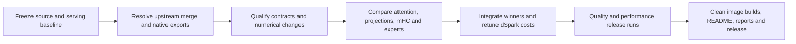

# SparkInfer upstream integration and release plan

Integrate the new upstream V4.1 kernels with DS41RT's native engine, measure
which implementations improve real serving, and publish a qualified release.
Decode on code and prose is the primary performance target; prefill, startup,
memory capacity, numerical quality, and concurrency remain release requirements.
This is an initial source analysis, **not evidence of an achieved speedup**.



## Placement-cost refit on selected upstream kernels

Fixed K1–K7 code and mixed calibration completed at C2/C4/C8/C16. All client
checks passed. The parser validated **9319 complete verification rounds**;
9125 remain after shape warmup filtering. Odd widths supply 5457 training
rounds; even widths provide 3668 held-out rounds. The observations separate
`rtx_tp2_shared2` from `spark_tp4_shared2` and retain a per-round non-expert term.

The affine profile reduces held-out median absolute relative prediction error
from **16.21% to 4.66% for code**, and **10.81% to 8.74% for mixed**. P90 errors
fall from 26.77% to 15.75% and 26.83% to 20.22%, respectively. The hinge-at-16
variant offers negligible mixed improvement and worse code error, so the
simpler affine profile is selected for the next serving experiment.

[Fit report and trace provenance](sparkinfer-upstream-adaptive-cost-fit-20260916.json)
and [experimental dual-RTX profile](sparkinfer-upstream-adaptive-cost-profile-20260916.json)
record all coefficients and identities. These are instrumented, short-context,
observed-route timings; they exclude route-forecast error and are **not release
throughput numbers**. The fit does not change runtime defaults. An uninstrumented
K7 legacy-versus-placement serving comparison is the next acceptance gate.

## Shared experts and Engram/loading selection

The real layer-0 shared-expert TP2 chain passes the full-width quantized oracle
on both GPUs at capacities **1, 16, 80, 256, 1024 and 4096**, including changed
inputs in captured graphs. The complete local up/gate → clamped SwiGLU →
quantization → down chain has essentially the same warm cost. Representative
RTX0 medians (published → candidate) are 27.6 → 28.7 µs at one row,
32.8 → 32.8 at 16, 55.4 → 55.6 at 256, 86.3 → 86.6 at 1024, and
493.7 → 501.8 at 4096. RTX1 shows the same broad pattern. These sequential
component screens exclude inter-rank reduction and scheduling; small differences
are not a claimed gain or a completed end-to-end prefill regression gate.
**Keep the existing FP8 shared chain**; no additional shared-specific backend
is justified by this screen. [Evidence](sparkinfer-upstream-shared-loading-20260916.json)
contains both GPU timings, oracle errors, identities and loader test output.

Upstream's final Engram `DiskTable` retains original E8M0 scale bytes optionally,
but disk lookup is synchronous and its prefetch methods are no-ops. Our native
[`EngramBatchStaging`](../rust/crates/ds41rt-loader/src/engram_staging.rs)
already gathers the original eight scale bytes per row without expansion or
requantization, sorts/deduplicates requests, and preserves token/head ordering.
[`EngramGatherer`](../rust/crates/ds41rt-loader/src/engram_gather.rs) uses bounded
background storage and cancellation; submission does not perform mapped reads.
[`MappedRows`](../rust/crates/ds41rt-loader/src/mapped_rows.rs) bounds and coalesces
prefetch pages while the gather worker handles actual page faults. Preserve
this native asynchronous path. Eagerly retaining both full scale tables would
read/retain **6,144,182,800 bytes (5.72 GiB)**; do not add that startup/memory cost
without evidence that scale faults dominate. Existing timing traces expose
queue/gather time and page-fault counters for that investigation.

Upstream's `DirectWeightSession` owns Torch metadata/destinations and a direct
reader or GDS executor; our native loader instead uses validated bounded
`read_exact_at` ranges, shard-aware packing, and caller-owned staging. A port
would replace a loader lifecycle, not merely select a faster kernel. Keep the
native loader for this integration; no GDS or cold-start speedup is claimed.
The native loader unit suite reports **70 passed, one optional official-tokenizer
test ignored**. This verifies the exercised range/mapping/prefetch contracts,
not cold storage performance or final long-context/vision acceptance. Final
clean-build warm/cold startup and memory qualification remain release gates.

## Native single-row vocabulary adapter

The opt-in `DS41RT_V41_VOCAB_ROW_EXPERIMENT` implements the upstream
single-row reduction strategy in native CUDA, retaining FP32 output and all
existing pointer/device/workspace checks. Only width 5120 with one live row
uses the new kernel; multirow vocabulary and dSpark Markov projections keep
the original cuBLAS path. No scratch, persistent memory, or host synchronization
is added. The option remains off pending serving acceptance.

Synthetic and checkpoint `head.weight` checks pass for 64640/129280 vocabulary
rows and live input rows 1/4/16, with normal/small/zero hidden states, graph
replay and stable allocation. Checkpoint-weight single-row max error is
3.34e-6, greedy winners match, and multirow outputs are bitwise identical.
Checkpoint hidden states here are synthetic, not captured serving activations.
Real-weight component medians are **448.2 → 402.9 µs per shard** and
**889.9 → 803.7 µs for a full vocabulary**. Multirow cost is unchanged.

The two-GPU shard/full and GPU winner-merge selftest passes, including graph
replay, tie/boundary handling and invalid-device checks. Its obsolete invalid
row count of 81 was corrected to 129: head handles already support 128 rows.
The initial test failure was this stale bound, not a numerical mismatch.

For serving A/B, reconstructing the baseline from its retained link inputs
reproduced `libcandidate-index-sort.so` byte-for-byte. Only the vocabulary CUDA
object was then replaced. [Native vocabulary evidence](sparkinfer-upstream-vocabulary-native-20260916.json)
records numerical checks, two-GPU results and artifact identities. This
controlled relink does not replace the clean release build requirement.

Both serving screens passed all 27 requests. The first CUDA object used
`sm_120`; a follow-up compiled using the baseline Ninja command's exact flags
(`sm_120f`, with only the experiment define and output paths changed) also
passed two-GPU checks and all 27 serving requests. Warm startup was 13.07 s.
The matched-build weighted median was **96.42 baseline → 95.20 candidate TPS**
(mean **95.51 → 94.22**). This does not establish a whole-model improvement.
**Selection: retain the existing vocabulary head for release; keep the row
adapter opt-in.** Its component savings are documented for future work without
promoting an unproven serving change. The matching-build candidate is currently
running; production build defaults and dependency pins are unchanged.

## Vocabulary projection applicability and component screen

The upstream BF16 vocabulary change adds multirow support and prepared dispatch;
its default selects the row-reduction Triton kernel only for capacity one and
Torch otherwise. The PCIe argmax kernel's numerical code is unchanged in this
delta (its launcher cache moved to `program_cache`). Our native vocabulary head
uses BF16 resident weights with pedantic FP32 accumulation and FP32 logits,
including two independent 64640-row shards and GPU-side winner reduction.

The [vocabulary probe](../python/tools/compare_v41_vocab_upstream.py) instantiates
upstream's row kernel with **FP32 output** to preserve our boundary. Synthetic
normal, small and zero inputs pass selected-column independent FP32 references,
full-logit comparison, changed-input graph replay and stable replay allocation.
All FP32 greedy winners match. Merely rounding these logits to BF16 changes a
greedy winner in one synthetic 16-row shard case; the public BF16 boundary is
therefore not a drop-in replacement.

| Vocabulary rows | Input rows | Native, µs | Upstream row kernel with FP32 output, µs |
| --- | ---: | ---: | ---: |
| 64640 | 1 | 446.4 | 402.4 |
| 64640 | 4 | 482.1 | 1605.4 |
| 64640 | 16 | 1604.1 | 6416.3 |
| 129280 | 1 | 889.8 | 803.3 |
| 129280 | 4 | 978.1 | 3208.7 |
| 129280 | 16 | 3237.6 | 12832.2 |

These are balanced warm graph component measurements on RTX0, not serving
throughput. Forced multirow measurements bound the possible adaptation; they
do not represent upstream's default multirow backend. A **single-row-only,
FP32-output native adapter** is worth a bounded comparison. Keep GEMM for
multirow calls. Real checkpoint weights, actual hidden states, graph/lane
integration and serving acceptance remain pending before adopting it.
[Raw vocabulary evidence](sparkinfer-upstream-vocabulary-20260916.json) records
all six cases and artifact identities.

## Hybrid selection after warm-state control

A second three-repeat baseline run after warming gives code **278.3 TPS at C2**
and **1308.7 at C16**, versus hybrid **281.8 / 1311.3**. All 54 paired code
outputs match exactly; sample ranges overlap. This removes most of the apparent
code gain from the first comparison. Warm baseline topic is **142.4 / 692.7**
versus hybrid **149.8 / 744.7**, but all 54 paired prose outputs differ and C16
sample ranges overlap. All objective checks pass in both arms.

Keep both hybrid experiment switches **off by default**: the native microkernel
gains are real, but a useful broad serving gain has not been established.
Retain the opt-in implementation and evidence for future tuning; do not spend
release qualification on promoting it now. Continue the remaining upstream
component evaluation and then tune dSpark against selected kernels. The
coordinator was stopped after this control to free GPUs for vocabulary probes;
the original Spark worker containers remain running.

## Combined hybrid experts: first serving screen

The combined RTX/Spark hybrid passed all 27 short decode requests, using
identical request bodies to the baseline. Three-run mean weighted throughput
was **95.51 → 95.33 TPS** (median **96.42 → 95.15**): no useful single-client
gain. Median code was 157.33 → 157.80 TPS and topic 86.55 → 88.36 TPS.
Warm coordinator startup took 13.03 seconds, with all twenty encoder expert
layers on RTX TP2 and the same cache reservation as the comparison baseline.

The initial concurrency screen also passed, but is mixed: code C2 was
218.5 → 216.5 TPS, topic C2 148.1 → 157.6, and topic C16 700.3 → 654.8.
Hybrid C16 code was 1245.1 TPS; comparing that against the old slow first
sample would be misleading (the repeated baseline previously reached
1299–1304 TPS). Repeated concurrency trials are recorded below before any
backend-selection decision. Both compact experiment defaults remain off.
[Serving evidence](sparkinfer-upstream-expert-hybrid-serving-20260916.json)
records the component identities, raw artifacts and summaries. This closes
the initial combined serving correctness screen, not final release quality
or performance acceptance.

Three-repeat concurrency follow-up passed in both arms. Median aggregate TPS:

| Workload | Baseline | Hybrid |
| --- | ---: | ---: |
| Code C2 | 268.3 | 281.8 |
| Code C16 | 1291.6 | 1311.3 |
| Topic C2 | 139.8 | 149.8 |
| Topic C16 | 710.5 | 744.7 |

These suggest a modest concurrency benefit, but the hybrid repeats followed
prior serving screens while the baseline repeats followed a restart and the
benchmark's built-in warmup. Baseline first samples were slower, especially
code C2. Do not attribute the entire median difference to the implementation.
The original coordinator and workers are restored and running. Next resolve
this warm-state comparison before selecting the combined hybrid, then close
the remaining component audit and retune dSpark against selected kernels.

## Full hybrid Spark worker qualification

The full serving library now passes the native shared-arena checks at live
rows 1/2/4/16. At two rows, warm expert time was 157.4 → 124.6 µs and cold
expert time 221.1 → 206.4 µs. At four and sixteen rows the hybrid uses the
original grouped path and its FP32 route outputs are bitwise identical.
These are component measurements; combined RTX/Spark serving acceptance is
still pending. The original worker containers and artifacts are preserved
for matched comparison and rollback.

The [full-worker evidence](sparkinfer-upstream-expert-hybrid-full-worker-20260916.json)
records the native checks and library identity. The controlled relink helper
replaces only expert objects and their wrapper, records all object hashes,
and verifies that the original library remains unchanged. This is an A/B
experiment artifact; release acceptance still requires a clean build.

## Source boundary and observed state

Inspected on 2026-09-16:

| Item | Revision or observation |
| --- | --- |
| DS41RT starting source | `c0319e2` on `dev`; working tree clean |
| Pinned fork, also local `master` | `3882b935ede761d6c73a5d6fd68e690f1e3f5380` |
| Fetched upstream `master` | `92cd3800932539c947c9a8e06123fe5f36c9eae4` |
| Shared ancestor | `3b862805d2b7fd52e6fe507fd28038bd48797cf5` |
| Divergence | 142 fork-only commits, 44 upstream-only commits |
| Merge preview | 48 conflicted paths, including API, kernel, test and deleted policy files |
| Local GPUs | Two RTX PRO 6000 Blackwell Workstation Editions, each configured for 400 W |
| Local runtime | Only `ds41rt-quant-dev` was running; no active v3 serving baseline |

The [September 11 merge](ds41-b12x-upstream-merge.md) already incorporated the
first upstream V4.1 implementation. Review the delta from the shared ancestor,
and the **final upstream tree**, rather than treating every historical V4.1
commit as functionality still present. For example, the initial dedicated
V4.1 micro kernels were subsequently removed/replaced during the recipe rewrite.

The submodule checkout exists and matches the lock, but Git reports SparkInfer
and xgrammar as uninitialized registrations. Repair registration without
changing their pinned source before reproducible build qualification. Current
DS41RT includes newer quantization work; it must be preserved, but routed-expert
EXL3/Trellis is explicitly outside this integration's serving comparison.

Sources: [upstream snapshot](https://github.com/local-inference-lab/b12x/tree/92cd3800932539c947c9a8e06123fe5f36c9eae4),
[fork snapshot](https://github.com/tpurtell/sparkinfer-glmrt/tree/3882b935ede761d6c73a5d6fd68e690f1e3f5380),
[native source lock](../third_party/sparkinfer.lock.json).

## Relevant implementation map and treatment

Paths beginning `b12x/` refer to the SparkInfer repository. “Compare” means a
correctness-qualified native comparison on our actual shapes, followed by an
engine comparison if promising. It does not mean replacing the implementation
based on an upstream benchmark.

| Logical part | Current DS41RT dependency | Upstream change and required treatment |
| --- | --- | --- |
| Native export, compilation and startup | `python/tools/export_b12x_v41_*`, `native/cmake/v41_*.cmake`; direct compiled entry points and caller-owned scratch | **Resolve first.** `77351c13` and follow-ups replace `b12x.policy` with `b12x.preparation`, retained compiled programs, tuning contracts and startup memory accounting. Port the fork's exports to the final interfaces, preserve their native ABI, and ensure selection/compilation stays outside replay. A successful textual merge is insufficient. |
| Dense FP8 GEMM and scale addressing | `export_b12x_v41_fp8_aot.py`, `v41_fp8.cu`; K32 activation quantization and block32 weight scales | **Merge correctness, then compare.** `ff36d2d1` bounds scale reads in swizzle padding. `a151c030` allows explicit four-partial FP32 reduction and specialized projection tiles. Preserve our shared-operand fence (`3882b935`), native AOT hooks, live-row contract and ordered partial reduction. Compare with our existing narrow-projection experiment rather than double-counting it as a new gain. |
| WO-A, inverse RoPE and WO-B | Grouped FP8 projection exports and fork `_quant_cute` entry points | **High-priority comparison.** `081b2359`, `a151c030`, and `b0a03813` change decode tile choice and bounded prefill preparation. Benchmark the complete inverse-RoPE → quantization → WO-A → quantization → WO-B chain. Preserve the existing CuTe quantization export instead of silently replacing native execution with upstream Python/Triton launch wrappers. Include grouped layout, scale stride, row tails and shared bound-arena lifetime. |
| Query and other narrow projections | Exported Q-A `(N=1280,K=5120)`, KV `(512,5120)`, index-Q `(4096,1280)`; native attention preparation | **High-priority comparison.** Compact BF16 projection tiles and updated preparation may help shapes still using BF16 or narrow projections. Compare BF16 and existing block-FP8 paths including conversion, scratch and surrounding operations. Do not assume a BF16→W8 conversion is already a new upstream improvement: much of our serving path already uses FP8. |
| Target sparse/compressed attention | `native/cuda/kernels/v41_sparse_attention.cu`; direct packed FP4 compressed cache plus FP8 window paths | **High-priority candidate integration.** `4af78b86` makes decode QK/PV FP8 and prefill QK BF16/PV FP8. Compare arithmetic and full latency against our native implementation. Adapt to our source aliases, selected indices, windows and sink semantics; avoid full-pool unpacking. Quantization, softmax and output changes require real-weight quality checks, not only cosine similarity. |
| Compressed cache writer and storage | `v41_kv.cu`, compressor/cache ownership, retained snapshots and speculative commit | **Audit correctness before adopting.** `6b133f58` fixes V4.1 MXFP4 tails; upstream now exposes cache writer/rotary/cast helpers. Verify bit packing, scale format, page strides, tail initialization, logical positions and high recycled pool IDs. Native FP4 and upstream MXFP4 names alone do not establish compatible layouts. Keep exact-cache reuse, bounded replay and rollback intact. |
| Index scoring and top-k | Fork `V41OverlayScore` export in `export_b12x_v41_index_aot.py`, native index scores/top-k | **Compare at long and short contexts.** `e2076951` bounds MXFP4 score launches to visible tiles; `4af78b86` improves position sorting. Upstream paged scoring is not our overlay ABI. Measure actual selected-source geometry, carry/overlay rows, selection ordering and scratch. Check exact top-k where math is unchanged, including ties and masked tails. |
| mHC projection and mixes | Fork `_v41_project` AOT plus `v41_hc.cu` | **Compare projection and full chain.** `864b6302` parallelizes lagged mHC decode; `fd3c638c` chooses compact prefill tiles; preparation follow-ups repair invalid candidates. Our residual/mix ownership and lagged semantics need explicit mapping. Do not replace the export with a generic kernel solely because names match. |
| Routed experts on Spark and RTX | `V41SlicePipeline`, native FP4 weights, FP8 transport/inputs, route planning, fused slices and ordered reduction | **Preserve qualified baseline and race upstream W4A8.** Upstream rewrites the V4.1 recipe (`15ec4b45`), restores compact M16/micro paths, and fixes compact scales, tails, SwiGLU clamp and barriers. Resolve shared `dynamic.py`/fused-MoE conflicts without deleting our native recipe. Test Spark TP4 and RTX TP2/local shapes separately, with real expert sharing and distributions. No EXL3/Trellis routed-expert change in this release. |
| Shared experts | Block-FP8 up/down exports, including TP2 half-width `(1152,5120)` and `(5120,1152)` | **Compare dense changes at full chain cost.** Up/down, activation clamp, quantization and reduction must retain their semantics. Include decode, draft verification rows and prefill; improvements to upstream routed-MoE dispatch do not automatically accelerate shared experts. |
| dSpark | Lane-owned workspaces, `V41DraftSlicePipeline`, native draft attention, shared projection exports | **Requalify every shared change and evaluate applicable replacements.** Target MLA does not automatically implement draft attention's mask/cache contract. Measure draft and verify costs separately, acceptance and useful output TPS. Refit adaptive costs only after kernel selection stabilizes, for configured Spark/RTX residency. Preserve independent lanes and current K defaults until measured changes justify them. |
| Vocabulary head and router | Native `v41_dspark.cu`/sampling and `v41_router.cu`, router AOT | **Review affected GEMM/preparation paths and compare where shapes overlap.** Upstream vocabulary BF16 and tensor-FP8 surfaces changed with preparation. Retain GPU top-1/top-k selection and constrained decoding behavior; avoid downloading the whole vocabulary as an adapter. Check route/top-token changes when evaluating lower precision. |
| Engram and loading | Native `engram.cu`, host gather/staging, resident projections and existing loader | **Audit applicability, then bounded experiments.** `135c9715` retains original scales; `c51d3c09` optimizes SSD reading; later `38ae4b6c` removes background prefetch; `213fc1b2` adds cuFile range reads with CPU fallback. Upstream PLE/Engram loading does not replace our host staging automatically. Compare warm/cold startup and gather latency without running cache-drop experiments during throughput tests. Preserve scale semantics and staging concurrency. |
| Vision | Native `v41_vision.cu` and supporting dense operations | **Regression coverage for changed shared dependencies.** No identified dedicated new vision kernel warrants a separate optimization project here. Validate vision serving and cache identity after shared numerical/runtime changes. |

These are the relevant logical areas, not a plan to benchmark every upstream
model or public operation. QSA, GDN/KDA, unrelated PLE models, vLLM-only serving
glue, and alternate routed-expert formats need no DS41RT performance matrix.
They may still require mechanical merge/import/test fixes when shared library
surfaces change. Attention/projection parallelization across GPUs is deferred;
retain the current ownership and expert parallelism in comparisons.

## Native live-row hybrid dispatch (September 16)

Fork `4e31d0a1` implements a single compiled launcher that selects compact by
live row count and otherwise executes the existing grouped pipeline. The
experimental cutoffs are 8 on RTX and 2 on Spark, within capacities 1/16;
larger capacities retain their original paths. Both branches use the existing
grouped scratch allocation and native FP8 wire/FP32 output ABI. Spark consumes
the real padded N640 weights rather than adapting through unpadded buffers.

[Native hybrid evidence](sparkinfer-upstream-expert-hybrid-20260916.json)
records exported C ABI comparisons on RTX and GB10. Numerical checks,
changed-input graph replay and shared-capacity arenas pass. Above the cutoff,
FP32 route outputs are bitwise identical to the existing grouped implementation.
Five GPU tests also check live-row transitions back and forth, invalid routes,
tiny activation floors, untouched tails and the actual branch selected.

| Shared routes | Native warm→hybrid, µs | Native cold→hybrid, µs |
| --- | ---: | ---: |
| RTX, 2 rows | 92.2→34.9 | 127.3→55.3 |
| RTX, 8 rows | 100.2→81.8 | 131.6→112.1 |
| RTX, 16 rows | 115.0→114.8 | 147.5→147.5 |
| Spark, 1 row | 122.3→121.8 | 204.7→196.5 |
| Spark, 2 rows | 167.7→142.7 | 221.1→207.8 |
| Spark, 4 rows | 151.5→157.9 | 217.0→216.9 |
| Spark, 16 rows | 219.5→218.2 | 253.9→252.0 |

The Spark padded layout removes most of the earlier prepared-path one-row
advantage. Small fallback timing differences are diagnostic variation, not
new kernels or arithmetic changes. Full hybrid serving comparisons and final
backend selection remain pending. Both experimental build switches are off
by default; no worker rollout or production-pin update is claimed here.

## Expert sharing changes the compact crossover (September 16)

[GB10 and shared-route evidence](sparkinfer-upstream-expert-sharing-20260916.json)
compares the real Spark worker library with the prepared native-arithmetic
compact path on GB10 SM121, and the real compact/native libraries on RTX.
All numerical and changed-input graph checks pass. Random routes and fully
shared expert IDs bracket reuse; these are synthetic component screens.

| Hardware / routes / rows | Native warm→compact, µs | Native cold→compact, µs |
| --- | ---: | ---: |
| Spark / one row | 138.8→83.5 | 211.9→191.4 |
| Spark / random / 2 | 268.2→249.8 | 323.6→302.1 |
| Spark / shared / 2 | 160.3→110.9 | 222.0→190.4 |
| Spark / shared / 4 | 171.3→155.8 | 219.0→241.7 |
| Spark / shared / 8 | 178.5→236.3 | 218.0→323.5 |
| Spark / shared / 16 | 226.8→444.3 | 254.9→498.6 |
| Spark / random / 16 | 1830.0→1816.3 | 1874.2→1871.9 |
| RTX / shared / 2 | 92.2→34.9 | 128.5→55.3 |
| RTX / shared / 4 | 96.3→49.2 | 129.0→65.5 |
| RTX / shared / 8 | 100.3→82.1 | 133.0→110.8 |
| RTX / shared / 16 | 115.1→173.5 | 148.0→197.6 |

Cold samples follow a 256 MiB write with its time excluded. The compact direct
path loses the native grouped kernel's reuse advantage on larger shared
batches. A blanket capacity-16 replacement is therefore inappropriate.
The next candidate should choose by live rows: compact through 2 on Spark
and through 8 on RTX, retaining grouped execution above those bounds.
These are experimental cutoffs, pending native and serving qualification.

The Spark screen uses unpadded N576 prepared weights, while the worker stores
padded N640 weights; a direct wire/native adapter must preserve that layout
before adoption. Spark tools ran in the existing NGC 26.05 development image
against a separate committed source checkout; worker binaries were unchanged.
The coordinator was stopped during these component measurements.

## Native compact TP2 export and serving integration (September 16)

The opt-in `DS41RT_V41_TP2_COMPACT_EXPERIMENT` build selects compact kernels
at capacities 1/16 and retains slices for larger capacities. Its AOT adapter
consumes existing 5280-byte FP8 wire rows directly, preserving the native
expert ABI and FP32 TP contributions. Separate-arena native C ABI checks pass
on both RTX cards and at live rows 1/2/4/8/16. RTX0 local stage times are
92.2→28.0, 97.9→36.0, 160.2→137.0, 289.6→273.6 and 561.9→560.1 µs,
respectively. These are component measurements, not serving TPS gains.
[Initial AOT evidence](sparkinfer-upstream-expert-compact-aot-20260916.json)
is explicitly limited by the integration failure discovered next.

The first serving attempt failed code/counting in all three repeats, while
the matched baseline passed all 27 requests. Serving shares one scratch
arena across capacity variants; initializing larger variants overwrote the
compact adapter's initialized unit-scale vectors. A native shared-arena
reproducer returned exactly zero for the one-row output. Fork `85de5f12`
replaces these scratch reads with compile-time unit scales. The reproducer
then passes, as do three native compact GPU tests and four generic regressions.
This is an integration fix, not a relaxed quality check.

[Fixed serving evidence](sparkinfer-upstream-expert-compact-serving-20260916.json)
records controlled relinks, exact artifact hashes and three matched short-corpus
repeats. Both arms pass all 27 requests. All request bodies match; 11 outputs
are identical and 16 differ, so this is not an exact-continuation comparison.

| Metric, median of three repeats | Baseline | Compact TP2 |
| --- | ---: | ---: |
| Weighted decode TPS | 96.42 | 96.16 |
| Code TPS | 157.33 | 159.58 |
| Topic TPS | 86.55 | 88.03 |
| Counting TPS | 200.39 | 198.75 |

The concurrency screen passes all checks. Single samples show code C2
218.5→222.1 aggregate TPS and topic C2 148.1→162.6, while topic C16 is
700.3→698.2. An initially large apparent code C16 gain (906.7→1251.6)
does not survive repetition: both arms have slow first samples, then settle
near 1300 TPS. Three-run medians are 1299.2→1285.2 with identical outputs.
The isolated one-row gain therefore does not establish a broad serving gain.
The experimental switch remains off by default; Spark applicability and
dSpark cost recalibration remain part of candidate selection.
The fixed candidate's warm startup was 12.95 seconds; this single observation
is not a formal startup comparison. Production pins remain unchanged.

## Compact experts adapted to native arithmetic (September 16)

Fork commit `80a7be9d` adds an explicit native V4.1 compact specialization:
routing is applied before the BF16/FP8 intermediate boundary, the intermediate
amax floor is 1e-4, and FC2 writes FP32 route contributions for TP reduction.
Generic upstream behavior remains the default. Compile identity and workspace
layout distinguish the native specialization and its larger FP32 output.

[Adaptation evidence](sparkinfer-upstream-expert-compact-native-20260916.json)
compares original and changed inputs/IDs against both the independent native
reference and the actual native TP2 library. At N1152 with 1 and 16 rows,
FP32 route contributions differ by at most **1.40e-7 relative L2**; native
reference gates and repeatable, allocation-free graph checks pass. The one-row
advantage survives: native→adapted compact is **92.3→26.7 µs warm** and
**127.0→53.2 µs after cache eviction**. Sixteen rows remain approximately tied
(562.3 µs warm; 589.9→584.9 µs after eviction), with clock variation preventing
a small-gain claim. These measurements include input quantization and local
reduction, but exclude cross-device traffic/final TP2 reduction.

Two new GPU tests cover N576/N1152, live rows 1/3/4 under one frozen capacity,
changed inputs/routing, invalid IDs, tiny input/intermediate floors, poisoned
outputs and untouched tail storage. Four existing compact generic GPU cases
also pass. The candidate source lock is advanced; production pins and serving
libraries are unchanged. A native AOT adapter, complete serving comparisons,
and actual Spark hardware qualification remain next.

## Compact expert cost screen against native TP2 (September 16)

[Timing evidence](sparkinfer-upstream-expert-compact-timing-20260916.json)
compares the actual native TP2 expert library with upstream's direct compact
path on RTX0, E384/K5120/N1152/top6. Both arms include BF16 input quantization
and local output reduction. Native FP32 local routes are summed and rounded
once to BF16; compact applies routing after FC2 and rounds each route to BF16
before summing. Cross-device traffic and final two-rank reduction are excluded.
Each arm passes its applicable arithmetic reference and graph checks before timing.

| Rows | Native local path | Direct compact | Protocol |
| --- | ---: | ---: | --- |
| 1 | 92.3 µs | 26.7 µs | Warm, eight balanced AB/BA samples of 100 graph replays |
| 1 | 127.0 µs | 53.2 µs | Each replay follows a 256 MiB write; write time excluded |
| 16 | 561.9 µs | 561.8 µs | Warm, same balanced protocol; provisional clock caveat |

The one-row gain survives cache eviction. Its run retained P1, standard
13365 MHz memory, a 400 W cap, and no active throttle bits; SM clocks changed
2662→2707 MHz. The 16-row run changed 2775→2475 MHz and therefore supports
only a provisional observation of similar cost, not release acceptance.
The earlier prepared-Python `silu_v41` baseline was substantially slower than
our native library and is not used to claim a production improvement.

The next step is to adapt the compact path to native routing/FP32 TP2 output
semantics, compare the full native path, and check other row counts and Spark
hardware. No backend/default switch or end-to-end speedup is established here.

## Direct compact expert arithmetic at DS4.1 shapes (September 16)

[Compact expert evidence](sparkinfer-upstream-expert-compact-20260916.json)
qualifies upstream's direct compact FP8 kernels at E384/K5120/top6,
N576 and N1152, with 1 and 16 rows on RTX SM120. The independent oracle
unpacks original FP4 weights and models FP8 inputs, BF16 FC1/activation
boundaries, FP8 intermediate values, routing after FC2, BF16 route outputs,
and FP32 top-k summation rounded to BF16. This differs intentionally from
our native routing-before-intermediate-quantization sequence.

All four cases pass that arithmetic oracle: one-row outputs are exact;
maximum relative L2 error for 16 rows is approximately 0.00086% at N576
and 0.0061% at N1152. Changed inputs and expert IDs, poisoned output,
identical-input graph replay, and unchanged allocation counters pass.
Native-reference discrepancies remain around 3.5–4.2%, so the original
native compatibility gate remains false and the diagnostic exits 1.
These results explain the earlier reference discrepancy without relaxing
that gate or treating the two arithmetic contracts as interchangeable.

The public selector uses compact micro only for the N64 tail geometry and
selects different backends at other capacities. The direct compact implementation
also works at aligned N1152; the probe explicitly bypasses public selection to
exercise it, including upstream's compiled top-k reduction. This is a candidate
for native adaptation and a complete-cost comparison, not an enabled serving
backend or a performance result. Actual Spark SM121 checks remain required.

## Tiny-decode clamp fix and numerical-contract clarification (September 16)

[Fix evidence](sparkinfer-upstream-tiny-clamp-20260916.json) identifies the
N1152/M1 `micro` selection as the two-phase `tiny_decode.py` backend, not the
similarly named general `micro.py` implementation. That backend explicitly
consumes BF16 inputs without activation FP8 quantization and uses BF16 atomic
output accumulation. Therefore the probe's earlier `own_reference` field is
more accurately the **declared generic W4A8 reference**, not an exact arithmetic
oracle for tiny decode. Small identical-replay differences can follow from the
atomic accumulation order and do not independently prove a memory race.

A real missing operation was found: the selected tiny path did not receive or
apply the declared SwiGLU limit. Fork commit
[`fadedecb`](https://github.com/tpurtell/sparkinfer-glmrt/commit/fadedecb841091a0c8678f3513409f4efdf54bf7)
threads the limit through preparation, the custom launch operation and both
compiled phases, includes it in compile identity, and clips gate/up before the
SiLU product in aligned and tail paths. No serving native backend was switched.

Six GPU regression cases pass at hidden size 5120, intermediate sizes 1152 and
1184, and limits None/10/20, including changed-input graph replay. Their exact
oracle enumerates BF16 atomic accumulation orders rather than comparing with
a single FP32 sum. The initial FP32-sum test failed even for unchanged unclamped
behavior: 54 BF16 additions of 50 yield 2624 instead of 2700. The revised oracle
models that documented arithmetic; it does not widen an arbitrary tolerance.

For the earlier random N1152/M1 input, discrepancy against the declared W4A8
reference falls **13.38%→4.91% relative L2** after clamping. Native-contract
error falls approximately **12.62%→4.71%**. It still fails the native numerical
compatibility gate, as expected for different activation and output arithmetic;
that gate remains unchanged. These are kernel diagnostics, not model-quality
or serving-throughput conclusions. The corrected path still needs a conscious
numerical/performance tradeoff or adaptation to the V4.1 boundaries.

The broad racecheck (session 27536) was deliberately terminated during expensive
fixture setup with exit 15. Its zero-hazards footer is **not a completed sanitizer
pass**. Source inspection and the exact saturation oracle explain the observed
atomic-order variation without requiring that incomplete run as evidence.

The candidate fork is clean and pushed. Its local candidate lock now verifies
revision `fadedecb` and source digest
`66df9802e108d84718cf600744af1d93446675c83a16854bde4012079bb27f36`.
The previous e157965b lock is preserved alongside archived native libraries;
those artifacts are not relabeled as the new revision. The production lock
and fork master remain unchanged pending full acceptance. Next compare the
upstream FP8 materialized/compact expert paths with native boundary semantics,
then measure complete paths on RTX and Spark. Coordinator serving remains
stopped for these GPU experiments.

## Expert numerical screen at actual model geometry (September 16)

[Prepared GPU evidence](sparkinfer-upstream-expert-numerics-20260916.json) and
[reproducible probe](../python/tools/compare_v41_expert_upstream.py) compare
native-contract `silu_v41` with generic upstream `silu` using identical encoded
synthetic weights, E384/K5120/top6, N576 and N1152, and 1/16 live rows. Both
paths include their prepared quantization, expert execution and reduction.
This screen runs on RTX SM120, including the Spark-shaped N576 case; it is not
Spark hardware performance evidence or a comparison through the serving C ABI.
No throughput claims are made before resolving the numerical differences.

The V4.1 path passes the existing independent reference gate (relative L2 below
1%, cosine above .9999) in all eight original/changed-input cases, with observed
relative L2 approximately **0.16–0.17%**. Generic upstream differs from that
reference by approximately **3.7–4.2% at N576**, **4.0% at N1152/M16**, and
**4.6–12.6% at N1152/M1**. Outputs remain finite, and changed-input graph replay
uses stable allocation. This does not establish a model-quality regression;
the generic implementation has different intermediate/route-weight boundaries
and is not a drop-in replacement for the native numerical contract.

The generic path was also compared with its own independent upstream reference.
N576 and N1152/M16 relative errors are approximately 1.1–1.9%; N1152/M1 reaches
**13.4% relative L2 and .9924 cosine** on the first input. A focused replay
identifies that path as `micro`; identical changed-input replay is not bitwise
repeatable, whereas the V4.1 `dynamic` path is repeatable. This merits kernel
investigation, rather than simply accepting alternate numerics or timing it as
a replacement. The reference uses FP32 intermediates where some kernels round
to BF16, so smaller reference differences also need boundary-aware analysis.

A Compute Sanitizer racecheck of the N1152/M1 generic case is currently active
(session 27536, log `expert-upstream-race-n1152.log` in the integration cache).
No sanitizer result is claimed yet. The coordinator was stopped to free GPU
memory for these tests; the four candidate Spark workers remain available.
Next isolate the micro-path discrepancy and map the generic intermediate
boundaries, then compare corrected full paths through the native ABI and on
Spark hardware. Production dependency promotion remains pending.

## Older-library control and return to expert comparisons (September 16)

[Older-library evidence](sparkinfer-upstream-legacy-cold-control-20260916.json)
runs `libcandidate-legacy-attention.so` target-only on two fresh coordinators.
This removes new attention, lagged mHC, narrow-projection scheduling and the
bounded index sort. The exact same 2089-token cold fable request reports zero
cached tokens in both runs, but generates different responses (148 versus 150
completion tokens). Thus variability is present without those recent kernel
integrations. The current daemon and candidate Spark workers remain common to
both runs: this is **not** proof of identical behavior in the original published
full stack, nor identification of the underlying numerical source.

The preceding controls do not establish an index-sort regression. Stop using
exact free-form response identity as its acceptance gate: native output/carry
and independent-oracle tests already cover its changed arithmetic-free sorting
contract on both GPUs. Keep the bounded sort in the combined candidate for
final quality and throughput qualification. Its isolated saving is established;
a stable end-to-end speedup is not, and a small serving regression remains
unresolved within the observed run-to-run variation. Final release performance
must judge the combined configuration on weighted/code/topic workloads.

Return to the remaining expert comparison. Four focused upstream compact-W4A8
GPU tests pass (9.63 seconds): frozen capacity with changing live rows for micro
and dynamic paths, zero/tiny-block quantization, and grouped SwiGLU clamping.
These fixtures use E16/K4096/N192 and validate upstream contracts only; they
are not measurements of our E384/K5120 Spark N576 or RTX TP2 N1152 geometry.
Our fork's native `silu_v41` path intentionally retains padded/fused layout and
FP32 route-plane semantics; generic upstream compact paths require explicit
weight-layout and intermediate-rounding comparison rather than changing the
activation label in production. Next race those complete expert paths on the
actual geometries, with conversion and reduction costs included.

The current diagnostic server is the older-library target-only configuration.
Production dependency promotion and release publication remain pending.

## Target-only and cold-request repeatability controls (September 16)

[Target-only evidence](sparkinfer-upstream-index-target-repeatability-20260916.json)
uses the same old-sort candidate library with dSpark disabled. Two fresh servers
run the identical retained 2K/32K corpus. Requests and seed replies match, all
cache and assessed objective checks pass, but **8 of 16 output hashes differ**
(four cases at each context). Target-only snapshots resume at 2049/32769 tokens,
versus 2050/32770 in the speculative control; comparisons here are strictly
between the two target-only runs, not an assertion of identical cache boundaries
across modes.

| Same target-only library | First restart | Second restart |
| --- | ---: | ---: |
| Weighted TPS, retained 2K | 47.96 | 47.68 |
| Weighted TPS, retained 32K | 47.75 | 46.76 |

A narrower control then sends the exact saved 2K fable request directly to two
further fresh target-only servers, without priming any cache. Both report
**2089 prompt tokens and zero cached tokens**, but produce different responses
(142 versus 166 completion tokens). The full cold requests/responses are saved
in the evidence. Thus neither prefix reuse nor speculation is necessary for
this variability; attributing it to adaptive verification or cache restoration
alone would be unsupported.

This remains the old-sort candidate library (new attention, lagged mHC and
narrow projection policy), not the original published implementation. Next
compare the older attention/mHC library on the same cold request across fresh
starts to determine whether this behavior predates those integrations. These
text differences are not automatically quality failures; the purpose is to
separate baseline numerical variability from a change-induced issue before
interpreting fine-grained performance differences. The current diagnostic
server is target-only, and release acceptance remains pending.

## Fixed-K5 repeatability control (September 16)

[Fixed-K5 evidence](sparkinfer-upstream-index-fixed-repeatability-20260916.json)
repeats the old-sort library on two fresh servers with `--dspark-fixed
--dspark-draft-limit 5`. Both runs start directly with the same retained 2K/32K
corpus, without the preceding short-context warmup used in the adaptive control.
The two fixed runs have identical requests and seed replies, matching binary
identities, and all serving, cache and assessed objective checks pass.

Nevertheless **9 of 16 output hashes differ**: five cases at 2K and four at
32K. Their common generated-token prefixes range from 3 to 49 tokens. This
rules out adaptive prefix-length selection as the sole cause of retained-output
variation. It does not isolate speculative verification itself, because fixed
K5 still uses the draft/verify path. It also does not establish a quality defect:
exact prose identity is a diagnostic for comparison, not an output-quality rubric.

| Same fixed-K5 library | First restart | Second restart |
| --- | ---: | ---: |
| Weighted TPS, retained 2K | 91.16 | 84.99 |
| Weighted TPS, retained 32K | 86.25 | 83.71 |

These throughputs involve different continuations and are not suitable for a
precise kernel speedup claim. The next bounded control is target-only retained
execution across fresh starts; if that also varies, inspect prefill/cache and
numerical execution independently of speculation. The diagnostic server is
currently running the old-sort library with fixed K5; no default flags were
changed in source. Bounded-sort release acceptance remains pending.

## Same-library retained-output repeatability (September 16)

[Repeatability evidence](sparkinfer-upstream-index-repeatability-20260916.json)
restarts the old `libcandidate-narrow.so` with the identical daemon and flags,
then repeats the same sequence: three short-context corpus runs followed by
one eight-case run at 2K and 32K retained context. Native/daemon SHA256 metadata
is preserved. All requests match; both seed requests and `OK` replies match.

All 27 short-context outputs are identical, but median weighted throughput
moves from **96.38 to 93.99 TPS with no library change**. Retained output hashes
change for **11 of 16 cases with that same library**, despite passing cache
accounting throughout. Weighted retained throughput moves 97.47→94.07 TPS at
2K and 90.66→90.08 at 32K; these figures involve changed continuations.
Consequently, the earlier cross-library retained-output mismatch cannot by
itself implicate the bounded position sort, and timing variation is comparable
to the observed short-context difference. This does not prove performance
non-regression or establish the source of retained-output variability.

An audit extracted all 33 native CUDA cubins from each library, compared their
SHA256 hashes, and removed the temporary extraction directories. Exactly one
cubin differs: module 15, whose symbols are the index top-k kernels. The other
32 native CUDA cubins match byte-for-byte. This audit covers the embedded native
CUDA cubins, not an independent requalification of all exported DSL modules.

Adaptive dSpark is enabled by default in these runs. Source inspection confirms
that `select_prefixes` uses measured draft time in the cost comparison; changes
in chosen verification length can change batch geometry. That is a hypothesis
for the variability, not a demonstrated cause. Next compare fixed-K5 runs with
identical retained requests across fresh servers, then inspect target/index
outputs if variability remains. Keep release acceptance pending rather than
interpreting these mixed-output throughput measurements as a kernel verdict.

## Index-sort serving gate remains unresolved (September 16)

[Serving comparison](sparkinfer-upstream-index-sort-serving-20260916.json)
records a full native rebuild: the build log shows only `v41_index_topk.cu`
recompiled before linking. The candidate retains the same attention, mHC,
narrow-projection exports, daemon and four workers. Saved libraries remain
available as `libcandidate-narrow.so` (before) and `libcandidate-index-sort.so`
(after) in the integration cache.

The candidate ran first, then the old library was restarted and ran the same
three short-context repetitions followed by one eight-case retained-context
repetition at 2K and 32K. These are sequential, not interleaved measurements.

| Weighted decode TPS | Old sort | Bounded sort |
| --- | ---: | ---: |
| Short context, median of three | 96.38 | 93.29 |
| 2K retained context, one repetition | 97.47 | 94.83 |
| 32K retained context, one repetition | 90.66 | 89.15 |

All 27 short-context requests and output hashes match between arms. All 16
retained requests and both seed requests/replies match, and all cache accounting
checks pass, but **11 retained output hashes differ**. Therefore retained TPS
also compares different generated continuations and is not a clean latency
comparison. The checker's serving/cache pass is not proof of output equivalence.
Both short-context telemetry records show active memory clocks of 13365 MHz
and zero sampled clock-event bits, with the configured 400 W limits unchanged.

The full-serving result does not establish a gain and leaves a possible
regression unresolved. Do not promote this change based on the isolated kernel
speedup. Next establish retained-output repeatability with the old library
across equivalent fresh starts, then isolate index outputs or draft/verification
batching if needed. The old library is currently serving on port 8000; the
production dependency lock has not advanced. Final release qualification and
publication remain pending.

## Bounded final index-position sort (September 16)

Reviewing upstream's position-only sort exposed avoidable work in our existing
native selector: its final ascending position sort processes all 64 bits, although
valid token positions occupy 20 bits and block positions 17 bits. The candidate
now sorts 21/18 bits respectively, including a bit that places the invalid
`UINT64_MAX` sentinel after every valid position. Score sorting, deterministic
lower-position tie breaking, carry encoding and merge behavior are unchanged.

[Both-GPU evidence](sparkinfer-upstream-index-bounded-sort-20260916.json) comes
from [the complete native-chain probe](../python/tools/compare_v41_index_native.py).
Baseline and candidate are compiled with identical NVCC flags. Each GPU passes
40 cases across K=512/2048, 1/16 rows and widths 8/512/4096/16384, including
two-chunk carry merging, all-score ties, NaN/-infinity scores, invalid positions,
high logical positions, changed-input graph replay and stable allocations.
Output and encoded carry match the old native path exactly; selected positions
also match an independent stable-sort oracle. This is not a paged-pool test:
selection reads flat score/position arrays, not the physical KV pool.

Representative RTX0 medians below are **microseconds for two complete chunk
selections**, including score selection, carry merging and final position sorting.
Six timing samples alternate baseline/candidate order.

| K | Rows | Width per chunk | Before | Bounded sort |
| --- | ---: | ---: | ---: | ---: |
| 512 | 1 | 512 | 57.37 | 47.10 |
| 512 | 16 | 4096 | 96.66 | 86.00 |
| 512 | 16 | 16384 | 148.17 | 137.22 |
| 2048 | 1 | 512 | 114.72 | 92.14 |
| 2048 | 16 | 4096 | 127.09 | 104.45 |
| 2048 | 16 | 16384 | 211.89 | 189.04 |

The change saves approximately 5 us per top-512 call and 11 us per top-2048
call on RTX0. Native full-library rebuild and serving comparison remain pending.
This does not resolve upstream's threshold-tie contract mismatch; it improves
our complete equivalent selection path while that larger replacement remains
under evaluation. Production serving has not yet been restarted with this edit.

## Index selection contract and first comparison (September 16)

[GPU comparison evidence](sparkinfer-upstream-index-topk-20260916.json) and
[reproducible probe](../python/tools/compare_v41_index_topk.py) compare our native
`top512` with upstream `run_row_topk`, using BF16-rounded scores at rows/widths
1/512, 1/4096, 16/4096 and 16/16384. Changed-input graph replay and stable
allocation checks pass. Native selected positions match an independent stable
score-sort oracle in every case. Upstream selects unique valid indices with
exactly the correct score multiset in every case, but differs on position sets
at tied scores, including ordinary rounded random inputs at 16 rows. All-zero
scores also expose the difference. This is a contract mismatch, not evidence
that upstream returns incorrect top-k scores.

The native contract prefers lower logical positions on ties and returns the
selected positions ascending. It also merges carry between bounded chunks.
Upstream row selection alone omits that final ordering and carry merge. The
probe therefore reports it only as a selection-cost lower bound and deliberately
returns failure when exact positions differ; no timings are collected for those
shapes. At width 512, where every candidate is selected, native full selection
costs approximately 30 us versus approximately 2 us for upstream selection only.
That degenerate case identifies overhead worth investigating, not an equivalent
replacement or serving speedup. Next: retain deterministic tie handling and
measure the complete sorting/carry chain before considering adoption.

The existing engine already derives score width from visible source length,
rounds it to eight, caps each chunk at 16384, and uses multiple chunks for longer
sources (`v41_index_selection.rs`). Thus upstream visible-length bounding is
not automatically a new engine optimization. Native scoring additionally needs
separate data/scale pools and append-only speculative overlays.

## Repeated narrow-policy serving comparison (September 16)

[Preserved requests, outputs, artifact identities and telemetry summary](sparkinfer-upstream-narrow-repeats-20260916.json)
record three repetitions per freshly started server, baseline first and candidate
second. Both use the same daemon, workers, K5 and nonce seed 91601. All 27
requests and output hashes match between builds; all workload checks pass.
These throughput workloads explicitly disable thinking and are not the final
high-thinking tool evaluation.

| Metric | mHC candidate, old projection policy | Narrow policy candidate |
| --- | ---: | ---: |
| Weighted TPS, repetition 1 | 97.31 | 99.43 |
| Weighted TPS, repetition 2 | 96.12 | 100.98 |
| Weighted TPS, repetition 3 | 92.02 | 96.29 |
| Median weighted TPS | 96.12 | 99.43 |
| Median code TPS | 157.30 | 157.70 |
| Median topic TPS | 85.04 | 90.03 |
| Median counting TPS | 201.25 | 195.18 |

The earlier approximately 5% slowdown is not reproduced; this comparison is
approximately +3.4% weighted, flat code, +5.9% topic and -3.0% counting. Runs
are sequential rather than interleaved, and both builds vary across repetitions,
so this is not proof of a stable serving speedup. Keep the experimental build
option off by default pending broader serving acceptance; further one-case
tracing to explain a supposedly reproducible slowdown is not justified by this
result.

Both GPUs retain 400 W limits and sampled active memory clocks of 13365 MHz.
Active samples report zero clock-event reason bits; sampled maximum power is
roughly 209 W or less. One-second telemetry cannot rule out shorter events.
Raw telemetry remains alongside the reports in the integration cache.

The next indexer comparison must preserve the native speculative overlay ABI.
Upstream MXFP4 pages contain a data plane followed by scales within each page;
our scorer accepts separate pool planes plus proposal data and metadata. Its
bounded score grid and sorting changes therefore require a deliberate adapter,
not direct substitution of the upstream paged scorer.

## Experimental single-row projection policy (September 16)

[Stage and serving evidence](sparkinfer-upstream-narrow-policy-20260916.json)
records the exact-object diagnostic from
[diagnose_v41_fp8_stages.py](../python/tools/diagnose_v41_fp8_stages.py).
For the previous library's single-row plans, capacity-16 quantization costs
approximately 1.03 µs versus 1.95 µs for capacity 1. Its GEMM plus reduction is
also faster: Q-A 3.89 versus 4.72 µs, KV 3.56 versus 4.30 µs. Thus both the
quantizer subgroup choice and the one-row GEMM path contribute.

Fork candidate `e157965b` adds a b12x-owned native scheduling decision for
single-row Q-A/KV on the 188-SM RTX. The exporter records `expected_m=16`
while keeping capacity 1 and the original scratch sizes (Q-A 47104 bytes,
KV 34816 bytes). It consistently applies that scheduling choice to quantizer
compilation, runtime grids and GEMM compilation. Other shapes keep their
original policy. DS41RT exposes this through the **off-by-default** experimental
`DS41RT_ENABLE_V41_NARROW_AOT` build option; the production pin is unchanged.

The new exports pass native quantized-oracle tests on both GPUs, including
changed-input graph replay. Official-weight capacity testing covers 22
shape/sequence cases through 4096 rows with scratch guards and output tails.
Warm single-row component latency becomes approximately 4.51 µs for KV and
4.92 µs for Q-A. No additional serving buffer or BF16 weight copy is needed.

**Serving acceptance remains unproven.** All nine zero-cache corpus outputs
match the mHC-only candidate exactly, but the new policy gives 95.36 weighted
TPS, versus the earlier mHC-only 96.70 and an immediate mHC-only rerun of
100.60 TPS. Counting is 182.20 versus the immediate baseline's 187.84 TPS.
These are single-pass diagnostics, not a release performance claim. Preserve
the policy as experimental until repeat measurements and draft/verification
analysis distinguish a reproducible regression from runtime variability.

An additional 256 MiB L2-flush probe gives approximately 14.06 µs for new Q-A
versus 16.35 µs for the previous one-row plan, and 11.26 versus 12.29 µs for KV.
The coarse/noisy cold timings do not reveal a component slowdown and therefore
do **not** establish cold-cache behavior as the explanation for serving TPS.
The exact narrow candidate FP8/attention export artifacts are preserved under
`narrow-artifacts/` in the integration cache, alongside `libcandidate-narrow.so`.

## Narrow projection and rounding investigation (September 16)

[Evidence](sparkinfer-upstream-narrow-and-rounding-20260916.json) extends the
native quantized-oracle qualification to Q-B, index-Q, TP2 shared up/down and
draft main projection at capacities 16/80/256: **15 variants pass**, with
live counts 1/7/full and changed-input graph replay.

The [narrow projection probe](../python/tools/compare_v41_narrow_projection.py)
compares native FP8 against upstream's prepared BF16 projection on checkpoint
weights for KV, Q-A and index-Q. BF16 weights are expanded before timing; each
path is checked against its own numerical oracle because BF16 omits activation
quantization. All fifteen shape/live-count cases pass their oracle and output
tail checks. BF16 is slower at full 16/256-row counts for all three projections.
It is competitive for single-row KV, but would add approximately 2.5 MiB of
resident weights per layer. These are warm component measurements, not native
BF16 serving or full-chain acceptance.

An alternating same-input comparison additionally races capacity-1 and
capacity-16 native FP8 plans for one live row:

| Projection | Capacity 1 FP8, µs | Capacity 16 FP8, µs | BF16, µs |
| --- | ---: | ---: | ---: |
| KV (5120→512) | 6.23 | 4.51 | 3.31 |
| Q-A (5120→1280) | 6.56 | 4.81 | 6.04 |
| Index-Q (1280→4096) | 4.61 | 5.33 | 5.84 |

The two FP8 outputs match exactly after graph replay with changed inputs.
Rust currently chooses the smallest available capacity. Both Q-A/KV plans use
four FP32 split-K partials, but their one-row scheduler, non-TMA input path and
quantizer subgroup selection differ. Investigate a shape-specific b12x policy
rather than changing every one-row projection or expanding weights blindly.
No projection dispatch change has been made from these measurements yet.

The mHC diagnostic now records FP64 collapse/normalization comparisons without
relaxing the existing gate. In the 512-row unit-scale case, old native collapse
matches the FP32 Torch reference **exactly** across 2,621,440 elements; the
flagged old-native discrepancy arises at normalization (2.203125 versus
2.21875). Upstream's relative L2 output error against the FP64 pipeline is
1.63e-5, compared with 2.68e-5 for the FP32 reference itself. Three of its four
flagged elements match the FP64 pipeline's rounded output. At input scale 0.01,
upstream's relative L2 error is 2.62e-5 versus 2.84e-5 for the reference.
These observations support a finite-precision explanation, not a corrupt
projection. They do not establish an error bound for all inputs or close the
larger-row acceptance gate; retain the reproducer and use meaningful rounding
and model-quality checks before adopting the larger-row path.

## Serving integration of lagged mHC (September 16)

The candidate build option `DS41RT_ENABLE_V41_HC_LAGGED_AOT` exports and hashes
the pointer ABI, loads its module during per-device planning, and exposes a
validated native begin call. The Rust HcSublayer uses it for 1–80 rows when
available, otherwise retaining the existing sequence. The native boundary
rejects bad row counts, insufficient scratch, misalignment and output overlap.
It performs no module loading, host allocation or synchronization during replay.
The experimental option remains off by default pending complete acceptance.

[Serving and bridge evidence](sparkinfer-upstream-mhc-serving-20260916.json)
contains successful synthetic bridge checks on both GPUs. On RTX1, all 86
checkpoint target/draft mHC weight sets match upstream exactly at 1/16/80 rows
(258 comparisons), including graph replay and the existing scratch allocation.
Native and Rust release builds succeed. Candidate startup reached ready in
18.1 seconds and retained the 28736-group approximately 14M-token KV pool.
This is an observed warm startup, not a formal startup comparison.

The first zero-cache, single-pass serving corpus improves weighted decode from
88.86 to 96.70 TPS against the previous merged candidate. All nine workloads
pass their checks. Counting improves 177.94→197.31 TPS with identical output;
math and structured-schema output also remain identical. Other outputs change,
so their TPS changes include model/draft behavior, not just kernel latency.

Initial standalone C16 code/topic results are 1066.36/704.85 aggregate TPS.
A same-daemon, previous-library standalone C16 code check produces 1008.84 TPS.
Running the old library through C1→C16 then produces 1224.40 C16 TPS, showing
that the earlier isolated C16 comparison is insufficient to establish a
regression. The matched C1→C16 sequences give the following aggregate code TPS:

| Concurrency | Previous library | Lagged mHC |
| --- | ---: | ---: |
| 1 | 155.77 | 163.63 |
| 2 | 273.92 | 218.43 |
| 4 | 445.99 | 449.18 |
| 8 | 712.86 | 774.27 |
| 16 | 1224.40 | 1267.17 |

The same current daemon binary runs both libraries. Three targeted C2 repeats
produce previous-library samples 204.38/251.88/251.53 TPS and mHC samples
262.62/267.49/268.06 TPS (medians 251.53→267.49). The mHC repeats follow its
full curve; the previous-library repeats follow a restart and the script's
single-request warmup, so initial graph/adaptive state is not identical.
The results do not reproduce a steady C2 regression, but expose substantial
first-run sensitivity. Final benchmarks need consistent warmup and repeated
measurements. Keep the feature experimental pending broader quality and
performance acceptance; no single favorable result substitutes for that gate.

## Native lagged mHC adapter (September 16)

Candidate fork revision `5bda5b2f` adds a pointer-only AOT wrapper around the
upstream partial and finalize kernels. It accepts runtime rows with no row
count in its compile identity. Scratch is 8000 bytes per row, which fits the
existing 10240-byte-per-row collapsed buffer. The pre-only kernel can omit its
redundant residual copy; the native wrapper uses this mode, preserving input
immutability without allocating a second expanded residual. Existing upstream
callers keep the original behavior, and all 26 lagged tests still pass.

[Native adapter evidence](sparkinfer-upstream-mhc-native-20260916.json) records
source/object/library identities. The component C harness launches the actual
exported object. One compiled callable handles 1, 2, 7, 8, 16 and 80 rows;
outputs match prepared upstream **exactly** after changed-input graph replay.
Residual immutability and the scratch end guard pass. This is still a component
harness, not integrated serving dispatch or final native-boundary validation.

| Rows | Existing native begin, µs | Native upstream adapter, µs |
| --- | ---: | ---: |
| 1 | 10.23 | 4.81 |
| 2 | 10.45 | 5.23 |
| 7 | 12.12 | 6.65 |
| 8 | 12.48 | 6.88 |
| 16 | 15.18 | 9.00 |

These are warm component timings. The 80-row case has no timing acceptance:
with this input sequence, the old native normalized output exceeds the FP32
reference tolerance at one element; upstream and the adapter pass and remain
exactly equal. The test exits nonzero while retaining all evidence. The earlier
512-row discrepancy is also still open. Neither failure is hidden by changing
the numerical tolerance.

Next integrate the export/manifest, per-device initialization and bounded
native bridge, then connect the existing HcSublayer begin operation and run
real-weight and serving comparisons. Retain larger-row fallback until its
rounding behavior and performance are qualified. The production pin remains
unchanged pending complete integration acceptance.

## Lagged mHC candidate comparison (September 16)

[Raw mHC evidence](sparkinfer-upstream-mhc-20260916.json) includes **26 passing
upstream lagged-mHC tests** and the native split-projection qualification:
774 real-weight cases pass, with maximum coefficient error approximately
1.07e-6. These cover separate contracts; neither substitutes for native
integration of the upstream complete operation.

The [component comparison](../python/tools/compare_v41_mhc_upstream.py) measures
our actual native begin sequence (mixes with scratch, incoming-mix collapse,
RNE BF16 RMS normalization) against upstream prepared lagged `pre`. Both
predict the next mix separately from the incoming mix. Random, zero and small
inputs are checked against the upstream FP32 reference after graph replay with
changed inputs. The prepared session is frozen and replay allocation is stable.

| Rows | Native begin, µs | Upstream lagged pre, µs |
| --- | ---: | ---: |
| 1 | 10.21 | 5.23 |
| 8 | 12.51 | 7.37 |
| 16 | 15.25 | 9.42 |
| 80 | 48.26 | 30.59 |

These are alternating warm graph measurements of synthetic inputs, not serving
throughput. This is enough evidence to prioritize a native upstream adapter,
including frozen-capacity live-row coverage and caller-owned scratch. No native
serving dispatch has changed yet.

**512-row numerical gate remains unresolved.** At unit input scale, the native
normalized BF16 output exceeds the reference absolute tolerance of 0.008 at
1/2,621,440 elements (maximum difference 0.015625); upstream exceeds it at four
elements (maximum 0.03125). At input scale 0.01, upstream exceeds it at two
elements. All coefficient outputs pass. Timing is deliberately omitted for
this shape. Investigate collapse and normalization rounding boundaries before
claiming prefill acceptance; do not interpret this as a new serving regression
or silently relax the threshold.

The upstream `mla_query_projection` component is a separate geometry:
per-head 192-to-512 projection plus a 64-dimensional rope component. It is not
a direct replacement for DS4.1's exported dense Q-A/Q-B/index projections.
Their dense-kernel changes still require evaluation on our actual shapes.

## WO projection qualification and fusion probe (September 16)

[Projection evidence](sparkinfer-upstream-wo-projections-20260916.json)
records the published and candidate native-library hashes and raw measurements.
The actual native grouped WO-A path passes random, tiny and zero input checks
against the quantized oracle across planned capacities through 4096, including
sparse live rows. The candidate fused inverse-RoPE path matches its unfused
counterpart exactly, including changed inputs replayed through graphs.
WO-A decode timings are effectively unchanged from the published library:
approximately 30.7 µs at one row. These component measurements use 256 MiB
flushes without clock admission; they are not formal release performance data.

The upstream WO planner additionally fuses WO-B activation quantization into
its GEMM for exact planned counts of at most eight rows. Its explicit tile
specialization targets two groups; DS41RT currently has eight groups because
attention is not tensor-parallel. The generic fused implementation supports our
shape, so it was tested before attempting a native adapter. The standalone AOT
export presently lacks group-stride and split-K support, which an adapter would
also need to address.

The [reproducible probe](../python/tools/compare_v41_wo_b_fusion.py) compares
upstream unfused quantization plus GEMM against fused quantization/GEMM for
8 groups × 1024 rank → 5120 hidden dimensions. All three cases pass exact
comparison, changed-input graph replay and stable replay-allocation checks.
Six alternating warm samples, each containing 1000 GPU launches, give:

| Planned/live rows | Separate quantization + GEMM, µs | Fused, µs |
| --- | ---: | ---: |
| 1 | 12.58 | 14.23 |
| 4 | 12.58 | 17.58 |
| 8 | 11.62 | 18.94 |

This is a warm GPU component probe through upstream Python entry points, not
the native serving ABI, a full WO-A/WO-B chain comparison, or an exhaustive
tile search. It does not justify adopting generic WO-B fusion. Keep the native
path while evaluating the remaining projection opportunities. No serving
policy, weight storage, KV capacity or GPU ownership changed in this probe.

## Initial attention kernel comparison (September 16)

The candidate's H16 FP8 decode regression now passes Compute Sanitizer memcheck:
**1 passed, 0 errors**, 892.41 seconds. This closes the pending sanitizer check
for the repaired shared-memory layout, not all engine memory-safety coverage.

[Reproducible comparison tool](../python/tools/compare_v41_upstream_attention.py)
and [raw measurements](sparkinfer-upstream-attention-comparison-20260916.json)
compare identical quantized FP8 window/FP4 indexed values, 64 query heads,
128 window keys and 512 selected keys, including attention sinks. Native uses
10 key partitions. Upstream uses its default prepared decode plan. Each timing
sample contains 50 replays of a 20-launch graph; five samples alternate order.
The GPU was RTX PRO 6000 at a 400 W limit; observed memory clock at collection
was 13,365 MHz. No memory-clock adjustment was made by this experiment.

| Query rows (not serving concurrency) | Native attention, µs | Candidate upstream, µs | Kernel speed ratio |
| --- | ---: | ---: | ---: |
| 1 | 21.95 | 10.98 | 2.00× |
| 2 | 21.90 | 11.26 | 1.95× |
| 7 | 39.73 | 18.74 | 2.12× |
| 16 | 77.10 | 35.16 | 2.19× |
| 32 | 137.74 | 60.58 | 2.27× |

This is **kernel-only opportunity evidence**, not a serving speedup. Packing
and layout conversion occur before timing. Queries share one synthetic cache;
multi-request ownership, bounds, private compressed proposals, source recycling
and prefill remain to be compared. Against FP32 attention over the dequantized
cache, native RMS error was approximately 0.000095 and upstream approximately
0.00134 (maximum absolute error up to 0.00664). These differences require
real-model quality checks; the tool reports them without claiming acceptance.

Next implement native cache access for the candidate: separate value/scale
planes, committed and private sources, row-specific descriptors and replay
bounds. Avoid a full-cache repack or extra lane synchronization. Then compare
the adapted complete chain and serving behavior before choosing a winner.

The first adapter component is committed on the fork integration branch as
`06102ecc`: `native_v41_records.py` resolves existing native 120-byte descriptors
directly to value and scale addresses using CuTe. It does not copy payloads or
allocate scratch. Two GPU address-oracle tests pass for FP4 and legacy FP8
source layouts, including private stride-two proposals, stale metadata, bounded
window replay, an older committed-only prefix, invalid physical pages, graph
replay after page-table changes, and offsets beyond 2 GiB. Payload addresses in
these tests are synthetic; this verifies address arithmetic, not payload reads
or attention numerics. Wiring this helper into the producer remains unfinished.
The candidate source lock now identifies this commit; prior AOT and attention
timing evidence continues to identify its original `37ff0dbd` revision.

The producer connection follows in candidate `de950111`. Its internal
`UnifiedDecodeKernel.call_native_v41` entry reads the native descriptor,
metadata, selected IDs and replay bounds directly. The IO warps copy existing
FP8-window/FP4-source payload planes into upstream's shared-memory stage and
derive canonical FP8 scale metadata from the separate scale planes. It creates
no global payload repack and adds no cross-lane synchronization. The initial
entry requires validated, aligned FP4 descriptors and the H16 decode geometry;
it is not yet a public native export or an engine replacement.

Actual-payload comparison against upstream's interleaved producer gives
**bit-identical valid partial outputs and normalization values** through private
window/source proposals, query and payload changes, page recycling and bounded
graph replay. A stale request explicitly writes zero partials and negative-
infinity normalization. This preserves the native malformed-request contract;
upstream's ordinary all-masked key path otherwise retains a finite negative
sentinel. The producer test, address tests and complete focused DS4.1 attention
file report **36 passed**. The first producer memcheck test passed numerically
but exited 99 with 40 CUDA API lookup diagnostics: installed `cuda-bindings`
13.4.1 probes API versions 13030/13041 while the driver advertises 13020. That
log reports no invalid/uninitialized device accesses, but is not a clean
sanitizer pass. A separate run with `--report-api-errors no` is pending to
isolate device-memory checking; the original API diagnostics are retained.
That separate check subsequently completed: **1 passed, 0 memory errors**,
55.85 seconds. API-error reporting was disabled for this second run only.
Next qualify
native export/binding, final merge and live-row/capacity handling, then measure
the adapted chain; the earlier 2× timing remains evidence for the unadapted
interleaved kernel only. Candidate lock advances to `de950111`; old evidence
and production source pins retain their original revisions.

Candidate `b2dcfdcd` now exports the producer and sink-aware final merge through
a single native pointer ABI. The [exporter](../python/tools/export_b12x_v41_attention_aot.py)
verifies the source lock, generated argument order and artifact hashes. The
[qualification bridge](../native/tests/v41_attention_aot_probe.cc) links the
generated object against the CuTe runtime. This remains a qualification bridge,
not the production serving wrapper. The same binary passed C-level launches and
graph replay at 1, 2, 7, 16 and 32 live rows, including changed queries and
malformed metadata producing zero final outputs. Scratch is 657,920 bytes per
row (BF16 partials plus FP32 normalization), versus 1,315,840 bytes for native
10-way FP32 partials. There is no global KV repack in the timed path.

[Direct native-chain measurements](sparkinfer-upstream-native-attention-20260916.json):

| Query rows | Baseline native producer + merge, µs | Candidate native producer + merge, µs |
| --- | ---: | ---: |
| 1 | 21.86 | 10.44 |
| 2 | 21.90 | 10.74 |
| 7 | 39.74 | 19.62 |
| 16 | 76.95 | 37.13 |
| 32 | 137.57 | 64.79 |

These synthetic, resident-cache attention-chain measurements include native
metadata lookup and final merge, but do not establish serving TPS or real-model
quality. Numerical errors against the FP32 reference remain those reported
above. Still required: production validation/loading/dispatch, window-only and
prefill paths, diverse request/cache geometries, full engine performance and
real-weight quality gates. The production source pin remains unchanged.

The native build now has an opt-in `DS41RT_ENABLE_V41_ATTENTION_AOT` CMake
option, with verified export dependencies, CuTe runtime linkage and per-device
module loading during initialization. The existing uniform split/bounded ABI
dispatches aligned FP4 requests of up to 64 rows and 10 partitions to the new
chain. A small lane-local GPU launch writes row descriptors and optional zero
bounds into unused space in the existing split scratch. It allocates nothing
and does not join lanes. Other layouts, window-only requests, larger rows and
non-split calls retain the baseline. This option remains off for the old
production source pin until release qualification is complete.

The clean candidate CMake configure and full `ds41rt_native` build passed with
CUDA enabled, candidate attention enabled and XGrammar disabled for this
isolated build check. [CMake-built dispatch measurements](sparkinfer-upstream-attention-dispatch-20260916.json)
include the descriptor launch: **21.87 → 11.11 µs** at one row,
**76.93 → 37.71 µs** at 16 rows and **267.70 → 127.13 µs** at 64 rows.
Native-ABI changed-query and malformed-metadata graph checks passed. The
existing `ds41rt_v41_fp4_attention_selftest` also passed all **96 closed-form
checks**, including unaligned payload planes and larger rows exercising the
fallback. These are attention-component results, not serving TPS. The
multi-request batch entry still uses the baseline and needs an explicit
eligibility-aware connection before the engine comparison.

The optional native batch symbol is now connected through the Rust FFI.
Preparation selects it only for FP4 batches with aligned value/scale planes and
scratch; otherwise it retains the existing batch kernel. The daemon's graph
fingerprint includes the selected backend, so changed descriptor eligibility
cannot reuse the wrong captured graph. Current descriptors still undergo the
existing host validation before upload/replay. No cross-lane decision was added.
The native build and `cargo check -p ds41rt-ffi -p ds41rt-daemon` pass. The host
build needed NASM for libjpeg-turbo; NASM is now installed via Homebrew, and the
release development Dockerfile already installs it for both target platforms.

Mixed-request GPU checks cover four-source payloads, request-specific values,
private proposal stride, mixed replay bounds, page recycling, malformed requests,
an invalid first selected key with later valid keys, and graph replay. They
exposed a sparse-selection regression: with only five selected compressed keys,
the initial candidate processed all eight compressed tiles. Candidate `1835d2a8`
skips empty tiles; `5ef6db08` tries checking the first selected key before scanning
the tile. Both changes are on the fork integration branch; the candidate lock
now identifies `5ef6db08`.

[Latest mixed-request results](sparkinfer-upstream-attention-batch-20260916.json)
remain synthetic attention tests, with an independent closed-form oracle:

| Requests × rows per request | Baseline, µs | Latest candidate, µs |
| --- | ---: | ---: |
| 2 × 1 | 21.3 | 11.7 |
| 2 × 4 | 22.0 | 14.2 |
| 16 × 1 | 23.9 | 19.7 |
| 16 × 4 | 80.4 | 58.7 |

**Measured tradeoff:** empty-tile detection improves sparse batches (the
64-row candidate was previously 107 µs), but adds overhead with all 512 selected
keys populated. [Latest populated-key measurements](sparkinfer-upstream-attention-populated-20260916.json)
are 12.0, 44.0 and 146.4 µs at 1/16/64 rows, versus 11.1, 37.7 and 127.1 µs
before the guard. The first-key shortcut did not recover that cost. These remain
faster than the old native baseline. Resource inspection found 168 registers
and a 136-byte stack with the guard, versus 167 registers and no stack without
it. The user chose to prioritize populated attention; candidate `928fd465`
removes the guard. The tables above retain the discarded guarded experiment.

[Restored native-interface measurements](sparkinfer-upstream-attention-restored-20260916.json)
pass numerical and graph-mutation checks and recover 11.09 / 37.71 / 127.12 µs
at 1 / 16 / 64 rows, versus baseline 21.87 / 76.94 / 267.73 µs. These are
attention timings, not end-to-end serving gains. Release defaults and published
images remain unchanged.

Sparse selection occurs with short context, not just the tail of long requests.
The saved code baseline has 54 prompt plus 216 output tokens; topic has 42 plus
213. Both remain below the approximately 512/1,024-token populated-selection
thresholds. Serving comparisons will retain those cases and add a fixed,
approximately 2k-token cached prefix, using identical content and cache warmup
for baseline and candidate. Report warm-prefix results separately; do not replace
the short-context baseline merely because a populated case is faster.

## Complete candidate build and expert preparation checks

The coordinator native library now builds with expert, full-width RTX, TP2,
FP8 projection, router, index, attention and XGrammar support; the optimized
Rust daemon also builds. Candidate `b9168bda` repairs the draft slice quantizer's
call to the merged MXFP8 interface by supplying its 5120-element source width.

Candidate `c69d3725` keeps native `silu_v41` on padded expert weights rather than
upstream's compact N64 materialized layout. Weight preparation, compiler
arguments and route selection now agree on that boundary. The migrated expert
numerical suite reports **13 passed**, covering native target/draft shapes,
changed inputs and routes under graph replay, and tiny-activation floors.
These tests ran on RTX; Spark hardware and full serving acceptance remain
required. The complete native library was rebuilt at this revision, and a
dual-RTX candidate startup uses the baseline's 20 TP2 encoder expert layers,
C16, 2048-token prefill batches, 24 snapshots and default KV budget.

## First complete coordinator serving comparison

The rebuilt coordinator at candidate `c69d3725` serves with unchanged baseline
Spark workers. A fresh process avoids smoke-test prefix hits. The
[single-pass candidate corpus](sparkinfer-upstream-candidate-decode-20260916.json)
passes serving and applicable objective checks; every request has zero cached
tokens and the same nonce as the saved baseline. This is diagnostic evidence,
not full release qualification or evidence that all upstream components won.

| Short-context workload | Baseline TPS | Candidate TPS |
| --- | ---: | ---: |
| Weighted | 87.10 | 88.13 |
| Code | 140.05 | 144.69 |
| Math | 141.08 | 140.04 |
| Fable | 56.11 | 67.82 |
| Hello | 85.94 | 90.25 |
| Topic | 80.19 | 80.36 |
| Structured JSON | 125.67 | 109.77 |
| Structured JSON schema | 125.83 | 118.92 |
| Multilingual | 76.21 | 73.96 |
| Counting | 176.35 | 177.26 |

The approximately 1% weighted improvement does not establish the requested
broad performance gain. Changed output sequences and speculative acceptance
can affect these single-pass timings; structured-output regressions need
investigation. The retained-context comparison uses a frozen README source
and exactly 2048 prompt tokens. Benchmark result labels no longer enter the
prompt: the separate `--context-tag` stays identical between arms.

The [paired 2k retained-context diagnostic](sparkinfer-upstream-retained-2k-20260916.json)
passes on both servers with identical seed and per-case requests. Each request
reuses 2050 tokens, including the seed response. Code improves 135.51 → 145.99
TPS and topic 81.19 → 84.34; math 112.82 → 131.48 and fable 57.35 → 61.74.
Structured JSON still regresses 129.93 → 114.24, while schema-constrained JSON
improves 112.05 → 124.36. Hello is 85.84 → 85.07 and multilingual 82.77 → 79.64.
These are single passes with changed output sequences, so the next diagnostic
disables only candidate attention to separate its numerical/speculative effects
from other merged coordinator components. Preserve the full-attention binary
and its hash while building that comparison variant.

The [short-context attention ablation](sparkinfer-upstream-attention-ablation-20260916.json)
keeps all merged coordinator components and disables only candidate attention.
All nine outputs then exactly match baseline; weighted throughput is 88.96 TPS,
code 147.15 and structured JSON 130.81. With candidate attention, the same
short-context JSON request measured 109.77 TPS. This associates that result with
the attention change but does not separate numerical/speculative effects from
kernel timing. The retained 2k ablation still changes several baseline outputs
and measures only 103.76 TPS on JSON, so attention alone is not a sufficient
explanation for all observed differences. Draft/verification timing and
concurrency comparisons remain necessary before selecting the final policy.

The [C1–C16 warm-prompt comparison](sparkinfer-upstream-candidate-concurrency-20260916.json)
uses identical prompts across baseline, merged coordinator with old attention,
and merged coordinator with new attention. Each arm has one sample per point.
At C16, code is **1074.94 / 1064.09 / 1167.20 TPS** and topic is
**612.51 / 630.90 / 680.65 TPS**, respectively. The full candidate therefore
shows approximately 9% code and 11% topic improvement at C16 in this diagnostic,
despite the small aggregate short-context C1 gain. These results justify keeping
the new attention candidate under investigation while examining numerical
effects on speculative acceptance and completing the remaining component work.

The [exact JSON request trace](sparkinfer-upstream-json-draft-timing-20260916.json)
reproduces each arm's uninstrumented output. Both execute 10 verification rounds.
Old attention emits 46 completion tokens and accepts 36/44 proposed drafts;
new attention emits 41 tokens and accepts 31/43. Output includes different JSON
spacing and rationale text, while both pass the existing checks. The new path
therefore emits 4.0 tokens per logged round versus 4.5. Debug timing is intrusive
(roughly 35 ms verification rounds) and must not replace normal serving TPS.
This explains much of the observed token-throughput difference through output
length and speculative efficiency; it does not establish a quality regression
or prove that every attention shape is faster.

On SM121, the full expert numerical file reports **13 passed**. The separate
prequantized-input test wrapper needed `attach_programs` for both compiled
branches under upstream preparation; candidate `ee591ded` makes that test-only
change. All **three prequantized-input cases pass** on Spark, including graph
replay, changed routes and poisoned payloads. The Spark native build with
expert AOT, SparkInfer AOT, RDMA and XGrammar then links successfully. Worker
runtime/ABI qualification and four-worker serving comparison remain pending.

[Native WO-B qualification](sparkinfer-upstream-native-wo-b-20260916.json)
passes capacities 1/16/80/256 through the real C interface, checking live-row
boundaries and input mutation under graph replay against quantized accumulation.
The oracle checkout matches the export's `c69d3725` revision. This adds numerical
coverage; it is not yet a WO-A/WO-B chain performance comparison.

The [native Spark consumer qualification](sparkinfer-upstream-spark-native-20260916.json)
passes ten capacity/live-row combinations at capacities 1/16/80/256, comparing
the actual native pointer ABI against independent quantized expert math.
It includes graph replay, changed input/routes, poisoned payloads, and both
per-route FP32 output and the larger-capacity token-accumulation ABI. Relative
L2 error is approximately 0.0017 with cosine above 0.999998. Native packing also
matches the tensor converter for TP4, TP2 and full-width layouts on Spark.
The ARM release daemon builds successfully; its artifacts are staged separately
from the preserved release containers for the upcoming four-worker comparison.

All four candidate workers now run the hash-verified ARM daemon and native
library in separately named containers, retaining the baseline containers for
rollback. Ranks 0–3 keep capacity 4096, layers 20–39 and the original device
budgets. The [complete-candidate cold-prompt corpus](sparkinfer-upstream-full-candidate-decode-20260916.json)
passes all serving/applicable objective checks with zero cache hits. Every
output exactly matches the earlier merged-coordinator/baseline-worker result.
Weighted throughput is 88.86 TPS versus 88.13 for that hybrid and 87.10 for the
original baseline; code is 145.53 and topic 80.79 TPS. These remain single-pass
diagnostics. The worker update preserves observed numerics here; remaining
kernel comparisons, quality qualification and release work are still required.

The complete stack subsequently reaches C16 code **1189.55 TPS** and topic
**688.69 TPS** with the preserved concurrency prompts (one pass each). Targeted
[needle retrieval](sparkinfer-upstream-needle-20260916.json) passes at 32768 and
131072 source tokens, positions 0.1/0.9, with thinking enabled/high and exact
prompt reuse. This does not cover the full 1M context limit.

[Vision serving checks](sparkinfer-upstream-vision-20260916.json) pass image
identity changes, order, partial reuse, completed-turn resume, and 16-image
exact repetition. The initial subject-description check rejected a valid
"completely blank" description of a solid black image because it required the
literal word "black". Subject-description checks now accept black or blank;
the explicit color question still requires black. Raw responses are preserved.

## Future parallelism and Trellis: analysis only

These observations are retained for subsequent releases at the user's request.
They create **no implementation or performance-qualification scope for this
release**. Preserve existing fork functionality during conflict resolution;
do not enable new distributed attention/projection or Trellis execution here.

| Area | Observed upstream delta | Relevance to a future DS41RT experiment |
| --- | --- | --- |
| Attention head partitioning | `9043b448` fixes V4.1 prefill dispatch for a 16-head-aligned prefix plus an 8-head remainder; tests cover 24 and 32 local heads. The change is in `_shared/mla/prefill.py`. | Helps evaluate local head counts after splitting attention across RTX GPUs. This is local launch partitioning, not a complete distributed-attention implementation. Map query heads, shared KV sources, sink terms and output-group ownership before deciding a split. |
| Query/WO shard geometry | Projection preparation now records shape/configuration and retains compiled programs; bounded WO prefill supports dynamic rows. The projection tile changes in `a151c030` are geometry-specific. | Future TP must race the smaller per-GPU GEMMs plus actual gather/reduce traffic against the unsplit chain. Shard WO-A groups and WO-B's reduction axis deliberately; do not assume today's full-width tile winner survives TP2. A query projection's presence in the library does not establish compatibility with DS41RT's Q-A/Q-B contract. |
| Expert shard widths | `c45ba6d9` changes V4.1 execution/benchmark handling to support native-width TP shards. | Useful for later hardware counts and balanced expert splits. Inspect final packing and tile constraints rather than padding every shard to historical benchmark dimensions. Existing RTX TP2/Spark TP4 remains in scope; additional topologies do not. |
| PCIe collectives and distributed top-k | `b12x/comm/pcie` now prepares existing one-shot, two-shot, DMA, hierarchical, island reduce-scatter, DCP all-to-all/top-k and vocabulary argmax owners through retained plans. `77351c13` and follow-ups account for preparation resources. | Candidate building blocks for projection reduction, sharded attention selection and sharded vocabulary heads. Most inspected changes are preparation/lifetime integration, not new collective algorithms or proven bandwidth gains. Measure message sizes, PCIe topology, synchronization and lane independence; preserve collective ordering without joining unrelated lanes. |
| Distributed vocabulary selection | `pcie_vocab_argmax.py` requires a prepared plan and changes IPC teardown ordering. The existing operation returns exact global argmax of a BF16-rounded local sum. | Potentially useful for a future split head without whole-vocabulary transfers. Greedy argmax alone does not implement constrained sampling/top-k or dSpark confidence. Account for those consumers before choosing head placement. |
| RoCE preparation | `comm/roce` adds preparation/tuning and retained launch integration for its existing one-shot path. | Review for later Spark counts or distributed reductions. It is not a drop-in replacement for DS41RT's native request/response expert transport; GPU launch ownership and heterogeneous topology differ. |
| Trellis dense API | `gemm/trellis_linear` now uses `Plan`, `_preparation.py` and `_tuning.py`; `run` consumes a session-prepared plan. Zero-copy EXL3 weight views and compact TP12 pair preparation already existed before this delta. | Future dense/Trellis integration must port plan construction and preserve codebook, rotation, axis and scratch contracts. Do not report pre-existing pair formats as newly added upstream functionality. |
| Trellis materialization and shared W4A16 | `trellis_materialize.py` moves its coupled materializer from direct `cute.compile` to `b12x_compile` with a named compile specification. Shared W4A16 compilation attaches retained program dependencies and records `broadcast_suh`/`broadcast_svh` metadata. | Future routed-expert Trellis work can reuse preparation/cache provenance, but must measure inline execution versus materialization, resident memory and conversion costs. The inspected delta does not prove a new Trellis numerical recipe or kernel speedup. Preserve our local descriptor-bound, clamp, packing and native-export fixes while merging shared files. |

Keep KV-source ownership central to future memory planning. In particular,
layers 15–19 remain with layer 14 and its attention source under the current
design; moving those layers independently would introduce unwanted PCIe
traffic. Additional parallelism should be justified by complete-chain latency
and memory measurements, including communication and workspace, rather than
per-kernel FLOPS or capacity alone.

## Merge hazards and numerical decisions

1. **Policy replacement is structural.** Upstream deletes profile blobs,
   catalog/types and several planning tests. Port relevant local capabilities
   into preparation/tuning and migrate their tests; do not retain a half-working
   parallel policy system merely to satisfy imports. Keep native artifact
   selection explicit and frozen before graph capture. Inspect upstream's
   current guidance as well as the fork's guidance when resolving this change.
2. **AOT exports are a separate integration contract.** DS41RT imports private
   compiler, quantizer, MoE and mHC entry points. Preserve pointer order, scalar
   widths, stream arguments, launch ownership, workspace sizing and cache
   identity. Check apparently clean automatic merges too.
3. **Changed precision is an experiment.** Record operand format, scale block,
   rounding, clamp placement, accumulator and reduction dtype for both arms.
   Distinguish FP8 checkpoint weights from newly requantized BF16 weights.
   Keep an unchanged-numerics arm when possible to separate kernel gains from
   quality tradeoffs. Removing upstream's FP32 MoE recipe does not authorize
   silently changing our FP32 slice reductions.
4. **Layouts and capacities are performance constraints.** Test high page IDs
   with 64-bit address products, tails, empty rows, changed live row counts,
   captured replay, two lanes and stable addresses. Neither a smaller KV pool
   nor reduced expert residency may masquerade as a kernel improvement.
5. **Toolchain changes need separate attribution.** Upstream declares CUTLASS
   DSL 4.6.2, also pinned by our Dockerfiles, but wheel/ABI and CUDA 13.4 work
   still requires environment inspection. Freeze compiler/package versions in
   both arms; isolate a compiler migration if one is necessary.

## Execution and release gates

The first three implementation gates are backed by the hashed baseline artifacts,
merge `37ff0dbd` (parents `3882b935` and `92cd3800`), and the component/native
qualification reports above. They do not imply final serving acceptance.
The production fork pin remains `3882b935`; the integrated fork candidate is
`4e31d0a1`. Placement-cost calibration is running against the candidate with
attention, lagged mHC, narrow projection scheduling and bounded index sorting;
compact experts and row vocabulary remain disabled.

- [x] Fetch the upstream snapshot, inspect selected native dependencies, and
  preview conflicts without changing the checked-out fork.
- [x] Write this initial component analysis before attempting integration.
- [x] Freeze the baseline source, images, model/checkpoint identity, serving
  arguments, residency, pool size, lane capacities and software versions.
  Reestablish official-FP4 serving and collect representative baseline evidence.
  Use the existing v3 reports for historical context, not as matched new runs.
- [x] Resolve the ancestry-preserving merge in an isolated worktree. Keep the
  main fork usable until acceptance. Audit local AOT and runtime invariants;
  build and run focused CPU/API and GPU correctness tests on selected paths.
- [x] Prioritize measured hot paths: compressed attention and projection
  chains, then mHC/indexer and expert candidates. Profile unresolved plateaus;
  retain promising structural candidates long enough to diagnose failures.
- [ ] Integrate measured winners, reprofile serving, and refit adaptive draft
  costs. Validate both one-RTX and dual-RTX configurations, Spark expert paths,
  independent lanes, startup and memory budgeting.
- [ ] Freeze the candidate. Run three final qualification repetitions where
  repetitions apply. Tool evaluations use thinking enabled at high effort by
  default; also cover supported constrained/no-thinking behavior explicitly.
  Run needle/long-context, retained prefix and snapshot/replay, tool/schema,
  cancellation/recovery, vision and concurrent serving checks.
- [ ] Refresh every README performance table and its linked report: counting,
  code and topic concurrency; representative weighted/mixed decode; prefill;
  startup and memory. State GPU power limits and standard memory speed up front,
  with UUIDs, clocks/mode, exact configuration and raw samples in evidence.
  Cache GB headlines must include token capacity. Repeat historical official
  API references only if needed; label their original date/protocol.
- [ ] Clean build and run the release images on the coordinator and Spark
  hosts. Verify the normal port 8000 and configurable concurrency/pool options.
  Publish the next version with concise feature notes and linked qualification
  evidence. Push accepted fork changes to the fork's `master`; update and push
  the DS41RT lock/submodule together. Commit messages should include approximate
  measured before/after performance when they represent such changes.

For performance, use paired/interleaved old/new trials on the same physical
hardware and compare useful generated tokens, not drafted work. Record raw
samples, variance, clock/power state, cold/warm status and ratio direction.
Use component timing to explain a serving gain, not to substitute for one.
Counting is a headline workload; code, topic and weighted/mixed performance
drive acceptance. The requested substantial improvement is an open release
goal, not something proven by completing a merge or passing correctness tests.

## Reproducing this source review

### First implementation checkpoint

The original v3 baseline is now serving through `run.sh` on port 8000 with
dual RTX, twenty TP2 resident encoder expert layers, four Spark workers,
C16, 24 retained turns, and the default 14M-token pool target. Submodule
registrations were repaired without changing either pinned revision.

One initial decode pass completed all eight weighted cases plus counting,
passing the benchmark's bounded completion/format checks. Observed TPS was
140.05 code, 80.19 topic, 176.35 counting and 87.10 weighted. This is a baseline
measurement, not a new implementation or a final statistical comparison.
[Compact baseline evidence](sparkinfer-upstream-baseline-20260916.json) records
the image/source identities, controls, samples and raw artifact hashes.

The merge is in progress on local branch `integrate/upstream-20260916` in
`/home/tj/.cache/ds41rt-upstream-20260916/sparkinfer`. Four of the original 48
conflicted paths were initially staged as resolved. Dense-GEMM artifact handles
now coexist with upstream retained-program metadata. The quantizer combines
upstream source-width padding with a fixed-width AOT entry point, preserving
the engine's existing exported signature. The native `silu_v41` activation
floor remains distinct from upstream generic quantization. These edits have
only syntax validation so far; they are not an accepted kernel revision.

The next checkpoint resolves four attention files, leaving **40 conflicted
paths**. It preserves legacy NVFP4 gather and inline-scale storage while adding
upstream V4.1 FP8-PV handling, preserves row-shared indexed views and main/index
format checks, and carries NVFP4 fast-path exclusions into the new decode
preparation function. The new preparation function also needs our per-token
record-width normalization for two-dimensional paged storage; copying only the
old runtime guard would leave the prepared path wrong.

All four attention files parse. A CPU-only direct import of the real traits,
layout and typed-storage helpers constructed four BF16-QK cases successfully:
DSV4 UE8M0, legacy DSV4 NVFP4, V4.1 BF16-PV and V4.1 FP8-PV. Their scale-footer
strides were respectively 8, 0, 0 and 8 bytes. This narrowly checks layout/struct
agreement; it does **not** prove package integration, launch correctness or GPU
attention numerics. Prepared API compatibility and GPU tests remain open.

The projection/mHC checkpoint leaves **33 conflicted paths**. Query projection
now combines the prepared main API with the fork's separate GLM H64 contract;
its prepared BF16 launch explicitly supplies the fork's `ZERO_ROPE` parameter.
mHC retains terminal head collapse/RMSNorm and optional collapsed output while
adopting upstream's prepared pre/post/collapse entry points. Obsolete allocating
pre/post functional wrappers were removed in favor of those upstream paths.
The head's preparation and graph-lifetime contract still needs runtime review.

Undefined-name checking exposed additional automatic-merge errors: upstream
prepared GEMM referenced the replaced two-slice reducer, and retained mHC
geometry branches referenced removed K-split constants. Prepared GEMM now calls
the fork's generalized reducer with an explicit slice count; existing mHC
geometry defaults are restored. `ruff check --select F821` passes for the
resolved query/mHC packages, dense GEMM, row quantization and four attention
files. This is static validation only, not GPU or end-to-end acceptance.

The WO/block-FP8/expert checkpoint leaves **29 conflicted paths**. WO keeps both
local binding metadata and upstream launcher retention. Shared W4A16 compile
results retain full-rotation output dtype alongside upstream broadcast metadata.
EP retains its rotation scratch/dtype contracts while accepting upstream's
prepared launcher and route-ID workspace. This preserves existing capabilities;
it does not enable new Trellis serving in DS41RT.

Block-FP8 now declares `activation_block_size` in its prepared caps/query
(query schema 7), preserving K128 as well as K32. Binding rejects a different
activation-scale recipe. Upstream preparation callers also needed the merged
quantizer's scale-block argument: all seven direct call sites now bind to the
merged signature in an AST/signature audit. The touched files parse and their
undefined-name checks pass. Actual preparation, export, GPU numerics, scratch
lifetime and performance remain unqualified until the full package is usable.

The fused-MoE implementation/API checkpoint leaves **27 conflicted paths**.
The implementation retains native prequantized-input compilation identity and
rotation workspace controls while consuming upstream's concrete decode config.
The public API uses canonical prepared weights; the obsolete compatibility
module and its local tests still require migration review. A missing
`variant_for` import in the automatically merged API is repaired.

Upstream's compact N64 grouped-route restriction would reject the fork's
existing `silu_v41` direct route. Its exact Spark capacity-one geometry guard
is now carried into the new tuning validator, with config schema bumped to 5;
the upstream SiLU restriction remains. An isolated execution of the actual
validator accepted the native direct and upstream grouped cases and rejected
nine incompatible configurations. The fused-MoE package passes F821 static
checks. These checks do not establish whole-package import, prepared launch,
GPU correctness or performance; all remain pending.

The policy-removal checkpoint leaves **14 conflicted paths**. The obsolete
policy/profile tree is removed after auditing its fork delta: the native route
guard moved to tuning, GDN/KDA already have upstream preparation registrations,
and the two fork-native cache producers retain local plans. The fork's
`docs/gpu-profiles.md` now explains that boundary. Empty legacy profile rules
and their tests no longer apply to upstream's selection-cache format.

The fused-MoE, query projection, mHC and compressed-attention public API modules
import from the merged worktree. All 20 b12x import names in DS41RT's V4.1 AOT
exporters resolve using their actual import statements. This proves import
compatibility only, not exporter compilation or native ABI compatibility.
The new `tests/moe/test_v41_prepared_route_contract.py` runs through the real
package: **10 passed**, covering native direct eligibility and preserving the
upstream compact-SiLU grouped restriction. BMM/QSA test conflicts now use the
prepared APIs and supported QSA geometry; **129 tests collect** successfully,
with F821 checks passing. Their GPU tests have not run.

The first prepared-GPU checkpoint leaves **10 conflicted paths**. Block-FP8
tests now preserve the fork's K128 activation recipe through prepared caps,
using an independent per-token quantization reference. K128 graph replay
changes inputs and poisons scratch/output; K32 exercises the nine-row boundary
in BF16 and FP16. The selected block-FP8 tests report **5 passed** (two CPU
declaration/scratch tests and three GPU graph cases).

Prepared query projection graph replay reports **2 passed**, covering MXFP8
weights with eight heads and BF16 weights with eleven heads. The fork's explicit
GLM H64 tests are retained, but have not run in this checkpoint. Prepared WO
inverse-RoPE replay reports **2 passed** at one and sixteen rows, preserving
bound-arena output identity and changed-input replay. F821 checks pass for the
four migrated GEMM test files. The fixed-width native AOT quantizer also compiles
at K5120, expected M7, amax floor `1e-4`; exporting and launching its native ABI
still need qualification.

These tests ran on physical RTX0 with `CUDA_VISIBLE_DEVICES=0`, using
`/home/tj/Developer/ds41rt/.venv/bin/python -m pytest` from the integration
worktree. The selected GPU tests are
`test_block_fp8_linear_fused_k128_matches_flash_quantized_reference`,
`test_block_fp8_padding_poison_and_graph[dtype0-9]` / `[dtype1-9]`,
`test_prepared_projection_graph_replays_changed_inputs`, and
`test_inv_rope_fused_wo_replays_under_graph_with_uninitialized_scale_padding`.
They establish correctness only for those shapes/contracts, not serving
acceptance, startup behavior or a measured speedup.

The mHC/attention test checkpoint leaves **6 conflicted paths**. mHC tests now
use upstream preparation for pre/post execution and retain the fork's head
oracles through its caller-output API. Initial epsilon/head selection reported
**7 passed**. Added DS4.1 hidden-size 5120 coverage required correcting the test
split count from the old fixed 64 to `hidden_size / 64`. The subsequent selected
run passed five cases (DS4.1 norm/head, GLM `1e-5` norm, high-slot graph replay,
and scratch binding) before exposing stale expectations in another upstream
test: unprepared plans now lazily prepare defaults, and excess rows report a
capacity error. The test now verifies rejection with kernel resolution frozen
and rejection above capacity; it does not require eager rejection outside that
guard.

The final combined scratch/attention check reports **4 passed**: both mHC
scratch/ownership checks, DSV4 NVFP4 record traits, and the fork's 128-head DSV4
compressed-attention graph replay migrated to the prepared API. This is not
DS4.1 FP8-attention numerical acceptance. The W4A16 test conflict also uses the
new prepared binding's explicit output buffer; its GPU cases remain pending.
All touched test files pass F821 checks. Tests ran on RTX0 with the same Python
environment as the preceding checkpoint. No throughput claims follow from
these correctness checks.

All **textual merge conflicts are resolved**. EP's migrated native weight and
workspace tests report **14 passed**; retained full-rotation Trellis metadata,
weight-plan and caps checks report **7 passed**. The fork-added planning tests
now call native APIs explicitly, with the full-rotation backend's packed route
config: **23 CPU cases passed**, plus **one GPU weight-preparation case**.
This preserves existing functionality without enabling Trellis serving. Both
mixed-Trellis conflict sides remain. The obsolete vLLM wrapper and WO's obsolete
mock-only scratch tests are removed; WO caller-arena identity and changed-input
replay are exercised by the migrated GPU tests above. Upstream removed the old
fused-MoE planning suite; fork-added native contract checks are retained in that
file, while retired policy/vLLM API checks are not kept as compatibility shims.

A package-wide F821 audit found nine unresolved names. Missing `os`, CUDA IPC,
Engram type-only imports and a startup-test `dataclass` import are fixed, along
with the missing GLM indexer declaration in the startup corpus builder. One
remaining unresolved name is also present in the pinned fork:
`decode_trellis_sqg_cheb_normal_e4m3_rank_lut` in `_lib/intrinsics.py`.
Its applicability and disposition still need review. Whole-package acceptance
is not established by the selected tests, and no merge commit or production
pin update has been made yet. Remaining work includes automatic-merge semantic
audits, native ABI/export qualification, DS4.1 attention numerics and measured
serving comparisons.

DS4.1 attention qualification exposed a semantic merge defect: the DSV4 NVFP4
inline-scale guard also excluded DS4.1's separate scale staging and second
head-group tail. The first H16 FP8 decode preparation failed with an illegal
address; Compute Sanitizer localized out-of-bounds shared writes in
`UnifiedDecodeKernel`. Decode layout, typed storage and launch addressing now
include those buffers for DS4.1 while retaining the legacy DSV4 NVFP4 exclusion.
Both DS4.1 compute modes are included in import-time layout assertions, and two
new CPU regression cases distinguish their layout from legacy inline scales.

After the fix, the H16 FP8 decode and H64 BF16-QK/FP8-PV extend tests report
**2 passed**, including changed live rows, page mappings, source lengths and
graph replay against the numerical oracle; the two CPU layout cases also pass.
The post-fix Compute Sanitizer run is still active at this checkpoint and must
finish before claiming sanitizer acceptance. Raw logs are
`v41-decode-memcheck.log` (original failure),
`v41-decode-memcheck-fixed.log` and corresponding `*-pytest.log` files under the
integration cache directory. High-offset pool cases and wider shape coverage
remain pending.

The pre-existing unresolved Trellis helper was in an unused shared-table
experimental branch with no scalar implementation. That branch now raises an
explicit `NotImplementedError`; the implemented global-table path is unchanged.
Package-wide F821 checks now pass. This adds no Trellis numerical implementation.

The resolved merge is committed and pushed as candidate
[`37ff0dbd`](https://github.com/tpurtell/sparkinfer-glmrt/commit/37ff0dbd9348b369f5c7a1469891a8d8399926db)
on `integrate/upstream-20260916`. The fork's `master` and DS41RT production lock
are not advanced until acceptance. A separate candidate lock in the integration
cache passes the real source verifier, enabling reproducible native exports.
The FP8 and router exporters now record the verified override lock rather than
accidentally labeling candidate artifacts with the production revision.

Twelve native projection variants exported at capacities 1/16: Q-A, KV, WO-A,
WO-B, and TP2 shared up/down, plus the mHC projection. Generated headers pass
the production ABI verifier. The actual `v41_fp8.cc`/`v41_fp8.cu` wrapper links
against these objects and the CuTe runtime. The new native qualification tool
checks artifact hashes and source revision, launches Q-A/KV/TP2 up/down through
the C ABI, captures CUDA graphs, changes inputs and compares against an
independent quantized-operand accumulation oracle. **Eight variants pass**,
with live rows 1 for capacity 1 and 1/7/16 for capacity 16.
[Native AOT evidence](sparkinfer-upstream-native-aot-20260916.json) records the
candidate revision, GPU UUID and artifact identities. WO native numerical
qualification and larger capacities remain pending.

The idle baseline coordinator was stopped to free memory for large-pool tests.
On RTX1, both default DS4.1 modes passed with indexed pages beyond the 2 GiB
offset boundary. The complete focused
`tests/attention/test_compressed_sparse_mla_v41.py` then reports **33 passed**,
covering varied head counts, BF16/FP8 arithmetic, heterogeneous sources, live
rows and graph replay. Raw output is `v41-attention-qualification.log` in the
integration cache. This is kernel correctness evidence, not real-weight needle
or tool-evaluation acceptance. The original post-fix sanitizer process remains
live and has not produced a terminal result; its completion is still pending.

Code/topic concurrency baseline collection completed sequentially at
C1/C2/C4/C8/C16 with one repetition each. C16 aggregate throughput was 1074.94
TPS for code and 612.51 TPS for topic. These warm, same-prompt concurrency
workloads differ from the single-client weighted corpus; do not compare their
per-request numbers as if the prompts/protocol were identical.
[Concurrency baseline evidence](sparkinfer-upstream-baseline-concurrency-20260916.json)
retains all five concurrency summaries and the raw artifact hashes. Working
artifacts for this integration live under the single cache directory above.
Next steps are remaining semantic merge resolutions, native ABI/GPU tests,
and measured kernel comparisons. The production submodule pin is unchanged.

Run from `third_party/sparkinfer` after fetching upstream:

```bash
git merge-base 3882b935 92cd3800
git rev-list --left-right --count 3882b935...92cd3800
git log --oneline 3882b935..92cd3800
git diff --name-status 3882b935...92cd3800 -- b12x
git merge-tree --write-tree --name-only 3882b935 92cd3800
```

The last command is a preview: it creates Git objects but does not alter the
index or working tree. Exit status 1 means conflicts were found. Its preview
tree for this review was `747eddddcd824e77e8586cba5b07d0c2ab67954c`.
