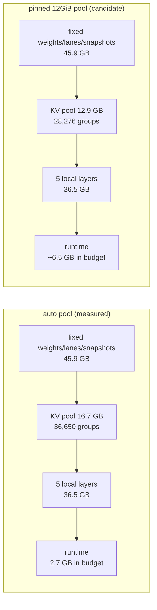

# v10 native TP3EP1 tool-eval OOM: memory budget, cause and the pinned pool

**Scope.** This is the CPU-only follow-up to the failed
`v10-native-tp3ep1` lane (`runs/v10-native-tp3ep1/`). It restates the measured
coordinator budget exactly, separates what the evidence proves from what it does
not, and records the one config change that answers the OOM without touching the
model, the weight placement or the API output contract. **No GPU was used**: the
hardware is leased to the EXL3 arm, so every number here is either read from the
retained lane evidence or derived arithmetically from it. Nothing here is a
measurement of the fix.

## 1. What actually happened

The lane ran the accepted battery and failed two families; this note only covers
tool-eval. All figures below are verbatim from
`runs/v10-native-tp3ep1/logs/coordinator-memory.txt`,
`runs/v10-native-tp3ep1/logs/coordinator-tool-eval-oom.log`,
`runs/v10-native-tp3ep1/raw/memory.json` and
`runs/v10-native-tp3ep1/tool-eval-short-oom/README.md`.

| Quantity | Value |
| --- | ---: |
| Device total (`nvidia-smi`, 97,887 MiB) | 102,641,958,912 B |
| Coordinator reservation (`device_budget_bytes`) | 101,973,491,712 B |
| Fixed runtime headroom (`RUNTIME_HEADROOM`) | 2,147,483,648 B |
| KV pool `global_bytes` (auto, 36,650 groups) | 16,700,672,000 B |
| KV cache `cache_bytes` | 16,745,176,576 B |
| `device_occupied_bytes` before the KV pool | 45,882,802,176 B |
| `device_occupied_bytes` at residency ready | 99,091,742,720 B |
| Free inside the budget at residency ready | 2,881,748,992 B (2.68 GiB) |
| *Actually* free on the device at residency ready | 3,550,216,192 B (3.31 GiB) |
| RTX-local expert layers (pinned) | 5 resident, 35 remote |
| Remote dispatch layers at residency | 35 |

Tool-eval run 1 started 16 scenarios concurrently (`--parallel 16`, thinking
enabled, `reasoning_effort=high`, 4096-token cap). It ran for about six minutes,
then request admission failed three times:

```
15:04:17 WARN  native request admission failed
        error=ds41rt_cuda_graph_end_capture returned status 6: cudaGraphInstantiate failed: out of memory
15:04:35 WARN  native request admission failed
        error=ds41rt_alloc_device_buffer returned status 4: cudaMalloc failed: out of memory
15:05:03 WARN  native request admission failed
        error=ds41rt_alloc_device_buffer returned status 4: cudaMalloc failed: out of memory
```

Each admission failure was followed by `native decode round failed
error=native target embedding CUDA status 2`. The run still recorded all 88
scenarios, but the last 18 are `Server error '500 Internal Server Error'`. Runs
2 and 3 never executed: the qualifier's startup probe hit the degraded server
(`native target embedding CUDA status 2`) and aborted with exit 3. The lane
therefore has **88 / 264 scenario-runs**, capacity-gated, and that shortfall is
retained rather than retried to pass.

## 2. The budget, exactly

The coordinator is one RTX PRO 6000 (97,887 MiB). At launch it makes this
allocation, in this order:

1. **Fixed allocations first.** Backbone, index, embedding and head weights,
   both execution lanes, both transports, the optional dSpark weights and both
   lane-local draft workspaces (`total_workspace_bytes=468,695,984`), vision, and
   the preallocated snapshot arenas (`snapshot_slots=42`,
   `snapshot_bytes=122,766,336`). This is the measured
   `device_occupied_bytes=45,882,802,176` at the KV-pool step.
2. **KV/index pool second.** With no `KV_POOL_SIZE` and no
   `MEMORY_RESERVATION`, `PoolPlan` has no ceiling beyond the device total, and
   it sizes the pool to fill everything left after the fixed allocations and
   `RUNTIME_HEADROOM` (2 GiB). It booked 36,650 groups
   (`source_pages=[36650, 36650, 36650, 73300]`), i.e.
   `36,650 * 455,680 = 16,700,672,000 B` of global pool, with
   `cache_bytes=16,745,176,576` (the cache adds 1,214 B per group of
   bookkeeping).
3. **Local expert layers third, bounded by what is left.** `RTX_EXPERT_LAYERS=5`
   requests exactly five layers; `LocalLayerPlan` reserved 36,097,228,800 B for
   them plus 341,047,072 B of workspace (`peak_bytes=36,457,076,512`) and
   stopped, because the request is a fixed count, not `auto`.

Residency then reports `device_occupied_bytes=99,091,742,720` against the
101,973,491,712 B budget: 2.68 GiB inside the budget, 3.31 GiB genuinely free on
the device. That is the entire runtime margin for CUDA graphs, per-request
scratch, allocator fragmentation and the CUDA context/driver overhead the budget
does not model (about 637 MiB of total-minus-budget).

**The budget itself is not wrong, and KV capacity is not the shortage.** The
failures are device-allocation failures (`cudaGraphInstantiate`, `cudaMalloc`),
not `SourcePoolExhausted`/KV-pool refusals, and the pool holds ~18.7M device
tokens. The shortage is that the *only* thing left for runtime allocations is a
fixed 2 GiB constant, while the `auto` policy deliberately spends everything else
on cache. At 16-way concurrency that constant is not enough.

## 3. What the tool-eval workload actually needs

`scripts/bench/v10-tp3-campaign.md` fixes the protocol at
`--runs 3 --parallel 16 --reference-date 2026-09-21`; `--parallel` is the only
concurrency dial and 16 is the accepted value. The qualifier forwards it to
`tool-eval-bench`, which runs 88 scenarios with up to 16 requests in flight,
thinking enabled at high effort, and a 4096-token per-response cap (an explicit
override, recorded in `summary.json`). Twelve turns are allowed per scenario.

The retained traces bound the real demand. Across all 88 run-1 traces the
largest raw scenario log is 10,150 characters (~2.5k tokens of raw traffic; the
median is ~870 tokens) over at most 7 turns. Even allowing generously for
system-prompt and reasoning overhead, 16 concurrent requests occupy on the order
of tens of thousands of tokens, i.e. **well under 1% of the ~18.7M-token pool the
lane already had**. Tool-eval is not a KV-capacity workload. It is a 16-way
*device-allocation* workload on a coordinator that had already reserved almost
the whole card.

The concurrency baseline supports the same reading: C1..C16 passed 45/45 in the
same lane with the same pool, because those cells are short. Tool-eval is the
first family to hold 16 concurrent high-effort thinking requests for six
continuous minutes, so it is the first family to demand the runtime headroom the
plan never reserved.

**Conclusion: the fixed 16 is not the problem and should not become
capacity-derived.** Reducing `--parallel` would lower the load, but it would also
change the protocol: the campaign fixes it, the tool itself warns that server
saturation under load can turn into recorded timeouts, and a lower-concurrency
run is a different protocol that cannot be published against this arm. The
capacity problem is on the serving side and belongs in the coordinator budget.

## 4. Prior accepted configurations

- The v9 TP6xEP1 1-RTX official record (`docs/release-v9-tp6-1rtx-official.md`)
  ran the *same* `auto` sizing to the *same* figures:
  `global_bytes=16,700,672,000`, `cache_bytes=16,745,176,576`,
  `reservation_bytes=101,973,491,712`, `runtime_headroom_bytes=2,147,483,648`,
  residency `99,343,400,960`. It records no tool-eval family, so it does not
  establish that 16-wide tool-eval fits; it only shows the pool sizing predates
  this lane.
- The 2-RTX matched candidate keeps `KV_POOL_SIZE` unset on purpose
  (`scripts/bench/candidate-tp6-2x-official-match.config`) because an explicit pin
  would confound the topology comparison with pool size. The 1-RTX candidate is
  likewise unset (`scripts/bench/tp6-candidate-flags.md` §1).
- Where a bounded arm exists, the project already pins the pool instead of
  leaving it to fill the device: the compact EXL3 TP3 arm pins
  `MEMORY_RESERVATION=32GiB` / `KV_POOL_SIZE=2GiB` / `PREFILL_BATCH_TOKENS=256`
  (`examples/configs/exl3-compact-tp3.config`), and the six-rank candidate
  fixtures pin `KV_POOL_SIZE=5,037,542,400`.
- The last native tool-eval that completed 264/264 was v1 on a compressed-KV
  engine (`docs/release-v1-tool-eval-final.md`), not this one.

So there is no accepted native configuration that demonstrates 16-wide tool-eval
inside this budget, and the closest accepted bounded configurations answer the
same pressure by pinning the pool.

## 5. The change

`examples/configs/tp3ep1-native.config` now pins:

```ini
KV_POOL_SIZE=12GiB
```

`12GiB` is 12,884,901,888 B = **28,276 whole 455,680-byte groups**
(12,884,807,680 B of global pool; the daemon's fitter may step back a few groups
if the cache check binds, exactly as it did for the measured `auto` pool). The
cache drops from the measured 16,745,176,576 B to ~12,919,134,746 B, returning
**about 3.8 GB (3.56 GiB) to device headroom**: free device memory at residency
should move from ~3.31 GiB to ~6.9 GiB. That is the smallest change that clearly
changes the failure regime.

Why this is safe for everything else the arm measures:

- **Model and weights unchanged.** 12 GiB is a cache budget, not a model dial.
- **Placement unchanged.** `RTX_EXPERT_LAYERS=5` still requests five layers, so
  bottom-up placement stops at five and the 5-local/35-remote boundary is
  identical. The released bytes are *not* re-spent on local layers, which is why
  they survive as headroom.
- **API output contract unchanged.** `MAX_CONTEXT_TOKENS=1048576` and
  `MAX_OUTPUT_TOKENS=393216` are untouched. The pool still holds ~14.5M tokens,
  which covers one maximum-context request plus its output allowance
  (1,441,792 tokens) more than ten times over, and every measured family in the
  battery: the largest retained prime is 262,144 tokens.
- **Tool-eval protocol unchanged.** `--parallel 16`, three runs, thinking/high
  and the 4096-token cap are untouched.
- **No code change, no image change.** The pinned size is a config value
  (`run.sh --kv-pool-size`), so the coordinator/spark digests and engine revision
  are identical to the failed lane.



## 6. What this is not

- **Not a measured fix.** The exact runtime headroom 16-wide tool-eval needs is
  not instrumented anywhere in the retained evidence. The arithmetic shows the
  change adds ~3.8 GB and costs nothing the battery needs; it does not prove
  6.9 GiB is sufficient. Only the re-run can.
- **Not a re-classification of the OOM.** The lane's verdict stands: tool-eval is
  SHORT at 88/264, capacity-gated, and runs 2-3 were never executed. No raw file
  is invented here, and the strict release gate stays failed until a new measured
  manifest says otherwise.
- **Not a rewrite of the engine's headroom policy.** `RUNTIME_HEADROOM` remains a
  fixed 2 GiB constant and still does not scale with concurrency, prefill batch or
  graph inventory. The durable fix is to derive it from `CONCURRENCY` (and retain
  it before expert placement); that is a Rust change, a rebuild, a new image
  digest and a full campaign, and it should be done once the instrumented peak is
  known rather than guessed at.

## 7. Required re-run scope

The pinned config changes the arm's captured config SHA-256, which is part of its
identity (`scripts/bench/v10-tp3-campaign.md`, "Rules"). A partial rerun would
leave the manifest with two identities, so the whole native arm must be
re-executed from a frozen worktree containing this config:

- **Everything, once, from one frozen tree**: the `v10-native-tp3ep1` arm's full
  accepted battery — 359 performance records plus the 5 correctness/provenance
  gates plus tool-eval `3 x 88`.
- **Tool-eval must reach 264/264 scenario-runs.** That is the specific claim this
  change makes, and the first thing to inspect in the new
  `logs/coordinator-memory.txt` is the new `global_bytes`/`cache_bytes` and the
  new residency headroom. Any admission failure must again be retained verbatim;
  if the OOM recurs, the next step is the code-level concurrency-derived
  headroom, not a further pool reduction.
- **No image rebuild or republish is required.** The change is config-only
  (`run.sh --kv-pool-size`), so reusing the same v10 digests keeps the run
  comparable to the failed one and isolates the pool as the single variable.
- **The EXL3 compact arm is untouched** and still needs its own first execution;
  this note makes no claim about it.
- **Publications stay blocked** until the new measured manifest passes
  `--check --strict`. Nothing in `runs/v10-tp3/` (the bootstrap generator
  outputs, the measured manifest, the rendered reports) is edited by this change,
  and `runs/v10-tp3/generate-docs.py` must still not be re-run for a measured
  arm.

## 8. Tests that pin this

`scripts/tests/test_v10_native_kv_pool.py` (CPU-only, no Docker/SSH/GPU):

- the profile carries exactly one explicit `KV_POOL_SIZE=12GiB` and no
  `MEMORY_RESERVATION`;
- the pinned value converts to whole page groups and clears the launcher's own
  `2*CONCURRENCY + 2*PREFIX_CACHE_ENTRIES` minimum;
- the daemon's explicit-pool fitter books 28,276 groups from it
  (`12,884,807,680 B` of global pool), leaving one max-context request plus its
  output allowance comfortably inside the pool;
- the change returns at least 3.5 GB of cache (≈3.56 GiB) to headroom relative
  to the measured `auto` pool, using the measured per-group cost;
- `RTX_EXPERT_LAYERS=5`, `CONCURRENCY=16`, `MAX_CONTEXT_TOKENS`,
  `MAX_OUTPUT_TOKENS`, `PREFILL_BATCH_TOKENS` and the explicit `SPARK_TP/EP=3/1`
  geometry are unchanged;
- the retained OOM evidence still contains the admission failures and the
  measured residency this arithmetic is relative to.
